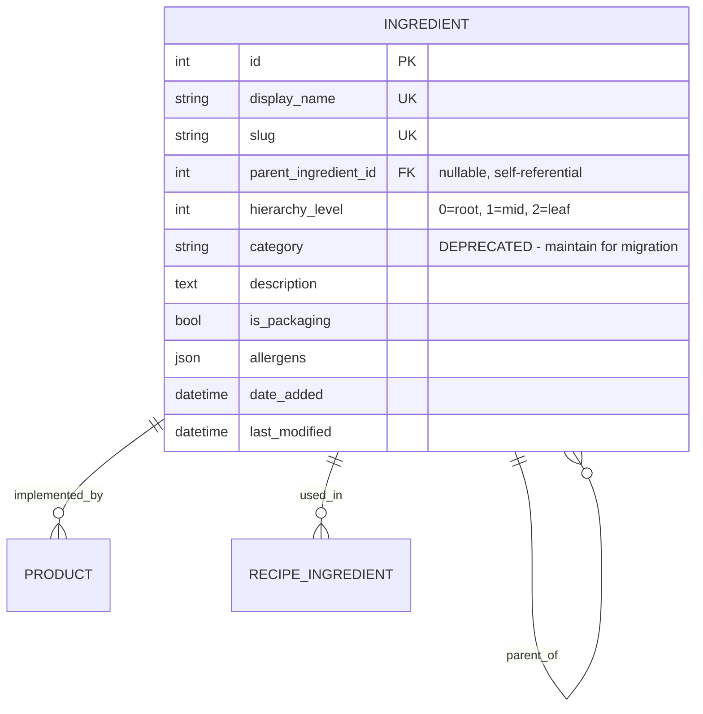
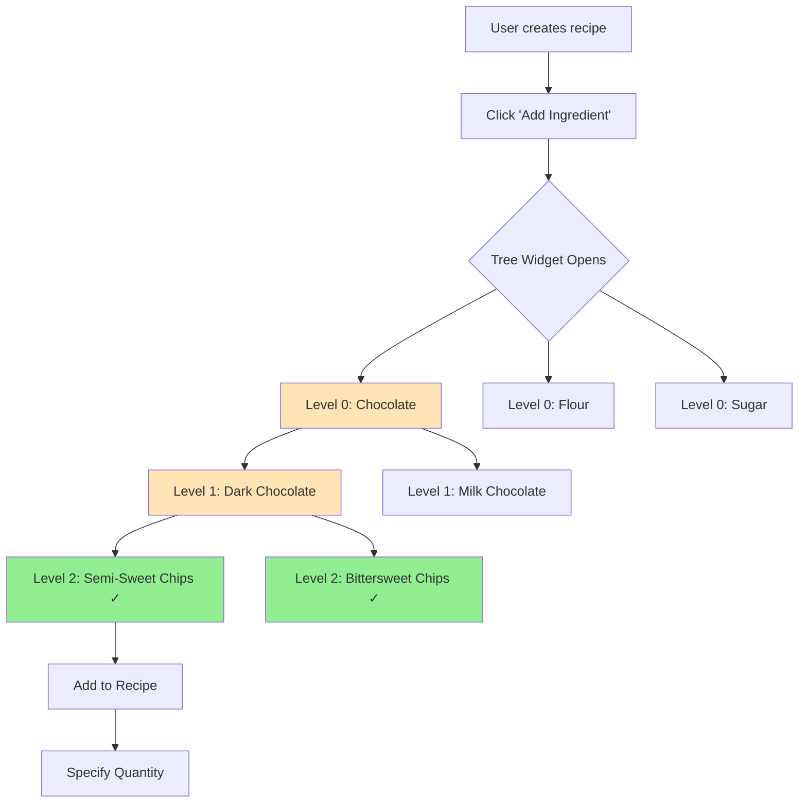
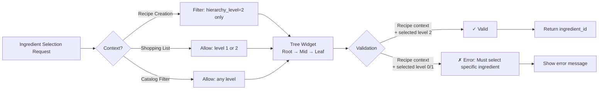

# Ingredient Hierarchy Architecture Specification

**Document Version**: 1.0  
**Status**: Design Proposal  
**Date**: December 2024  
**Constitutional References**: Principles III (Future-Proof Schema), V (Layered Architecture), VII (Pragmatic Aspiration)

---

## Executive Summary

This specification defines a **three-tier hierarchical ingredient taxonomy** to replace the current flat `category` field. The hierarchy enables context-appropriate ingredient selection (granular for recipes, broad for shopping lists, flexible for filtering) while maintaining data integrity and supporting future multi-domain expansion (baking → BBQ → meal prep).

**Key Design Decision**: Self-referential single table (`parent_ingredient_id`) rather than separate hierarchy tables, prioritizing simplicity for desktop phase while enabling web migration.

---

## 1. Problem Statement

### Current State
- **Flat taxonomy**: `Ingredient.category` is a simple string field (e.g., "Chocolate/Candies", "Flour")
- **Fixed granularity**: Same level of detail used for all contexts
- **No relationships**: Cannot express "Semi-Sweet Chocolate Chips" is a type of "Dark Chocolate" is a type of "Chocolate"

### Real-World Failure Scenarios

**Scenario 1: Recipe Creation**
```
User selects ingredient for recipe
Current: Scroll through flat list of 500+ ingredients
Desired: Navigate tree (Chocolate → Dark Chocolate → Semi-Sweet Chips)
```

**Scenario 2: Shopping List Generation**
```
Recipe calls for "Semi-Sweet Chocolate Chips"
User wants shopping list to say "Chocolate Chips (any brand)"
Current: Cannot generalize; must specify exact ingredient
Desired: Select mid-level node "Chocolate Chips" (allows brand substitution)
```

**Scenario 3: Catalog Filtering**
```
User wants to see all chocolate-related products
Current: Must filter by exact category string "Chocolate/Candies"
Desired: Filter by top-level "Chocolate" (includes all children)
```

**Scenario 4: Usage Reporting**
```
User wants total chocolate usage across all recipes
Current: Cannot aggregate across related ingredients
Desired: Report on "Chocolate" node (sums all children)
```

---

## 2. Proposed Solution: Three-Tier Self-Referential Hierarchy

### Data Model



### Schema Changes

**Modified `ingredients` table:**
```sql
-- New columns
ALTER TABLE ingredients ADD COLUMN parent_ingredient_id INTEGER REFERENCES ingredients(id);
ALTER TABLE ingredients ADD COLUMN hierarchy_level INTEGER NOT NULL DEFAULT 2;

-- Index for tree traversal
CREATE INDEX idx_ingredient_parent ON ingredients(parent_ingredient_id);
CREATE INDEX idx_ingredient_hierarchy_level ON ingredients(hierarchy_level);

-- Maintain category for backward compatibility during migration
-- (Will be deprecated after successful migration)
```

### Hierarchy Levels Defined

| Level | Name | Purpose | Example | Can Have Products? |
|-------|------|---------|---------|-------------------|
| 0 | **Root** | Top-level domain categorization | "Chocolate", "Flour", "Sugar" | No |
| 1 | **Mid-Tier** | Functional/type-based grouping | "Dark Chocolate", "All-Purpose Flour" | No |
| 2 | **Leaf** | Specific ingredient for recipes | "Semi-Sweet Chocolate Chips" | **Yes** |

**Critical Rule**: Only leaf-level ingredients (level 2) can have Products and be used in Recipes.

---

## 3. Conceptual Flow Diagram

### User Workflow: Recipe Creation with Hierarchical Selection



### System Workflow: Tree Traversal & Validation



---

## 4. Service Layer Design

### New Service Methods

```python
# src/services/ingredient_hierarchy_service.py

def get_root_ingredients() -> List[Ingredient]:
    """Get all root-level (level 0) ingredients for tree navigation."""
    
def get_children(parent_id: int) -> List[Ingredient]:
    """Get direct children of an ingredient node."""
    
def get_all_descendants(ancestor_id: int) -> List[Ingredient]:
    """Get all descendants (recursive) of an ingredient node."""
    
def get_ancestors(ingredient_id: int) -> List[Ingredient]:
    """Get path from leaf to root (breadcrumb trail)."""
    
def get_leaf_ingredients(parent_id: Optional[int] = None) -> List[Ingredient]:
    """Get all leaf-level ingredients (optionally under a parent)."""
    
def validate_hierarchy_level(ingredient_id: int, allowed_levels: List[int]) -> bool:
    """Validate ingredient is at allowed hierarchy level for context."""
    
def move_ingredient(ingredient_id: int, new_parent_id: Optional[int]) -> Ingredient:
    """Move ingredient to new parent (with cycle detection)."""
    
def prevent_cycles(ingredient_id: int, new_parent_id: int) -> bool:
    """Ensure moving ingredient doesn't create circular reference."""
```

### Modified Existing Services

**`ingredient_service.py`:**
```python
def create_ingredient(data: Dict) -> Ingredient:
    """
    Create ingredient with hierarchy validation.
    
    Rules:
    - If no parent_id: hierarchy_level must be 0 (root)
    - If parent_id provided: 
        - Parent must exist
        - hierarchy_level = parent.hierarchy_level + 1
        - hierarchy_level must be <= 2 (max depth)
    """
    parent_id = data.get('parent_ingredient_id')
    
    if parent_id is None:
        # Root ingredient
        data['hierarchy_level'] = 0
    else:
        parent = get_ingredient_by_id(parent_id)
        if parent.hierarchy_level >= 2:
            raise ValidationError("Cannot create child of leaf ingredient (max depth = 2)")
        data['hierarchy_level'] = parent.hierarchy_level + 1
    
    # Only leaf ingredients can have density
    if data['hierarchy_level'] < 2:
        if any([data.get('density_volume_value'), data.get('density_weight_value')]):
            raise ValidationError("Only leaf ingredients (L2) can have density specifications")
    
    # Create ingredient
    ...

def update_ingredient(slug: str, data: Dict) -> Ingredient:
    # If parent_id changes, recalculate hierarchy_level
    # Validate no cycles
    
def delete_ingredient(slug: str) -> bool:
    # Check if ingredient has children → block deletion
    # Check if ingredient has products → block deletion
    # Check if ingredient used in recipes → block deletion
```

**`recipe_service.py`:**
```python
def add_ingredient_to_recipe(recipe_id: int, ingredient_slug: str, quantity: float):
    """Only leaf ingredients can be used in recipes."""
    ingredient = ingredient_service.get_ingredient(ingredient_slug)
    
    if ingredient.hierarchy_level != 2:
        # Get leaf children for suggestion
        children = ingredient_hierarchy_service.get_leaf_ingredients(ingredient.id)
        child_names = [c.display_name for c in children[:3]]
        
        raise ValidationError(
            f"Cannot add '{ingredient.display_name}' to recipe "
            f"(hierarchy level {ingredient.hierarchy_level}). "
            f"Please select a specific ingredient. "
            f"Options: {', '.join(child_names)}..."
        )
    
    # Proceed with adding to recipe
    ...
```

---

## 5. Migration Strategy

### Phase 1: Schema Extension (Non-Destructive)
1. Add `parent_ingredient_id` and `hierarchy_level` columns (nullable)
2. All existing ingredients default to `hierarchy_level=2` (leaf)
3. No `parent_ingredient_id` set (all roots for now)
4. **System continues to work with flat structure**

### Phase 2: Data Augmentation (Export → Transform → Import)

**Constitutional Principle VI compliance:**
```
Export current data → JSON files
  ↓
AI analysis suggests hierarchy
  ↓
Manual review/editing of JSON (add parent_ingredient_id, hierarchy_level)
  ↓
Delete database
  ↓
Recreate schema (with new columns)
  ↓
Import transformed JSON
```

**No database migration scripts needed** ✅

**Detailed Steps:**

1. **Export all ingredients to JSON**
   ```bash
   python -m src.cli.export --ingredients ingredients_export.json
   ```

2. **AI analysis** (separate script using Claude/Gemini API)
   ```python
   # scripts/analyze_ingredient_hierarchy.py
   
   def suggest_hierarchy(ingredients: List[Dict]) -> Dict:
       """
       Use LLM to suggest hierarchy based on ingredient names.
       
       Prompt:
       "Given these baking ingredients, suggest a 3-tier hierarchy:
       - Level 0 (root): Broad categories (Chocolate, Flour, Sugar, etc.)
       - Level 1 (mid): Functional types (Dark Chocolate, All-Purpose Flour)
       - Level 2 (leaf): Specific ingredients (Semi-Sweet Chips, King Arthur AP Flour)
       
       Return JSON with suggested parent relationships."
       
       Returns:
           {
               "suggested_roots": ["Chocolate", "Flour", "Sugar", ...],
               "hierarchy": {
                   "Semi-Sweet Chocolate Chips": {
                       "parent": "Dark Chocolate",
                       "grandparent": "Chocolate",
                       "confidence": 0.95
                   },
                   ...
               }
           }
       """
   ```

3. **Manual review/approval** of suggested structure
   - Simple CLI or HTML interface
   - Show suggested hierarchy as tree
   - Allow edits (move ingredients, rename nodes)
   - Flag low-confidence suggestions
   - Export reviewed structure

4. **Transform JSON** (add parent_ingredient_id fields)
   ```python
   # scripts/transform_ingredient_json.py
   
   def transform_to_hierarchical(
       flat_ingredients: List[Dict],
       hierarchy_mapping: Dict
   ) -> List[Dict]:
       """
       Transform flat ingredient list to hierarchical structure.
       
       1. Create root ingredients (L0) if not exist
       2. Create mid-tier ingredients (L1) if not exist
       3. Update existing ingredients with parent_id and level
       """
   ```

5. **Delete database and recreate with new schema**
   ```bash
   rm bake_tracker.db
   python -m src.cli.init_db
   ```

6. **Import transformed data**
   ```bash
   python -m src.cli.import --ingredients ingredients_hierarchical.json
   ```

### Phase 3: UI Enablement
1. Deploy tree widget for ingredient selection
2. Enable hierarchy management UI (admin section)
3. Test with real user (Marianne)

### Phase 4: Deprecation
1. Once validated, mark `category` field as deprecated in code
2. Future schema version can remove `category` column

---

## 6. UI Mockup: Tree Selection Widget

```
┌─ Select Ingredient ────────────────────────────────────┐
│                                                         │
│  Search: [chocolate________]  [Clear]                  │
│                                                         │
│  ▼ Chocolate                                           │
│    ▼ Dark Chocolate                                    │
│      ○ Semi-Sweet Chocolate Chips                      │
│      ○ Bittersweet Chocolate Chips                     │
│      ○ Dark Chocolate Bar (70% Cacao)                  │
│    ▼ Milk Chocolate                                    │
│      ○ Milk Chocolate Chips                            │
│    ▶ White Chocolate                                   │
│  ▶ Flour                                               │
│  ▶ Sugar                                               │
│                                                         │
│  Selected: Dark Chocolate / Semi-Sweet Chocolate Chips │
│                                                         │
│  [Cancel]  [Select]                                    │
└─────────────────────────────────────────────────────────┘
```

**Widget Behavior:**
- **▶ / ▼**: Expand/collapse nodes
- **○**: Selectable leaf node (level 2)
- **Search**: Filters tree, expands matching branches automatically
- **Breadcrumb**: Shows selected path
- **Context-aware**: For recipes, only leaf nodes selectable

---

## 7. Gap Analysis

### Schema Gaps
| Gap | Current | Required | Migration Path |
|-----|---------|----------|----------------|
| Hierarchy relationship | None | `parent_ingredient_id` FK | Add column (nullable initially) |
| Level tracking | None | `hierarchy_level` INT | Add column with default=2 |
| Tree indexes | None | Index on `parent_ingredient_id` | Create index |

### Service Layer Gaps
| Gap | Current | Required |
|-----|---------|----------|
| Tree traversal | None | `get_children()`, `get_descendants()` |
| Ancestry queries | None | `get_ancestors()` (breadcrumb) |
| Cycle prevention | None | `prevent_cycles()` validation |
| Level validation | None | `validate_hierarchy_level()` for context |
| Bulk operations | None | `move_subtree()`, `bulk_reparent()` |

### UI Gaps
| Gap | Current | Required |
|-----|---------|----------|
| Ingredient selection | Flat dropdown | Hierarchical tree widget |
| Hierarchy management | None | Admin UI for tree structure |
| Breadcrumb navigation | None | Path display (Chocolate → Dark → Chips) |
| Context-aware filtering | None | Show only appropriate levels per context |

---

## 8. Constitutional Compliance Check

### Principle II: Data Integrity & FIFO Accuracy
✅ **Compliant**: Hierarchy is structural metadata, doesn't affect FIFO calculations

### Principle III: Future-Proof Schema
✅ **Compliant**: Self-referential design supports arbitrary depth (not locked to 3 levels)
✅ **Compliant**: Nullable `parent_ingredient_id` allows incremental adoption

### Principle V: Layered Architecture Discipline
✅ **Compliant**: 
- Models: Schema only (`parent_ingredient_id` relationship)
- Services: Business logic (tree traversal, validation)
- UI: Presentation (tree widget, no logic)

### Principle VI: Schema Change Strategy (Desktop Phase)
✅ **Compliant**: Migration via export → augment → import cycle
- No Alembic migration scripts needed
- JSON export includes new fields
- Transform script creates hierarchy
- Import restores structured data

### Principle VII: Pragmatic Aspiration
✅ **Compliant - Desktop Phase**: Simple self-referential table
✅ **Web Migration Ready**: Structure supports multi-user (no user-specific hierarchy needed)
❓ **Platform Phase Consideration**: May need multiple taxonomies for different cooking domains (baking vs. BBQ)

**Future Evolution Path**:
- Desktop: Single global hierarchy
- Web: Still single hierarchy (shared across users for recipe sharing)
- Platform: Multiple parallel taxonomies with tags (future consideration)

---

## 9. Example Hierarchy Structure

### Proposed Three-Tier Baking Taxonomy

```
Chocolate (L0)
├── Dark Chocolate (L1)
│   ├── Semi-Sweet Chocolate Chips (L2)
│   ├── Bittersweet Chocolate Chips (L2)
│   └── Dark Chocolate Bar 70% (L2)
├── Milk Chocolate (L1)
│   ├── Milk Chocolate Chips (L2)
│   └── Milk Chocolate Bar (L2)
└── White Chocolate (L1)
    └── White Chocolate Chips (L2)

Flour (L0)
├── Wheat Flour (L1)
│   ├── All-Purpose Flour (L2)
│   ├── Bread Flour (L2)
│   └── Cake Flour (L2)
└── Alternative Flour (L1)
    ├── Almond Flour (L2)
    └── Coconut Flour (L2)

Sugar (L0)
├── Granulated Sugar (L1)
│   ├── White Granulated Sugar (L2)
│   └── Superfine Sugar (L2)
├── Brown Sugar (L1)
│   ├── Light Brown Sugar (L2)
│   └── Dark Brown Sugar (L2)
└── Powdered Sugar (L1)
    └── Confectioners Sugar (L2)

Oils/Fats (L0)
├── Butter (L1)
│   ├── Unsalted Butter (L2)
│   └── Salted Butter (L2)
└── Vegetable Oils (L1)
    ├── Canola Oil (L2)
    └── Vegetable Oil (L2)
```

---

## 10. Design Decisions (Locked)

### Q1: How many hierarchy levels to enforce?
**Decision**: **Hard limit: Exactly 3 levels (L0, L1, L2)**

**Rationale**: Desktop phase benefits from constraints. Simplifies UI and service layer validation.

---

### Q2: Can mid-tier ingredients (L1) have products?
**Decision**: **No - Only leaf ingredients can have products**

**Rationale**: 
- Prevents ambiguity (is "Dark Chocolate" a product or category?)
- Cleaner data model (products always at same level)
- Aligns with recipe semantics (recipes use specific ingredients)

---

### Q3: Search behavior in tree widget?
**Decision**: **Auto-expand branches with matches**

**Rationale**: User maintains context (can see sibling ingredients) while finding target quickly.

---

### Q4: Migration of existing 500+ ingredients?
**Decision**: **AI-assisted bulk categorization with manual review**

**Rationale**: 500 ingredients × manual categorization = weeks of work. AI can suggest with 90%+ accuracy, user reviews edge cases.

---

### Q5: Display name for hierarchy nodes?
**Decision**: **Keep full names at all levels (explicit)**

**Rationale**: Full names prevent ambiguity when ingredients are referenced outside tree context (e.g., in shopping lists, reports).

---

## 11. Updated Schema Specification

```sql
-- Modified ingredients table (Phase 2)
CREATE TABLE ingredients (
    id INTEGER PRIMARY KEY,
    display_name TEXT NOT NULL UNIQUE,
    slug TEXT NOT NULL UNIQUE,
    
    -- HIERARCHY FIELDS (Phase 2)
    parent_ingredient_id INTEGER REFERENCES ingredients(id),
    hierarchy_level INTEGER NOT NULL CHECK(hierarchy_level IN (0, 1, 2)),
    
    -- Original fields (unchanged)
    category TEXT,  -- DEPRECATED: maintained for rollback safety
    description TEXT,
    notes TEXT,
    is_packaging BOOLEAN NOT NULL DEFAULT 0,
    
    -- Density (only valid for hierarchy_level = 2)
    density_volume_value REAL,
    density_volume_unit TEXT,
    density_weight_value REAL,
    density_weight_unit TEXT,
    
    -- Industry standards (future-ready)
    foodon_id TEXT,
    foodex2_code TEXT,
    langual_terms TEXT,  -- JSON
    fdc_ids TEXT,  -- JSON
    
    -- Physical properties
    moisture_pct REAL,
    allergens TEXT,  -- JSON
    
    -- Timestamps
    date_added TIMESTAMP NOT NULL DEFAULT CURRENT_TIMESTAMP,
    last_modified TIMESTAMP NOT NULL DEFAULT CURRENT_TIMESTAMP,
    
    -- Constraints
    CONSTRAINT valid_parent_depth CHECK (
        parent_ingredient_id IS NULL OR 
        (SELECT hierarchy_level FROM ingredients WHERE id = parent_ingredient_id) < 2
    )
);

-- Indexes
CREATE INDEX idx_ingredient_parent ON ingredients(parent_ingredient_id);
CREATE INDEX idx_ingredient_hierarchy_level ON ingredients(hierarchy_level);
CREATE INDEX idx_ingredient_display_name ON ingredients(display_name);
CREATE INDEX idx_ingredient_slug ON ingredients(slug);
CREATE INDEX idx_ingredient_is_packaging ON ingredients(is_packaging);
```

---

## 12. Implementation Complexity Assessment

### Complexity Factors

| Factor | Complexity | Justification |
|--------|-----------|---------------|
| Schema changes | **Low** | Add 2 columns + indexes (non-breaking) |
| Service layer | **Medium** | Tree traversal algorithms (well-understood patterns) |
| UI widget | **Medium-High** | CustomTkinter tree widget (new component) |
| Migration script | **High** | AI-assisted categorization + manual review |
| Testing | **Medium** | Service layer straightforward, UI needs real user testing |

### Estimated Effort
- Schema changes: 2 hours
- Service layer: 8-12 hours
- UI tree widget: 12-16 hours
- Migration tooling: 16-20 hours (AI integration + review UI)
- Testing: 8-12 hours
- **Total: 46-62 hours** (roughly 6-8 working days)

### Risk Mitigation
1. **Risk**: AI categorization errors create bad hierarchy
   - **Mitigation**: Manual review step, ability to reject/modify suggestions
   
2. **Risk**: Tree widget UX confusing to user (Marianne)
   - **Mitigation**: Early prototype testing, fallback to flat dropdown if needed
   
3. **Risk**: Performance degradation with recursive queries
   - **Mitigation**: Denormalize if needed (store full path, not just parent)

---

## 13. Next Steps

### Immediate (Pre-Implementation)
1. **Validate with Marianne**: Show mockup, confirm 3-tier model matches mental model
2. **Create sample hierarchy** (20-30 ingredients across 5-6 root categories)
3. **Prototype AI categorization** (test with subset of data)

### Implementation Sequence
1. Schema changes (add columns, indexes)
2. Service layer (tree traversal methods)
3. Migration tooling (AI-assisted categorization)
4. UI tree widget (basic version)
5. Test with sample data
6. Full migration of 500+ ingredients
7. User testing with Marianne

### Success Criteria
- ✅ User can navigate ingredient tree in <3 clicks for common selections
- ✅ Shopping lists show appropriate granularity (not over-specific)
- ✅ Recipe creation remains intuitive (no workflow regression)
- ✅ Migration completes without data loss
- ✅ All existing functionality preserved

---

## 14. Related Documents

- `/docs/design/schema_v0.6_design.md` - Current schema baseline
- `/docs/workflows/workflow-refactoring-spec.md` - Workflow pattern example
- `/.kittify/memory/constitution.md` - Architectural principles
- `/docs/design/PHASE2_workflow_ux_redesign.md` - Phase 2 requirements

---

**Document Status**: Approved - Ready for implementation

**Next Requirement**: #2 Recipe Redesign or #4 UI Mode Restructure
