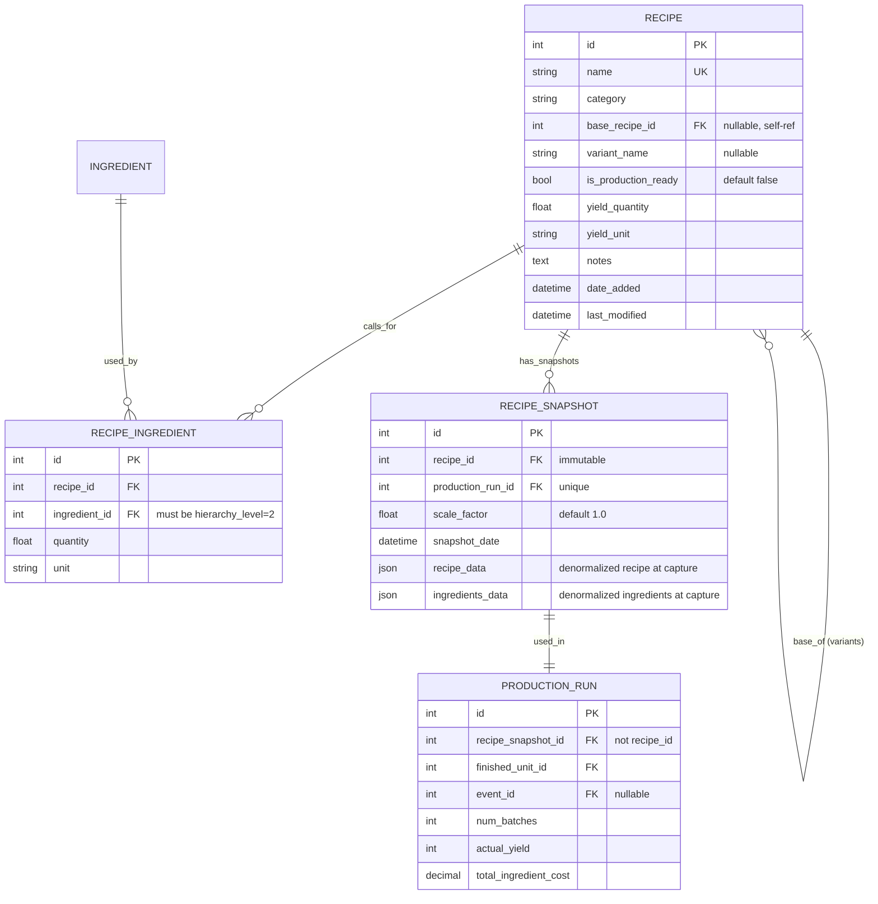
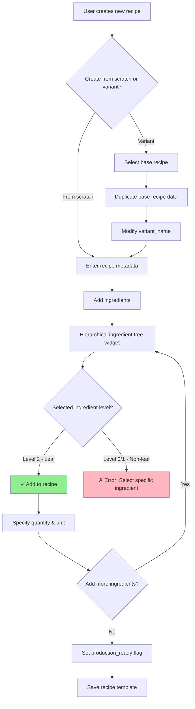
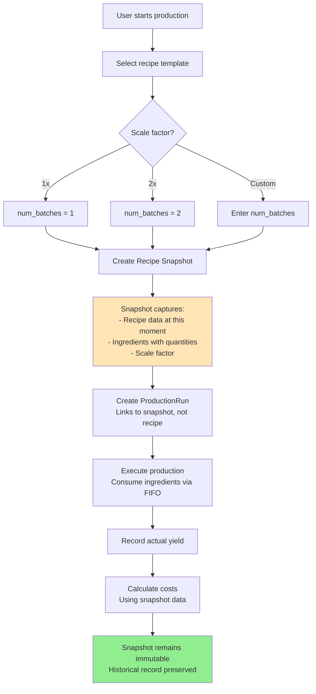
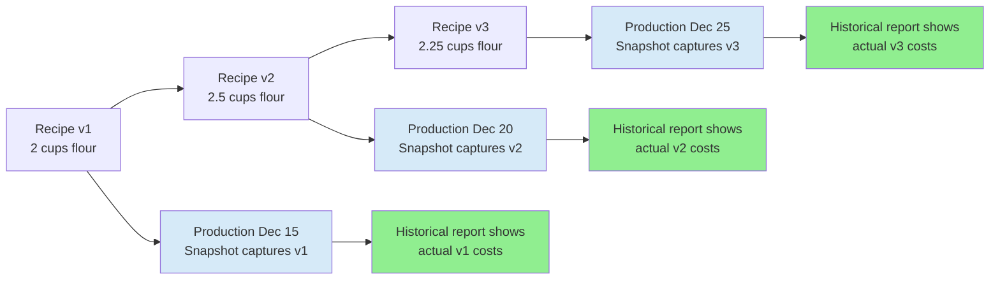

# Recipe Redesign Architecture Specification

**Document Version**: 1.0  
**Status**: Design Proposal  
**Date**: December 2024  
**Constitutional References**: Principles II (Data Integrity), III (Future-Proof Schema), V (Layered Architecture), VI (Schema Change Strategy), VII (Pragmatic Aspiration)

---

## Executive Summary

This specification redesigns the recipe system to distinguish between **recipe templates** (definitions) and **recipe snapshots** (production instances), enabling accurate historical costing, recipe versioning, scaling, and base/variant relationships. The redesign solves critical problems where recipe changes retroactively affect historical production costs and where creating variants requires full duplication.

**Key Design Decisions**:
1. **Recipe as Template**: Recipes are mutable definitions; snapshots capture immutable production instances
2. **Self-Referential Variants**: Base/variant relationships via `base_recipe_id` (single table)
3. **Simple Scaling**: Multiplier-based (1x, 2x, 3x) stored with snapshots
4. **Leaf-Only Ingredients**: Recipes use hierarchical ingredient selection (depends on Requirement #1)

---

## 1. Problem Statement

### Current State Issues

**Issue 1: No Recipe Versioning (Historical Data Corruption)**
```
Timeline:
Dec 15: Make 3 batches chocolate chip cookies (Recipe v1: 2 cups flour)
Dec 20: Improve recipe (Recipe v1 → v2: 2.5 cups flour)
Dec 25: Review production costs

Problem: Dec 15 production now shows v2 costs (2.5 cups), not actual v1 costs (2 cups)
Result: Historical cost data is corrupted, cannot track actual expenses
```

**Issue 2: No Base/Variant Relationships**
```
Have: "Raspberry Thumbprint Cookies" (tested, perfected)
Want: "Strawberry Thumbprint Cookies" (same recipe, different jam)

Current Solution: Duplicate entire recipe, manually keep in sync
Problem: 
- Changes to technique/timing need manual propagation
- No way to see "all thumbprint variants"
- Cannot report "total thumbprint cookie production"
```

**Issue 3: No Batch Scaling**
```
User wants to make 3 batches of cookies for an event

Current Solution: Create 3 separate production runs, each consuming ingredients separately
Problem:
- Cannot see "this event used 3 batches of Recipe X"
- Shopping list must aggregate across multiple production runs
- No simple "scale to 3x" function
```

**Issue 4: No Production Readiness Flag**
```
User has:
- 20 production-ready recipes (proven, for events)
- 5 experimental recipes (testing, not for events)

Problem: All recipes appear in production planning UI
Result: User must remember which are safe for events
```

---

## 2. Proposed Solution: Template/Snapshot Architecture

### Conceptual Model

```
RECIPE (Template - Mutable Definition)
  ├─ Base/variant relationships (base_recipe_id)
  ├─ Production readiness flag
  ├─ Can be edited/updated over time
  └─ Used for: Planning, browsing, editing
  
RECIPE SNAPSHOT (Instance - Immutable Record)
  ├─ Captured at production time
  ├─ Denormalized copy of recipe at that moment
  ├─ Links to ProductionRun
  ├─ Scale factor (1x, 2x, 3x)
  └─ Used for: Historical costing, reporting
```

### Real-World Analogy

**Recipe = Class definition in programming**
- You can modify the class
- New instances use updated definition
- Old instances remain unchanged

**Recipe Snapshot = Object instance**
- Captures state at creation time
- Immutable after creation
- Historical record of "what actually happened"

---

## 3. Data Model

### Entity Relationship Diagram



### Schema Changes

**New Table: `recipe_snapshots`**
```sql
CREATE TABLE recipe_snapshots (
    id INTEGER PRIMARY KEY,
    recipe_id INTEGER NOT NULL REFERENCES recipes(id) ON DELETE RESTRICT,
    production_run_id INTEGER UNIQUE REFERENCES production_runs(id) ON DELETE CASCADE,
    
    -- Snapshot metadata
    snapshot_date DATETIME NOT NULL DEFAULT CURRENT_TIMESTAMP,
    scale_factor REAL NOT NULL DEFAULT 1.0 CHECK(scale_factor > 0),
    
    -- Denormalized recipe data (JSON for flexibility)
    recipe_data TEXT NOT NULL,  -- JSON: {name, category, yield_quantity, yield_unit, notes}
    ingredients_data TEXT NOT NULL,  -- JSON: [{ingredient_name, quantity, unit, notes}, ...]
    
    -- Indexes
    CONSTRAINT fk_recipe_snapshot_recipe FOREIGN KEY (recipe_id) REFERENCES recipes(id),
    CONSTRAINT fk_recipe_snapshot_production FOREIGN KEY (production_run_id) REFERENCES production_runs(id)
);

CREATE INDEX idx_recipe_snapshot_recipe ON recipe_snapshots(recipe_id);
CREATE INDEX idx_recipe_snapshot_production ON recipe_snapshots(production_run_id);
CREATE INDEX idx_recipe_snapshot_date ON recipe_snapshots(snapshot_date);
```

**Modified Table: `recipes`**
```sql
-- Add new columns
ALTER TABLE recipes ADD COLUMN base_recipe_id INTEGER REFERENCES recipes(id) ON DELETE SET NULL;
ALTER TABLE recipes ADD COLUMN variant_name TEXT;
ALTER TABLE recipes ADD COLUMN is_production_ready BOOLEAN NOT NULL DEFAULT 0;

-- Add indexes
CREATE INDEX idx_recipe_base ON recipes(base_recipe_id);
CREATE INDEX idx_recipe_production_ready ON recipes(is_production_ready);

-- Constraint: prevent self-reference
ALTER TABLE recipes ADD CONSTRAINT ck_recipe_no_self_variant 
    CHECK (base_recipe_id IS NULL OR base_recipe_id != id);
```

**Modified Table: `production_runs`**
```sql
-- Add recipe_snapshot_id (will eventually replace recipe_id)
ALTER TABLE production_runs ADD COLUMN recipe_snapshot_id INTEGER REFERENCES recipe_snapshots(id);

-- For migration period, allow either recipe_id OR recipe_snapshot_id
-- After migration, make recipe_snapshot_id NOT NULL and drop recipe_id
CREATE INDEX idx_production_run_snapshot ON production_runs(recipe_snapshot_id);
```

**Modified Table: `recipe_ingredients`**
```sql
-- Add constraint: only leaf ingredients (hierarchy_level=2) can be used
-- Note: Enforced in service layer, not DB constraint (to avoid cross-table CHECK)
```

---

## 4. Conceptual Flow Diagrams

### Flow 1: Recipe Creation with Hierarchical Ingredients



### Flow 2: Production Run with Snapshot Capture



### Flow 3: Recipe Template Evolution Over Time



---

## 5. Service Layer Design

### New Service: `recipe_snapshot_service.py`

```python
def create_snapshot(recipe_id: int, scale_factor: float = 1.0) -> RecipeSnapshot:
    """
    Create immutable snapshot of recipe at current state.
    
    Args:
        recipe_id: Recipe to snapshot
        scale_factor: Batch multiplier (1.0 = single batch, 2.0 = double batch)
    
    Returns:
        RecipeSnapshot with denormalized recipe and ingredient data
    
    Raises:
        RecipeNotFound: If recipe_id invalid
        ValidationError: If scale_factor <= 0
    """
    
def get_snapshot_for_production(production_run_id: int) -> RecipeSnapshot:
    """Get snapshot associated with production run."""
    
def get_snapshots_for_recipe(recipe_id: int, limit: int = 10) -> List[RecipeSnapshot]:
    """Get recent snapshots of a recipe (for version history view)."""
    
def calculate_snapshot_cost(snapshot_id: int) -> Decimal:
    """
    Calculate total ingredient cost from snapshot data.
    
    Uses denormalized ingredient quantities, respects scale_factor.
    """
```

### Modified Service: `recipe_service.py`

```python
def create_recipe(data: Dict, base_recipe_id: Optional[int] = None) -> Recipe:
    """
    Create new recipe or variant.
    
    If base_recipe_id provided:
    - Duplicate base recipe data
    - Set base_recipe_id and variant_name
    - Mark as variant in display
    
    Args:
        data: Recipe metadata
        base_recipe_id: If provided, create as variant of this recipe
    """
    
def update_recipe(recipe_id: int, data: Dict) -> Recipe:
    """
    Update recipe template.
    
    WARNING: Does NOT affect existing snapshots.
    Future production runs will use updated template.
    """
    
def get_recipe_variants(base_recipe_id: int) -> List[Recipe]:
    """Get all variants of a base recipe."""
    
def get_recipe_history(recipe_id: int) -> List[RecipeSnapshot]:
    """Get snapshot history showing recipe evolution over time."""
    
def validate_ingredient_for_recipe(ingredient_id: int) -> Tuple[bool, str]:
    """
    Validate ingredient can be used in recipe.
    
    Rules:
    - Must be hierarchy_level = 2 (leaf ingredient)
    - Must have at least one product defined
    
    Returns:
        (is_valid, error_message)
    """
```

### Modified Service: `production_run_service.py`

```python
def create_production_run(
    recipe_id: int,
    finished_unit_id: int,
    num_batches: int,
    scale_factor: float = 1.0,
    event_id: Optional[int] = None,
    **kwargs
) -> ProductionRun:
    """
    Create production run with automatic snapshot capture.
    
    Flow:
    1. Create recipe snapshot (captures current recipe state)
    2. Create production run (links to snapshot)
    3. Calculate expected yield (recipe.yield_quantity * num_batches * scale_factor)
    4. FIFO consume ingredients (based on snapshot ingredient data)
    5. Calculate costs (based on actual FIFO consumption)
    
    Args:
        recipe_id: Recipe template to produce
        finished_unit_id: What's being made
        num_batches: Number of batches (1 batch = 1x recipe yield)
        scale_factor: Multiplier within each batch (2.0 = double each batch)
        event_id: Optional event attribution
    
    Returns:
        ProductionRun with linked RecipeSnapshot
    """
    
def get_production_cost(production_run_id: int) -> Decimal:
    """
    Get production cost from snapshot (not current recipe).
    
    Uses snapshot's ingredient data + FIFO consumption records.
    """
```

---

## 6. Migration Strategy

### Phase 1: Additive Schema Changes (Non-Breaking)

**Step 1: Add new fields to `recipes`**
```sql
ALTER TABLE recipes ADD COLUMN base_recipe_id INTEGER;
ALTER TABLE recipes ADD COLUMN variant_name TEXT;
ALTER TABLE recipes ADD COLUMN is_production_ready BOOLEAN NOT NULL DEFAULT 0;
```

**Step 2: Create `recipe_snapshots` table**
```sql
CREATE TABLE recipe_snapshots (...);
```

**Step 3: Add `recipe_snapshot_id` to `production_runs` (nullable initially)**
```sql
ALTER TABLE production_runs ADD COLUMN recipe_snapshot_id INTEGER;
```

**System continues working with existing `recipe_id` on production runs.**

---

### Phase 2: Data Transformation (Export → Transform → Import)

**Export current data:**
```bash
python -m src.cli.export --recipes recipes.json --production-runs production_runs.json
```

**Transform production runs → create snapshots:**
```python
# scripts/migrate_production_snapshots.py

def create_snapshots_for_historical_production(
    recipes: List[Dict],
    production_runs: List[Dict]
) -> Tuple[List[Dict], List[Dict]]:
    """
    For each historical production run:
    1. Create snapshot of recipe as it was at production time
       (Assumption: use current recipe data as best approximation)
    2. Link snapshot to production run
    3. Update production_run with recipe_snapshot_id
    
    Returns:
        (snapshots, updated_production_runs)
    """
```

**Import transformed data:**
```bash
python -m src.cli.import --recipe-snapshots snapshots.json --production-runs production_runs_updated.json --reset
```

---

### Phase 3: Cutover

**Make `recipe_snapshot_id` required:**
```sql
-- After migration, enforce snapshot requirement
ALTER TABLE production_runs ALTER COLUMN recipe_snapshot_id SET NOT NULL;

-- Optionally: Drop old recipe_id column (or keep for rollback safety)
-- ALTER TABLE production_runs DROP COLUMN recipe_id;
```

---

## 7. UI Mockups

### Mockup 1: Recipe List with Variants

```
┌─ Recipes ──────────────────────────────────────────────┐
│  [+ New Recipe]  [+ New Variant]          [Filters ▼] │
│                                                         │
│  Show: ○ All  ● Production Ready  ○ Experimental       │
│                                                         │
│  ▼ Thumbprint Cookies (Base Recipe) ★                  │
│    │  Yield: 24 cookies | Cost: $8.50                  │
│    ├─ → Raspberry Thumbprint Cookies                   │
│    │    Yield: 24 cookies | Cost: $9.20                │
│    └─ → Strawberry Thumbprint Cookies                  │
│         Yield: 24 cookies | Cost: $8.75                │
│                                                         │
│  ▼ Chocolate Chip Cookies ★                            │
│    │  Yield: 36 cookies | Cost: $12.00                 │
│    └─ → Double Chocolate Chip (Experimental)           │
│         Yield: 36 cookies | Cost: $15.50               │
│                                                         │
│  ○ Test Recipe - Gingerbread (Experimental)            │
│     Yield: 12 cookies | Cost: $6.00                    │
│                                                         │
│  Legend: ★ Production Ready | → Variant                │
└─────────────────────────────────────────────────────────┘
```

**Widget Behavior:**
- ▼/▶: Expand/collapse base recipes with variants
- ★: Production ready indicator
- → : Variant indicator (indented under base)
- Filters: Toggle production ready / experimental / all

---

### Mockup 2: Start Production Run (with Scaling)

```
┌─ Start Production Run ─────────────────────────────────┐
│                                                         │
│  Recipe: [Chocolate Chip Cookies ▼]                    │
│  Making: [Finished Unit ▼]                             │
│  Event:  [Christmas 2025 ▼] (optional)                 │
│                                                         │
│  ┌─ Batch Size ─────────────────────────────────────┐  │
│  │                                                   │  │
│  │  Recipe Yield: 36 cookies per batch              │  │
│  │                                                   │  │
│  │  Number of Batches: [3___]                       │  │
│  │  Scale Factor:      [1x ▼] 1x, 2x, 3x, Custom   │  │
│  │                                                   │  │
│  │  Expected Total Yield: 108 cookies               │  │
│  │  (3 batches × 36 cookies × 1x)                   │  │
│  └───────────────────────────────────────────────────┘  │
│                                                         │
│  Estimated Ingredient Cost: $36.00                     │
│  (Based on current recipe + inventory FIFO)            │
│                                                         │
│  [Cancel]  [Start Production →]                        │
└─────────────────────────────────────────────────────────┘
```

**Widget Behavior:**
- **Number of Batches**: How many times to make the full recipe
- **Scale Factor**: Multiplier for each batch (1x = normal, 2x = double recipe)
- **Expected Yield**: Calculated automatically (batches × yield × scale)
- **Snapshot created on "Start Production"** (captures recipe at this moment)

---

### Mockup 3: Recipe Version History

```
┌─ Recipe History: Chocolate Chip Cookies ───────────────┐
│                                                         │
│  Current Version (Template - Editable)                 │
│  ┌─────────────────────────────────────────────────┐   │
│  │ Yield: 36 cookies                               │   │
│  │ Ingredients:                                     │   │
│  │   - 2.5 cups All-Purpose Flour                  │   │
│  │   - 1 cup Butter                                │   │
│  │   - 2 cups Semi-Sweet Chocolate Chips           │   │
│  │                                                  │   │
│  │ [Edit Recipe]                                   │   │
│  └─────────────────────────────────────────────────┘   │
│                                                         │
│  Production History (Snapshots - Read-Only)            │
│  ┌─────────────────────────────────────────────────┐   │
│  │ Dec 25, 2024 - 3 batches (1x scale)             │   │
│  │   Flour: 2.5 cups | Cost: $12.00                │   │
│  │   [View Details] [View Production Run]          │   │
│  ├─────────────────────────────────────────────────┤   │
│  │ Dec 20, 2024 - 2 batches (1x scale)             │   │
│  │   Flour: 2.25 cups | Cost: $9.50                │   │
│  │   [View Details] [View Production Run]          │   │
│  ├─────────────────────────────────────────────────┤   │
│  │ Dec 15, 2024 - 1 batch (2x scale)               │   │
│  │   Flour: 2 cups | Cost: $5.00                   │   │
│  │   [View Details] [View Production Run]          │   │
│  └─────────────────────────────────────────────────┘   │
│                                                         │
│  [Close]                                               │
└─────────────────────────────────────────────────────────┘
```

**Widget Behavior:**
- **Current Version**: Always shows latest recipe template (editable)
- **Production History**: Shows snapshots taken at production time (read-only)
- Can see evolution of recipe over time
- Can compare historical costs vs current costs

---

## 8. Gap Analysis

### Schema Gaps

| Gap | Current | Required | Migration Path |
|-----|---------|----------|----------------|
| Recipe versioning | None | `recipe_snapshots` table | Create table, populate from historical production |
| Base/variant tracking | None | `base_recipe_id`, `variant_name` | Add columns (nullable) |
| Production readiness | None | `is_production_ready` BOOLEAN | Add column (default false) |
| Production → Snapshot link | `recipe_id` on ProductionRun | `recipe_snapshot_id` | Add column, backfill, cutover |
| Ingredient hierarchy enforcement | None | Service-layer validation | No schema change (enforced in service) |

### Service Layer Gaps

| Gap | Current | Required |
|-----|---------|----------|
| Snapshot creation | None | `create_snapshot()` with denormalization |
| Snapshot-based costing | Uses current recipe | `calculate_snapshot_cost()` using snapshot data |
| Variant management | None | `create_variant()`, `get_variants()` |
| Scaling logic | Manual batches | `scale_factor` parameter in production creation |
| Ingredient validation | None | `validate_ingredient_for_recipe()` (hierarchy level check) |

### UI Gaps

| Gap | Current | Required |
|-----|---------|----------|
| Variant display | Flat list | Tree view (base + variants) |
| Production readiness filter | None | Toggle filter (production ready / experimental / all) |
| Scaling UI | None | Batch count + scale factor inputs |
| Version history view | None | Recipe history modal showing snapshots |
| Hierarchical ingredient selection | Flat dropdown | Tree widget (from Requirement #1) |

---

## 9. Constitutional Compliance Check

### Principle II: Data Integrity & FIFO Accuracy
✅ **Compliant - Enhanced**: Snapshots preserve historical accuracy
- Production costs calculated from snapshot data, not current recipe
- FIFO consumption records linked to immutable snapshots
- Historical reports show actual costs, not retroactively updated costs

### Principle III: Future-Proof Schema
✅ **Compliant**: 
- Self-referential variant structure supports arbitrary depth
- JSON snapshot format allows schema evolution without breaking historical data
- Scale factor supports future proportional scaling (non-linear adjustments)

### Principle V: Layered Architecture Discipline
✅ **Compliant**:
- Models: Schema only (Recipe, RecipeSnapshot, relationships)
- Services: Business logic (snapshot creation, validation, costing)
- UI: Presentation (tree views, scaling UI, version history display)

### Principle VI: Schema Change Strategy (Desktop Phase)
✅ **Compliant**: Migration via export → transform → import
- Historical production runs → create snapshots programmatically
- No complex Alembic migrations
- Transformation script handles backfilling

### Principle VII: Pragmatic Aspiration
✅ **Desktop Phase**: Simple multiplier scaling (1x, 2x, 3x)
✅ **Web Phase Ready**: 
- Snapshots support multi-user historical data (each user's production preserved)
- Variant structure enables recipe sharing with attribution
⚠️ **Platform Phase**: May need proportional scaling (non-linear batch adjustments)

---

## 10. Implementation Complexity Assessment

### Complexity Factors

| Factor | Complexity | Justification |
|--------|-----------|---------------|
| Schema changes | **Low** | Add columns + new table (straightforward) |
| Snapshot service | **Medium** | JSON denormalization + snapshot creation logic |
| Production run refactor | **Medium** | Change foreign key, add snapshot creation hook |
| Variant UI | **Medium** | Tree view for base/variants |
| Scaling UI | **Low** | Simple input fields (batch count + multiplier) |
| Migration script | **High** | Backfill snapshots for historical production runs |
| Testing | **Medium-High** | Snapshot creation, historical cost validation |

### Estimated Effort
- Schema changes: 2 hours
- Snapshot service layer: 10-12 hours
- Production run refactoring: 8-10 hours
- Variant management UI: 8-10 hours
- Scaling UI: 4-6 hours
- Migration tooling: 12-16 hours
- Testing: 12-16 hours
- **Total: 56-72 hours** (roughly 7-9 working days)

### Dependencies
- **Critical**: Ingredient Hierarchy (#1) must be implemented first
  - Recipe creation uses hierarchical ingredient selection
  - Validation enforces leaf-level (L2) ingredients only

---

## 11. Edge Cases & Design Decisions

### Q1: What happens when base recipe is deleted?
**Decision**: `ON DELETE SET NULL` for `base_recipe_id`
**Result**: Variant becomes standalone recipe (orphaned but functional)
**Rationale**: Preserves variant data, prevents cascade deletion

### Q2: Can variants have variants? (Multi-level hierarchy)
**Decision**: **Yes, but not recommended for Phase 2**
**Enforcement**: Service layer can warn/prevent, but schema allows
**Rationale**: Keep schema flexible, guide via UI design

### Q3: How to handle snapshot when recipe has sub-recipes (RecipeComponent)?
**Decision**: **Phase 3 - Defer complex nesting**
**Phase 2**: Snapshots only capture direct ingredients, not component recipes
**Future**: Snapshot recursively includes component snapshots

### Q4: Can user edit a snapshot?
**Decision**: **No - Snapshots are immutable**
**Workaround**: If production was wrong, delete production run (which orphans snapshot for audit trail) and create new production with corrected data
**Rationale**: Immutability is core to historical accuracy

### Q5: What if user wants to "rollback" recipe to previous snapshot?
**Decision**: **Provide "Create Recipe from Snapshot" function**
**Flow**: 
1. User views snapshot in history
2. Clicks "Restore as New Recipe"
3. Creates new recipe template with snapshot data
4. User can edit/save as needed

---

## 12. Example Workflow: Recipe Evolution

### Scenario: Improving Chocolate Chip Cookie Recipe

**Timeline:**

**Dec 10, 2024 - Initial Recipe**
```
Recipe: Chocolate Chip Cookies (v1)
- 2 cups flour
- 1 cup butter
- 2 cups chocolate chips
Yield: 36 cookies
```

**Dec 15, 2024 - First Production**
```
User: Make 2 batches for Christmas event
System: 
  1. Create snapshot (captures v1 recipe)
  2. Create production run (links to snapshot)
  3. FIFO consume ingredients (2 cups flour × 2 batches)
  4. Record cost: $10.00
Result: 72 cookies produced, cost $10.00 (locked in snapshot)
```

**Dec 18, 2024 - Recipe Improvement**
```
User: Cookies too dry, increase flour
Recipe: Chocolate Chip Cookies (v2)
- 2.5 cups flour ← CHANGED
- 1 cup butter
- 2 cups chocolate chips
Yield: 36 cookies
```

**Dec 20, 2024 - Second Production**
```
User: Make 3 batches for New Year event
System:
  1. Create NEW snapshot (captures v2 recipe)
  2. Create production run (links to NEW snapshot)
  3. FIFO consume ingredients (2.5 cups flour × 3 batches)
  4. Record cost: $18.00
Result: 108 cookies produced, cost $18.00 (locked in snapshot)
```

**Dec 25, 2024 - Historical Report**
```
User: Review total cookie costs for holiday season

Report shows:
- Dec 15: 72 cookies @ $10.00 (using v1 recipe with 2 cups flour)
- Dec 20: 108 cookies @ $18.00 (using v2 recipe with 2.5 cups flour)
- Total: 180 cookies @ $28.00

✅ Historical costs accurate (snapshots preserve actual recipes used)
✅ Current recipe shows v2 (2.5 cups flour) for future production
```

---

## 13. Success Criteria

### Functional Requirements
- ✅ Recipe changes do not affect historical production costs
- ✅ Can create variants of base recipes with minimal duplication
- ✅ Can scale recipes (1x, 2x, 3x) during production planning
- ✅ Can filter recipes by production readiness (experimental vs proven)
- ✅ Can view recipe evolution history (snapshots over time)
- ✅ Only leaf-level ingredients (L2) can be added to recipes

### Data Integrity Requirements
- ✅ Snapshots immutable after creation
- ✅ Production runs always link to snapshots (not templates)
- ✅ Historical cost calculations use snapshot data
- ✅ Deleting recipe does not delete historical snapshots

### User Experience Requirements
- ✅ Recipe creation workflow intuitive (uses hierarchical ingredient tree)
- ✅ Variant creation simple (duplicate + modify)
- ✅ Scaling UI clear (batch count + multiplier)
- ✅ Version history accessible but not intrusive

---

## 14. Related Documents

- `/docs/design/ingredient_hierarchy_architecture.md` - Ingredient hierarchy (Requirement #1)
- `/docs/design/schema_v0.6_design.md` - Current schema baseline
- `/docs/workflows/workflow-refactoring-spec.md` - Production workflow patterns
- `/.kittify/memory/constitution.md` - Architectural principles
- `/docs/design/PHASE2_workflow_ux_redesign.md` - Phase 2 requirements

---

## 15. Next Steps

### Immediate (Pre-Implementation)
1. **Validate with Marianne**: Confirm template/snapshot model matches mental model
2. **Prototype snapshot creation**: Test denormalization logic with sample recipes
3. **Define JSON schema**: Standardize snapshot data format

### Implementation Sequence (After #1 Ingredient Hierarchy Complete)
1. Schema changes (add columns, create snapshots table)
2. Snapshot service layer (creation, retrieval, costing)
3. Modify production run service (snapshot creation hook)
4. Variant management UI (base/variant tree view)
5. Scaling UI (batch + multiplier inputs)
6. Migration script (backfill historical snapshots)
7. Version history UI (snapshot timeline view)
8. User testing with Marianne

### Critical Dependencies
- **BLOCKS**: Planning Workspace (#5) - requires recipe scaling + variants
- **BLOCKED BY**: Ingredient Hierarchy (#1) - recipes use hierarchical selection

---

**Document Status**: Approved - Ready for implementation after Requirement #1 complete

**Next Requirement**: #4 UI Mode Restructure (sets framework for #5 Planning Workspace)
