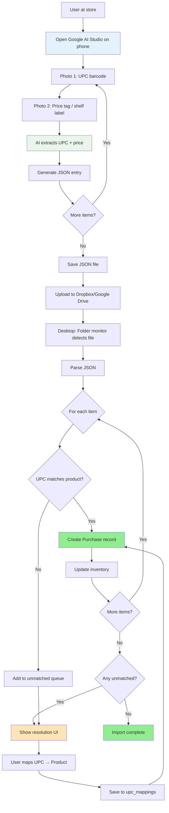
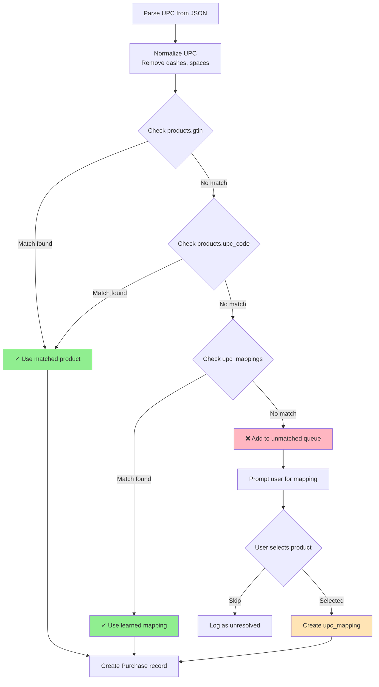
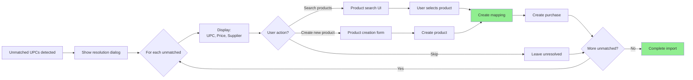

# Purchase Workflow & AI Assist Architecture Specification

**Document Version**: 1.0  
**Status**: Design Proposal  
**Date**: December 2024  
**Constitutional References**: Principles II (Data Integrity), V (Layered Architecture), VI (Schema Change Strategy), VII (Pragmatic Aspiration)

---

## Executive Summary

This specification defines a **low-friction purchase capture system** combining manual UI entry, bulk CSV import, and AI-assisted capture via Google AI Studio. The system addresses the critical usability blocker where manual price entry for 100+ items takes hours and discourages price tracking. The solution uses a **batch-oriented, file-based workflow** for Phase 2 (desktop demo), with a path to real-time sync for Phase 3 (web).

**Key Design Decisions**:
1. **Batch File Import**: AI Studio generates JSON → Desktop monitors folder → Import on detection
2. **UPC Matching**: Automatic product matching via GTIN/UPC codes with manual fallback
3. **Unmatched Resolution**: Interactive UI for mapping unknown UPCs to products
4. **Manual Entry**: Always available for items without UPCs or as fallback

---

## 1. Problem Statement

### Current State Issues

**Issue 1: Manual Price Entry is Prohibitively Tedious**
```
Scenario: User shops at Costco, buys 20 items

Current Workflow:
1. Keep physical receipt
2. Later, sit at computer
3. For each item:
   - Find product in catalog
   - Type in price
   - Type in quantity
   - Type in date
4. Total time: 30-45 minutes for 20 items

Result: User abandons price tracking after 1-2 shopping trips
```

**Issue 2: No Shopping List Generation**
```
User wants to know: "What do I need to buy for Christmas event?"

Current: No tool to generate shopping list from event plans
Result: User makes handwritten list or uses memory (incomplete, error-prone)
```

**Issue 3: No Purchase History Visibility**
```
User questions that cannot be answered:
- "When did I last buy flour?"
- "What price did I pay last time?"
- "Where did I buy the chocolate chips?"

Current: Must search through receipts or rely on memory
```

**Issue 4: Price Comparison Impossible**
```
User wants to know: "Is this a good price for butter?"

Current: No historical price data to compare
Result: Cannot make informed purchasing decisions
```

---

## 2. Proposed Solution: Multi-Channel Purchase Capture

### Architectural Overview

```
┌─────────────────────────────────────────────────────────┐
│                  PURCHASE CAPTURE                       │
├─────────────────────────────────────────────────────────┤
│                                                         │
│  Channel 1: MANUAL ENTRY (Always Available)            │
│  ┌──────────────────────────────────────────────────┐  │
│  │ Desktop UI → Purchase Form → Save to Database    │  │
│  └──────────────────────────────────────────────────┘  │
│                                                         │
│  Channel 2: CSV BULK IMPORT (Phase 2)                  │
│  ┌──────────────────────────────────────────────────┐  │
│  │ CSV File → Validate → Match Products → Import    │  │
│  └──────────────────────────────────────────────────┘  │
│                                                         │
│  Channel 3: AI-ASSISTED (Phase 2 Demo)                 │
│  ┌──────────────────────────────────────────────────┐  │
│  │ Phone (Google AI Studio)                         │  │
│  │   → Capture UPC + Price                          │  │
│  │   → Generate JSON                                │  │
│  │   → Upload to Dropbox/Google Drive              │  │
│  │                                                   │  │
│  │ Desktop (Bake Tracker)                           │  │
│  │   → Monitor folder                               │  │
│  │   → Detect JSON file                             │  │
│  │   → Match UPC → Product                          │  │
│  │   → Create Purchase records                      │  │
│  │   → Update Inventory                             │  │
│  └──────────────────────────────────────────────────┘  │
│                                                         │
└─────────────────────────────────────────────────────────┘
```

### System Components

| Component | Location | Purpose | Phase |
|-----------|----------|---------|-------|
| **Manual Entry UI** | Desktop app | Direct purchase recording | 2 (Now) |
| **CSV Import** | Desktop app | Bulk import from spreadsheet | 2 (Now) |
| **AI Capture (Phone)** | Google AI Studio | UPC + price extraction | 2 (Demo) |
| **JSON Monitor** | Desktop app | Detect AI-generated files | 2 (Demo) |
| **UPC Matcher** | Desktop app | Match UPCs to products | 2 (Now) |
| **Unmatched Resolver** | Desktop app | Manual UPC mapping UI | 2 (Now) |

---

## 3. Data Model (Minor Extensions)

### Modified Table: `products`

**Already exists with GTIN field:**
```sql
-- No changes needed - products.gtin already exists
-- products.upc_code exists for legacy support
```

### Modified Table: `purchases`

**Already exists with required fields:**
```sql
-- No changes needed - Purchase model already complete
-- Fields: product_id, supplier_id, purchase_date, unit_price, quantity_purchased
```

### New Table: `upc_mappings` (Unmatched UPC Learning)

```sql
CREATE TABLE upc_mappings (
    id INTEGER PRIMARY KEY,
    upc_code TEXT NOT NULL UNIQUE,
    product_id INTEGER NOT NULL REFERENCES products(id) ON DELETE CASCADE,
    mapped_by TEXT,  -- "user" or "ai_suggestion"
    confidence REAL,  -- 0.0-1.0 for AI suggestions
    created_at TIMESTAMP NOT NULL DEFAULT CURRENT_TIMESTAMP,
    notes TEXT
);

CREATE INDEX idx_upc_mapping_upc ON upc_mappings(upc_code);
CREATE INDEX idx_upc_mapping_product ON upc_mappings(product_id);
```

**Purpose**: 
- Learn from user corrections when UPC doesn't match
- Store UPC codes not in product catalog
- Enable future AI suggestions based on learned mappings

---

## 4. Conceptual Flow Diagrams

### Flow 1: AI-Assisted Purchase Capture (End-to-End)



### Flow 2: UPC Matching Logic (Detailed)



### Flow 3: Unmatched UPC Resolution UI



---

## 5. JSON Import Format Specification

### AI-Generated Purchase File Format

**File naming convention:** `purchases_YYYYMMDD_HHMMSS.json`  
**Location:** User's Dropbox/Google Drive sync folder

```json
{
  "version": "1.0",
  "generated_at": "2024-12-30T14:30:00Z",
  "source": "google_ai_studio",
  "supplier": {
    "name": "Costco",
    "location": "Waltham MA"
  },
  "purchases": [
    {
      "upc": "016000275539",
      "price": 5.99,
      "quantity": 2,
      "item_description": "King Arthur All-Purpose Flour 25lb",
      "confidence": 0.95,
      "notes": "On sale - regular $7.49"
    },
    {
      "upc": "028000815974",
      "price": 4.29,
      "quantity": 1,
      "item_description": "Nestle Toll House Semi-Sweet Chips",
      "confidence": 0.98
    },
    {
      "upc": "071012902504",
      "price": 12.99,
      "quantity": 1,
      "item_description": "Challenge Butter Unsalted 4lb",
      "confidence": 0.92
    }
  ]
}
```

**Field Specifications:**

| Field | Type | Required | Description |
|-------|------|----------|-------------|
| `version` | string | Yes | Format version (currently "1.0") |
| `generated_at` | ISO datetime | Yes | When AI generated the file |
| `source` | string | Yes | "google_ai_studio", "manual", "csv_import" |
| `supplier.name` | string | No | Supplier name (matched to suppliers table) |
| `supplier.location` | string | No | Store location |
| `purchases[].upc` | string | Yes | UPC/GTIN code (normalized) |
| `purchases[].price` | number | Yes | Unit price (per package) |
| `purchases[].quantity` | integer | Yes | Number of packages purchased |
| `purchases[].item_description` | string | No | AI's description (for unmatched resolution) |
| `purchases[].confidence` | number | No | AI confidence (0.0-1.0) |
| `purchases[].notes` | string | No | Additional notes (sales, etc.) |

---

## 6. Service Layer Design

### New Service: `purchase_import_service.py`

```python
def import_purchases_from_json(
    file_path: str,
    auto_create_inventory: bool = True,
    resolver: Optional[UPCResolver] = None
) -> ImportResult:
    """
    Import purchases from AI-generated or manual JSON file.
    
    Args:
        file_path: Path to JSON file
        auto_create_inventory: Automatically create inventory items
        resolver: UPC resolver for unmatched codes (if None, queue for later)
    
    Returns:
        ImportResult with:
        - success_count: Number of purchases created
        - skipped_count: Number skipped (duplicates)
        - unmatched_upcs: List of UPCs that couldn't be matched
        - errors: List of error messages
    
    Flow:
    1. Parse JSON file
    2. Validate structure and required fields
    3. Match supplier (create if auto_create enabled)
    4. For each purchase:
       a. Match UPC to product (gtin → upc_code → upc_mappings)
       b. If matched: create Purchase, optionally create InventoryItem
       c. If unmatched: add to unmatched_upcs list
    5. If unmatched_upcs and resolver provided:
       a. Call resolver for each unmatched
       b. Create upc_mapping if user maps
       c. Create purchase after mapping
    6. Return ImportResult
    """

def match_upc_to_product(upc: str) -> Optional[Product]:
    """
    Match UPC/GTIN to product.
    
    Lookup order:
    1. products.gtin (exact match)
    2. products.upc_code (legacy field, exact match)
    3. upc_mappings.upc_code (learned mappings)
    
    Args:
        upc: UPC/GTIN code (will be normalized)
    
    Returns:
        Product if matched, None otherwise
    """

def normalize_upc(upc: str) -> str:
    """
    Normalize UPC code for matching.
    
    - Remove spaces, dashes, other non-numeric characters
    - Pad to standard length (UPC-A = 12 digits, EAN-13 = 13 digits)
    - Handle check digit validation
    
    Args:
        upc: Raw UPC string
    
    Returns:
        Normalized UPC string
    """

def create_upc_mapping(
    upc: str,
    product_id: int,
    mapped_by: str = "user",
    confidence: float = 1.0,
    notes: Optional[str] = None
) -> UPCMapping:
    """
    Create or update UPC → Product mapping.
    
    Used when user manually maps an unmatched UPC to a product.
    Future imports with this UPC will auto-match.
    """

def get_unmatched_upcs(import_result: ImportResult) -> List[Dict]:
    """
    Get list of unmatched UPCs with context for resolution UI.
    
    Returns:
        List of dicts with:
        - upc: The UPC code
        - item_description: AI's description (if available)
        - price: Price from import
        - quantity: Quantity from import
        - suggested_products: List of possible matches (fuzzy search)
    """
```

### Modified Service: `purchase_service.py`

```python
def create_purchase(
    product_id: int,
    supplier_id: int,
    purchase_date: date,
    unit_price: Decimal,
    quantity_purchased: int,
    notes: Optional[str] = None,
    auto_create_inventory: bool = True
) -> Purchase:
    """
    Create purchase record and optionally create inventory item.
    
    Args:
        product_id: Product purchased
        supplier_id: Where purchased
        purchase_date: When purchased
        unit_price: Price per package
        quantity_purchased: Number of packages
        notes: Optional notes
        auto_create_inventory: If True, create InventoryItem records
    
    Returns:
        Purchase record
    """

def get_recent_purchases(
    days: int = 30,
    supplier_id: Optional[int] = None,
    product_id: Optional[int] = None
) -> List[Purchase]:
    """Get recent purchases with optional filters."""

def get_purchase_history_for_product(
    product_id: int,
    limit: int = 10
) -> List[Purchase]:
    """Get purchase history for a specific product."""
```

---

## 7. UI Design

### UI 1: Purchases Tab (Manual Entry)

```
┌─ SHOP Mode → Purchases ────────────────────────────────┐
│                                                         │
│  [+ New Purchase] [Import CSV] [Import AI JSON]        │
│                                        [Refresh]        │
│                                                         │
│  Search: [___________] Supplier: [All ▼] Date: [Last 30 days ▼] │
│                                                         │
│  ┌─ Recent Purchases ──────────────────────────────┐   │
│  │ Date       Product           Supplier  Price    │   │
│  │ ──────────  ───────────────  ────────  ──────  │   │
│  │ Dec 30     King Arthur AP    Costco    $5.99   │   │
│  │            Flour 25lb                  (×2)     │   │
│  │ Dec 28     Semi-Sweet Chips  Wegmans   $4.29   │   │
│  │ Dec 25     Unsalted Butter   Costco    $12.99  │   │
│  │ ...                                             │   │
│  └──────────────────────────────────────────────────┘   │
│                                                         │
│  Status: 15 purchases in last 30 days                  │
└─────────────────────────────────────────────────────────┘
```

**Actions:**
- **+ New Purchase**: Opens manual entry form
- **Import CSV**: Opens file picker → CSV import wizard
- **Import AI JSON**: Opens file picker → JSON import with UPC matching

---

### UI 2: Manual Purchase Entry Form

```
┌─ Add Purchase ─────────────────────────────────────────┐
│                                                         │
│  Product: [King Arthur All-Purpose Flour 25lb ▼]      │
│           (Search by name, brand, or UPC)              │
│                                                         │
│  Supplier: [Costco Waltham MA ▼]                      │
│                                                         │
│  Purchase Date: [12/30/2024]                           │
│                                                         │
│  Unit Price: [$___.__]  per package                    │
│                                                         │
│  Quantity: [___] packages                              │
│                                                         │
│  Notes: [_________________________________]             │
│         (Optional: sale info, etc.)                    │
│                                                         │
│  ☑ Add to inventory                                    │
│                                                         │
│  Total Cost: $11.98 (2 × $5.99)                        │
│                                                         │
│  [Cancel]  [Save Purchase]                             │
└─────────────────────────────────────────────────────────┘
```

---

### UI 3: JSON Import with UPC Matching

```
┌─ Import Purchases from JSON ───────────────────────────┐
│                                                         │
│  File: purchases_20241230_143000.json                  │
│  Source: Google AI Studio                              │
│  Generated: Dec 30, 2024 2:30 PM                       │
│                                                         │
│  Supplier: Costco Waltham MA                           │
│                                                         │
│  ┌─ Import Preview ─────────────────────────────────┐  │
│  │ Status  UPC            Product       Price  Qty │  │
│  │ ──────  ────────────── ───────────  ─────  ─── │  │
│  │ ✅      016000275539   King Arthur  $5.99   2  │  │
│  │                        Flour 25lb              │  │
│  │ ✅      028000815974   Nestle Chips $4.29   1  │  │
│  │ ⚠️      071012902504   (Unknown)    $12.99  1  │  │
│  │         Description: "Challenge Butter..."     │  │
│  │         [Map to Product →]                     │  │
│  └────────────────────────────────────────────────┘  │
│                                                         │
│  Summary:                                              │
│  • 2 matched automatically                             │
│  • 1 requires mapping                                  │
│                                                         │
│  [Cancel]  [Import Matched Items]  [Resolve All]      │
└─────────────────────────────────────────────────────────┘
```

**Workflow:**
- **Matched items (✅)**: Ready to import immediately
- **Unmatched items (⚠️)**: Click "Map to Product" → Opens resolution dialog
- **Import Matched Items**: Import only matched items, queue unmatched for later
- **Resolve All**: Step through each unmatched item for resolution

---

### UI 4: UPC Resolution Dialog

```
┌─ Map UPC to Product ───────────────────────────────────┐
│                                                         │
│  Unmatched UPC: 071012902504                           │
│  Description: "Challenge Butter Unsalted 4lb"          │
│  Price: $12.99 | Quantity: 1                           │
│                                                         │
│  ┌─ Suggested Matches (AI) ─────────────────────────┐  │
│  │ ○ Challenge Butter Unsalted 4lb (confidence: 92%)│  │
│  │   Supplier: Costco | Package: 4 lb | $12.99     │  │
│  │                                                   │  │
│  │ ○ Costco Kirkland Butter Unsalted 4lb (75%)     │  │
│  │   Supplier: Costco | Package: 4 lb | $11.49     │  │
│  └───────────────────────────────────────────────────┘  │
│                                                         │
│  Search Products: [butter_________________] [Search]   │
│                                                         │
│  ┌─ Search Results ──────────────────────────────────┐  │
│  │ ○ Challenge Butter Unsalted 4lb                  │  │
│  │   Ingredient: Butter | Brand: Challenge          │  │
│  │ ○ Land O'Lakes Butter Unsalted 4lb               │  │
│  │   Ingredient: Butter | Brand: Land O'Lakes       │  │
│  └───────────────────────────────────────────────────┘  │
│                                                         │
│  [+ Create New Product]                                │
│                                                         │
│  [Skip This Item]  [Map & Continue]                    │
└─────────────────────────────────────────────────────────┘
```

**Actions:**
- **Select suggested match**: Use AI confidence ranking
- **Search products**: Manual search by name/brand
- **Create New Product**: Opens product creation form (pre-filled with UPC)
- **Skip**: Leave unresolved, can map later
- **Map & Continue**: Create mapping, move to next unmatched item

---

## 8. AI Studio Integration (Phase 2 Demo)

### Google AI Studio Workflow

**User Experience (on phone):**

1. **Open AI Studio project** (pre-configured prompt)
2. **Capture item:**
   - Photo 1: UPC barcode
   - Photo 2: Price tag / shelf label
3. **AI extracts:**
   - UPC code (OCR from barcode image)
   - Price (OCR from price tag)
   - Item description (optional, from label)
4. **Generate JSON entry** (appended to session)
5. **Repeat for all items**
6. **Export JSON** (copy to clipboard or save to file)
7. **Upload to sync folder** (Dropbox, Google Drive, etc.)

**AI Studio Prompt Template:**

```
You are a shopping assistant. Extract UPC codes and prices from images.

For each item:
1. Extract UPC barcode from the barcode image
2. Extract price from the price tag or shelf label
3. Note the item description if visible
4. Output as JSON

Output format for each item:
{
  "upc": "016000275539",
  "price": 5.99,
  "quantity": 1,
  "item_description": "King Arthur All-Purpose Flour 25lb",
  "confidence": 0.95
}

Accumulate items in a JSON array. After all items captured, output:
{
  "version": "1.0",
  "generated_at": "[current timestamp]",
  "source": "google_ai_studio",
  "purchases": [
    ... (all items)
  ]
}
```

---

### Desktop Folder Monitor

**Implementation:**

```python
# src/services/purchase_monitor_service.py

def monitor_folder(
    folder_path: str,
    check_interval: int = 5,
    callback: Callable[[str], None] = None
) -> None:
    """
    Monitor folder for new JSON files.
    
    Args:
        folder_path: Path to monitored folder (e.g., Dropbox/PurchaseImports)
        check_interval: Seconds between checks (default: 5)
        callback: Function to call when file detected
    
    Flow:
    1. Watch folder for new .json files
    2. When detected:
       a. Validate JSON structure
       b. Call import_purchases_from_json()
       c. Show import results UI
       d. Move file to processed/ subfolder
    """
```

**Configuration:**

```
Settings → Import → AI Capture Settings
┌─────────────────────────────────────────────┐
│ Monitor Folder:                             │
│ [C:\Users\Kent\Dropbox\BakeTracker\Imports] │
│ [Browse...]                                 │
│                                             │
│ ☑ Enable automatic monitoring              │
│ Check every: [5___] seconds                │
│                                             │
│ ☑ Show notification when file detected     │
│ ☑ Auto-import matched items                │
│ ☐ Auto-resolve unmatched (requires setup)  │
│                                             │
│ [Save Settings]                             │
└─────────────────────────────────────────────┘
```

---

## 9. CSV Import Format (Alternative Channel)

### CSV Structure

**File format:** `purchases_YYYYMMDD.csv`

```csv
Product Name,UPC,Brand,Supplier,Purchase Date,Unit Price,Quantity,Notes
King Arthur All-Purpose Flour 25lb,016000275539,King Arthur,Costco,2024-12-30,5.99,2,On sale
Nestle Toll House Semi-Sweet Chips,028000815974,Nestle,Wegmans,2024-12-30,4.29,1,
Challenge Butter Unsalted 4lb,071012902504,Challenge,Costco,2024-12-30,12.99,1,
```

**Import Flow:**
1. User selects CSV file
2. Parser validates structure
3. For each row:
   - Match by UPC (if provided) OR by Product Name
   - If matched: create purchase
   - If unmatched: add to resolution queue
4. Show results with unmatched items

**Advantage over AI Studio**: User can prepare in spreadsheet, bulk paste from receipt scan, etc.

---

## 10. Gap Analysis

### Schema Gaps

| Gap | Current | Required | Migration Path |
|-----|---------|----------|----------------|
| UPC mappings | None | `upc_mappings` table | Create table |
| GTIN field | ✅ Exists | `products.gtin` | Already present |
| UPC field | ✅ Exists | `products.upc_code` | Already present (legacy) |

### Service Layer Gaps

| Gap | Current | Required |
|-----|---------|----------|
| JSON import | None | `import_purchases_from_json()` |
| UPC matching | None | `match_upc_to_product()` |
| UPC normalization | None | `normalize_upc()` |
| UPC mapping creation | None | `create_upc_mapping()` |
| Folder monitoring | None | `monitor_folder()` |
| CSV import | None | `import_purchases_from_csv()` |

### UI Gaps

| Gap | Current | Required |
|-----|---------|----------|
| Purchases tab | None | New tab in SHOP mode |
| Purchase entry form | None | Manual entry dialog |
| JSON import wizard | None | Import preview + matching UI |
| UPC resolution dialog | None | Interactive mapping UI |
| CSV import wizard | None | CSV preview + matching UI |
| Monitor settings | None | Configuration UI for folder monitoring |

---

## 11. Constitutional Compliance Check

### Principle II: Data Integrity & FIFO Accuracy
✅ **Compliant**: 
- Purchase records immutable (no updated_at field)
- FIFO inventory creation automatic and correct
- UPC mapping ensures consistent product attribution

### Principle V: Layered Architecture Discipline
✅ **Compliant**:
- Models: Purchase, UPCMapping (data only)
- Services: Import logic, UPC matching, folder monitoring
- UI: Entry forms, import wizards, resolution dialogs

### Principle VI: Schema Change Strategy (Desktop Phase)
✅ **Compliant**: Simple table addition (upc_mappings)
- No migration scripts needed
- Can export/reimport if needed

### Principle VII: Pragmatic Aspiration
✅ **Desktop Phase**: File-based, batch-oriented (simple, works)
✅ **Web Phase Ready**: 
- JSON format translates to API endpoints
- UPC matching logic reusable
- Folder monitor → webhook/real-time sync
⚠️ **Platform Phase**: May need mobile app for direct capture (not file-based)

---

## 12. Implementation Complexity Assessment

### Complexity Factors

| Factor | Complexity | Justification |
|--------|-----------|---------------|
| Schema changes | **Low** | Single table addition (upc_mappings) |
| JSON parsing/import | **Low** | Standard JSON parsing, straightforward validation |
| UPC matching | **Medium** | Multi-source matching, normalization logic |
| Resolution UI | **Medium-High** | Interactive dialog, product search, mapping workflow |
| Folder monitoring | **Medium** | File watching, error handling, UI notifications |
| CSV import | **Medium** | Similar to JSON but different parsing |
| AI Studio integration | **Low** | User-managed, just generates JSON (no code needed in app) |

### Estimated Effort
- Schema changes: 2 hours
- Service layer (import, matching, mappings): 12-16 hours
- Purchases tab UI: 8-10 hours
- Manual entry form: 6-8 hours
- JSON import wizard: 10-12 hours
- UPC resolution dialog: 12-16 hours
- Folder monitoring: 8-10 hours
- CSV import: 8-10 hours
- Testing: 12-16 hours
- **Total: 78-100 hours** (roughly 10-13 working days)

### Risk Mitigation
1. **Risk**: UPC matching false positives
   - **Mitigation**: Always show confidence scores, allow manual override
   
2. **Risk**: AI Studio generates malformed JSON
   - **Mitigation**: Strict validation, show parsing errors clearly
   
3. **Risk**: Folder monitoring misses files
   - **Mitigation**: Manual "Check Now" button, process existing files on startup

---

## 13. Success Criteria

### Functional Requirements
- ✅ Can manually enter purchase in <30 seconds
- ✅ Can import 20 items from AI JSON in <5 minutes (including UPC resolution)
- ✅ Can import CSV with 50+ rows successfully
- ✅ UPC matching accuracy >90% for common products
- ✅ Unmatched UPCs can be resolved interactively
- ✅ Folder monitoring detects files within 10 seconds

### User Experience Requirements
- ✅ Purchase entry faster than current manual process (30-45 min → <5 min)
- ✅ AI Studio workflow simple enough for non-technical user (Marianne)
- ✅ UPC resolution UI intuitive (can map unknown items without help)
- ✅ Purchase history easily searchable and visible

### Data Integrity Requirements
- ✅ All purchases link to correct products
- ✅ Inventory automatically updated from purchases
- ✅ No duplicate purchases from accidental re-import
- ✅ UPC mappings persist and improve matching over time

---

## 14. Phase 3 Evolution Path (Web Migration)

### From Batch to Real-Time

**Phase 2 (Desktop):**
```
Phone → AI Studio → JSON file → Dropbox → Desktop monitor → Import
```

**Phase 3 (Web):**
```
Phone → Web App API → Real-time import → Immediate feedback
```

**Changes for Web:**
- Replace folder monitoring with API endpoints
- Add authentication/authorization for API
- Real-time notifications via WebSocket
- Mobile app (Phase 3B) for direct capture

---

## 15. Related Documents

- `/docs/design/ui_mode_restructure_architecture.md` - SHOP mode (contains Purchases tab)
- `/docs/design/PHASE2_workflow_ux_redesign.md` - Phase 2 requirements
- `/.kittify/memory/constitution.md` - Architectural principles

---

## 16. Next Steps

### Immediate (Pre-Implementation)
1. **Prototype AI Studio prompt** - Test UPC/price extraction accuracy
2. **Design JSON schema validator** - Ensure robust parsing
3. **Create sample CSV template** - For user testing

### Implementation Sequence
1. Schema changes (upc_mappings table)
2. Service layer (import, matching, normalization)
3. Purchases tab (basic list view)
4. Manual entry form
5. JSON import with UPC matching
6. UPC resolution dialog
7. Folder monitoring
8. CSV import
9. User testing with Marianne (actual shopping trip)

### Critical Dependencies
- **BLOCKS**: None (independent feature)
- **BLOCKED BY**: None (can implement immediately)
- **ENHANCES**: SHOP mode (#4) - Purchases tab fits in SHOP mode structure

---

**Document Status**: Approved - Ready for implementation

**Next Session**: Deep-dive #5 Planning Workspace OR quick spec for #7 Finished Goods Inventory
