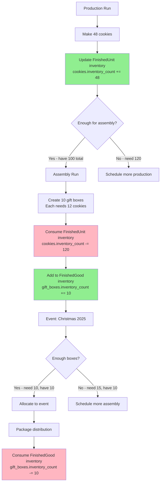

# Finished Goods Inventory Architecture Specification

**Document Version**: 1.0  
**Status**: Design Proposal  
**Date**: December 2024  
**Constitutional References**: Principles II (Data Integrity & FIFO), III (Future-Proof Schema), V (Layered Architecture)

---

## Important Note on Specification Approach

**This document contains detailed technical illustrations** including code samples, schema definitions, service method signatures, and UI mockups. These are provided as **examples and guidance**, not as prescriptive implementations.

**When using spec-kitty to implement this feature:**
- The code samples are **illustrative** - they show one possible approach
- Spec-kitty should **validate and rationalize** the technical approach during its planning phase
- Spec-kitty may **modify or replace** these examples based on:
  - Current codebase patterns and conventions
  - Better architectural approaches discovered during analysis
  - Constitution compliance verification
  - Test-driven development requirements

**The requirements and business logic are the source of truth** - the technical implementation details should be determined by spec-kitty's specification and planning phases.

---

## Executive Summary

This specification documents the **finished goods inventory architecture** for Phase 2. The data model already exists in Phase 1 with `inventory_count` fields on both `FinishedUnit` and `FinishedGood` models. Phase 2 adds service layer methods for inventory management and validation, preparing for Phase 3 UI implementation. This is an **architecture-only requirement** - no UI is planned for Phase 2.

**Key Design Decisions**:
1. **In-Memory Tracking**: Use existing `inventory_count` fields (no separate table needed for Phase 2)
2. **FIFO Not Required**: Finished goods consumed by production time, not purchase time
3. **Service Layer Focus**: Validation, availability checks, assembly feasibility
4. **Phase 3 UI**: Full inventory UI deferred to Phase 3

---

## 1. Current State

### Existing Data Model (Phase 1)

**FinishedUnit** (Individual items - cookies, truffles, cakes)
```python
class FinishedUnit:
    inventory_count: int  # ✅ Already exists
    
    def is_available(quantity: int) -> bool  # ✅ Already exists
    def update_inventory(quantity_change: int) -> bool  # ✅ Already exists
```

**FinishedGood** (Assembled packages - gift boxes, samplers)
```python
class FinishedGood:
    inventory_count: int  # ✅ Already exists
    
    def is_available(quantity: int) -> bool  # ✅ Already exists
    def update_inventory(quantity_change: int) -> bool  # ✅ Already exists
    def can_assemble(quantity: int) -> dict  # ✅ Already exists
```

### What's Missing (Phase 2)

**Service Layer:**
- Inventory queries (current stock levels, low stock alerts)
- Consumption validation (don't consume more than available)
- Assembly feasibility checks (before creating assembly runs)
- Inventory adjustment workflows (production yield, spoilage, gifts)

**UI Layer:**
- Inventory status views (deferred to Phase 3)
- Stock level management (deferred to Phase 3)
- Historical tracking (deferred to Phase 3)

---

## 2. Problem Statement

### Why This Matters

**Issue 1: No Inventory Visibility in Planning**
```
User planning Christmas event:
- Needs 50 cookies for packages
- Already has 30 cookies in finished goods inventory
- Only needs to produce 20 more

Current: No way to check existing inventory
Result: User produces 50, now has 80 (wasted effort/ingredients)
```

**Issue 2: Assembly Runs May Fail**
```
User tries to assemble 10 gift boxes:
- Each box needs 12 cookies
- Only has 100 cookies in inventory (needs 120)

Current: AssemblyRun created, then fails during consumption
Result: Orphaned records, confusion
```

**Issue 3: No Stock Level Awareness**
```
User wants to know:
- "How many cookies do I have ready?"
- "Can I fulfill this order with current inventory?"
- "What should I produce next?"

Current: No queries or reports available
```

---

## 3. Proposed Solution: Service Layer Enhancement

### Architecture (No Schema Changes)

```
┌─────────────────────────────────────────────────────────┐
│                  INVENTORY ARCHITECTURE                 │
├─────────────────────────────────────────────────────────┤
│                                                         │
│  DATA LAYER (Existing - Phase 1)                       │
│  ┌──────────────────────────────────────────────────┐  │
│  │ FinishedUnit.inventory_count (int)               │  │
│  │ FinishedGood.inventory_count (int)               │  │
│  └──────────────────────────────────────────────────┘  │
│                                                         │
│  SERVICE LAYER (New - Phase 2)                         │
│  ┌──────────────────────────────────────────────────┐  │
│  │ • get_inventory_status()                         │  │
│  │ • check_availability()                           │  │
│  │ • validate_consumption()                         │  │
│  │ • adjust_inventory()                             │  │
│  │ • get_low_stock_items()                          │  │
│  │ • get_assembly_feasibility()                     │  │
│  └──────────────────────────────────────────────────┘  │
│                                                         │
│  UI LAYER (Future - Phase 3)                           │
│  ┌──────────────────────────────────────────────────┐  │
│  │ • Inventory status dashboard                     │  │
│  │ • Stock level management                         │  │
│  │ • Low stock alerts                               │  │
│  │ • Manual adjustments                             │  │
│  └──────────────────────────────────────────────────┘  │
│                                                         │
└─────────────────────────────────────────────────────────┘
```

---

## 4. Service Layer Design (Phase 2)

### New Service: `finished_goods_inventory_service.py`

```python
# src/services/finished_goods_inventory_service.py

def get_inventory_status(
    finished_unit_id: Optional[int] = None,
    finished_good_id: Optional[int] = None,
    include_zero_stock: bool = False
) -> List[Dict]:
    """
    Get current inventory status for finished goods.
    
    Args:
        finished_unit_id: Filter by specific FinishedUnit
        finished_good_id: Filter by specific FinishedGood
        include_zero_stock: Include items with zero inventory
    
    Returns:
        List of inventory status dictionaries:
        {
            "type": "finished_unit" | "finished_good",
            "id": int,
            "slug": str,
            "display_name": str,
            "inventory_count": int,
            "unit_cost": Decimal,  # For units
            "total_cost": Decimal,  # For goods
            "inventory_value": Decimal  # count × cost
        }
    """

def check_availability(
    item_type: str,  # "finished_unit" | "finished_good"
    item_id: int,
    required_quantity: int
) -> Dict:
    """
    Check if sufficient inventory available.
    
    Returns:
        {
            "available": bool,
            "current_inventory": int,
            "required_quantity": int,
            "shortage": int  # 0 if available
        }
    """

def validate_consumption(
    item_type: str,
    item_id: int,
    quantity_to_consume: int
) -> Tuple[bool, str]:
    """
    Validate consumption before allowing operation.
    
    Returns:
        (is_valid, error_message)
        
    Examples:
        (True, "") - Consumption allowed
        (False, "Insufficient inventory: need 10, have 5")
    """

def adjust_inventory(
    item_type: str,
    item_id: int,
    quantity_change: int,
    reason: str,
    notes: Optional[str] = None
) -> Dict:
    """
    Adjust inventory with reason tracking.
    
    Args:
        item_type: "finished_unit" | "finished_good"
        item_id: ID of item
        quantity_change: Positive (add) or negative (remove)
        reason: "production", "assembly", "consumption", "spoilage", "gift", "adjustment"
        notes: Optional explanation
    
    Returns:
        {
            "previous_count": int,
            "new_count": int,
            "change": int,
            "reason": str
        }
    
    Raises:
        ValidationError: If would result in negative inventory
    """

def get_low_stock_items(
    threshold: int = 5,
    item_type: Optional[str] = None
) -> List[Dict]:
    """
    Get items with inventory below threshold.
    
    Args:
        threshold: Minimum acceptable quantity
        item_type: Filter by "finished_unit" or "finished_good"
    
    Returns:
        List of low-stock items with current counts
    """

def get_assembly_feasibility(
    finished_good_id: int,
    quantity: int
) -> Dict:
    """
    Check if assembly can be created with current inventory.
    
    This wraps FinishedGood.can_assemble() and adds service-layer validation.
    
    Returns:
        {
            "can_assemble": bool,
            "missing_components": List[Dict],
            "sufficient_components": List[Dict]
        }
    """

def get_total_inventory_value() -> Dict:
    """
    Calculate total value of all finished goods inventory.
    
    Returns:
        {
            "finished_units": {
                "count": int,
                "total_value": Decimal
            },
            "finished_goods": {
                "count": int,
                "total_value": Decimal
            },
            "grand_total": Decimal
        }
    """
```

---

## 5. Integration Points

### Integration 1: Production Run Service

**Modified: `production_run_service.py`**

```python
def create_production_run(...) -> ProductionRun:
    """
    Create production run and update finished goods inventory.
    
    Enhanced Flow:
    1. Validate recipe snapshot
    2. FIFO consume raw ingredients
    3. Record production
    4. ✨ NEW: Update FinishedUnit.inventory_count
       - Add actual_yield to inventory
       - Call finished_goods_inventory_service.adjust_inventory()
       - Reason: "production"
    5. Calculate costs
    """
```

**Example:**
```python
# After production completes
adjust_inventory(
    item_type="finished_unit",
    item_id=finished_unit.id,
    quantity_change=production_run.actual_yield,
    reason="production",
    notes=f"Production run #{production_run.id}"
)
```

---

### Integration 2: Assembly Run Service

**Modified: `assembly_run_service.py`**

```python
def create_assembly_run(...) -> AssemblyRun:
    """
    Create assembly run with inventory validation.
    
    Enhanced Flow:
    1. ✨ NEW: Check assembly feasibility
       - Call get_assembly_feasibility()
       - Abort if insufficient components
    2. Consume component inventory
       - For each component (FinishedUnit or FinishedGood):
         - Call validate_consumption()
         - Decrement inventory_count
         - Reason: "assembly"
    3. Add to assembled FinishedGood inventory
       - Increment FinishedGood.inventory_count
       - Reason: "assembly"
    4. Record assembly
    """
```

**Example:**
```python
# Before assembly
feasibility = get_assembly_feasibility(finished_good_id, quantity=10)
if not feasibility["can_assemble"]:
    raise ValidationError(f"Insufficient components: {feasibility['missing_components']}")

# During assembly (for each component)
for component in components:
    adjust_inventory(
        item_type="finished_unit",
        item_id=component.id,
        quantity_change=-component.quantity_needed,
        reason="assembly",
        notes=f"Assembly run #{assembly_run.id}"
    )

# After assembly
adjust_inventory(
    item_type="finished_good",
    item_id=finished_good.id,
    quantity_change=assembly_run.quantity,
    reason="assembly",
    notes=f"Assembly run #{assembly_run.id}"
)
```

---

### Integration 3: Event Fulfillment (Future)

**Future Service: `event_fulfillment_service.py`**

```python
def allocate_packages_to_event(event_id: int) -> Dict:
    """
    Check if event can be fulfilled with current inventory.
    
    For each package in event:
    1. Check FinishedGood.inventory_count
    2. If insufficient, check component availability
    3. Generate production/assembly plan
    
    Returns:
        {
            "can_fulfill": bool,
            "available_packages": List[Dict],
            "missing_packages": List[Dict],
            "production_needed": List[Dict]
        }
    """
```

---

## 6. Conceptual Flow Diagram

### Flow: Production → Inventory → Assembly → Event



---

## 7. Data Integrity Rules

### Rule 1: Non-Negative Inventory (Enforced)

**Database Constraint:**
```sql
CHECK (inventory_count >= 0)  -- Already exists in models
```

**Service Layer Validation:**
```python
def adjust_inventory(...):
    if item.inventory_count + quantity_change < 0:
        raise ValidationError(
            f"Insufficient inventory: attempting to consume {abs(quantity_change)}, "
            f"but only {item.inventory_count} available"
        )
```

---

### Rule 2: Consumption Precedes Production

**Validation:**
- Production adds to inventory (positive change)
- Assembly consumes components (negative change) then adds assembled goods (positive change)
- Consumption must validate availability before proceeding

**Example:**
```python
# WRONG - consume without checking
finished_unit.inventory_count -= 120  # Might go negative!

# RIGHT - validate first
is_valid, error = validate_consumption("finished_unit", finished_unit.id, 120)
if not is_valid:
    raise ValidationError(error)
adjust_inventory("finished_unit", finished_unit.id, -120, "assembly")
```

---

### Rule 3: FIFO Not Required for Finished Goods

**Rationale:**
- Raw ingredients: Purchased at different times/prices → FIFO required
- Finished goods: Cost based on production time, not purchase time
- All units of same FinishedUnit produced in same batch have same cost
- Consumption order doesn't affect cost accuracy

**Result:** Simple decrement of `inventory_count` sufficient

---

## 8. Phase 3 UI Preview (Not Implemented in Phase 2)

### Future: Inventory Status Dashboard

```
┌─ OBSERVE Mode → Inventory Status ──────────────────────┐
│                                                         │
│  Finished Units Inventory                              │
│  ┌─────────────────────────────────────────────────┐  │
│  │ Item              Count  Value    Status        │  │
│  │ ─────────────────  ─────  ──────  ────────────  │  │
│  │ Chocolate Cookies  120    $36.00  ✅ In Stock   │  │
│  │ Sugar Cookies      45     $22.50  ✅ In Stock   │  │
│  │ Gingerbread        3      $9.00   ⚠️ Low Stock  │  │
│  │ Magic Bars         0      $0.00   ❌ Out        │  │
│  └─────────────────────────────────────────────────┘  │
│                                                         │
│  Finished Goods Inventory                              │
│  ┌─────────────────────────────────────────────────┐  │
│  │ Package           Count  Value    Status        │  │
│  │ ─────────────────  ─────  ──────  ────────────  │  │
│  │ Holiday Gift Box   15     $180.00 ✅ In Stock   │  │
│  │ Cookie Sampler     8      $64.00  ⚠️ Low Stock  │  │
│  └─────────────────────────────────────────────────┘  │
│                                                         │
│  Total Inventory Value: $311.50                        │
└─────────────────────────────────────────────────────────┘
```

---

## 9. Gap Analysis

### Schema Gaps
**None** - Inventory tracking already exists in Phase 1 models

### Service Layer Gaps

| Gap | Current | Required |
|-----|---------|----------|
| Inventory queries | None | `get_inventory_status()`, `get_low_stock_items()` |
| Availability checks | Model methods only | `check_availability()`, `validate_consumption()` |
| Inventory adjustments | Direct field updates | `adjust_inventory()` with reason tracking |
| Assembly feasibility | Model method exists | Service wrapper for validation |
| Inventory value | None | `get_total_inventory_value()` |

### UI Gaps (Deferred to Phase 3)

| Gap | Current | Phase 3 |
|-----|---------|---------|
| Inventory dashboard | None | Planned |
| Stock management | None | Planned |
| Low stock alerts | None | Planned |
| Manual adjustments | None | Planned |

---

## 10. Constitutional Compliance Check

### Principle II: Data Integrity & FIFO Accuracy
✅ **Compliant**: 
- Non-negative constraints enforced
- Validation prevents overconsumption
- FIFO not required for finished goods (different costing model)

### Principle III: Future-Proof Schema
✅ **Compliant**: 
- Simple `inventory_count` field supports future enhancements
- Can add historical tracking table in Phase 3 without schema changes

### Principle V: Layered Architecture Discipline
✅ **Compliant**:
- Models: Inventory count storage (existing)
- Services: Inventory logic and validation (Phase 2)
- UI: Inventory display (Phase 3)

---

## 11. Implementation Complexity Assessment

### Complexity Factors

| Factor | Complexity | Justification |
|--------|-----------|---------------|
| Schema changes | **None** | Already exists |
| Service layer | **Low-Medium** | Straightforward queries and validation |
| Integration with production | **Low** | Simple inventory adjustments |
| Integration with assembly | **Medium** | Component validation and multi-item updates |
| Testing | **Medium** | Service layer tests, integration tests |

### Estimated Effort
- Service layer implementation: 8-12 hours
- Integration with production runs: 4-6 hours
- Integration with assembly runs: 6-8 hours
- Testing: 8-10 hours
- **Total: 26-36 hours** (roughly 3-5 working days)

---

## 12. Success Criteria

### Functional Requirements (Phase 2)
- ✅ Production runs automatically update finished unit inventory
- ✅ Assembly runs validate component availability before proceeding
- ✅ Assembly runs consume component inventory correctly
- ✅ Assembly runs add to finished good inventory
- ✅ Inventory cannot go negative (enforced)
- ✅ Can query current inventory status programmatically

### Future Requirements (Phase 3)
- ⏳ UI displays current inventory status
- ⏳ Low stock alerts visible to user
- ⏳ Manual inventory adjustments supported
- ⏳ Historical inventory tracking (optional)

---

## 13. Related Documents

- `/docs/design/recipe_redesign_architecture.md` - Production runs (integration point)
- `/docs/design/ui_mode_restructure_architecture.md` - OBSERVE mode (future UI home)
- `/docs/workflows/workflow-refactoring-spec.md` - Production workflow patterns
- `/.kittify/memory/constitution.md` - Architectural principles

---

## 14. Next Steps

### Implementation Sequence (Phase 2)
1. Create `finished_goods_inventory_service.py`
2. Implement core methods (get_inventory_status, check_availability, validate_consumption)
3. Modify `production_run_service.py` to update inventory
4. Modify `assembly_run_service.py` to validate and consume inventory
5. Write service layer tests
6. Write integration tests
7. Document API for future UI implementation

### Phase 3 Planning
1. Design inventory dashboard UI
2. Add manual adjustment workflows
3. Implement low stock alerts
4. Consider historical tracking (audit trail)

---

**Document Status**: Approved - Architecture complete, UI deferred to Phase 3

**Phase 2 Scope**: Service layer only (no UI)

**Next Requirement**: All Phase 2 architecture specs complete!
