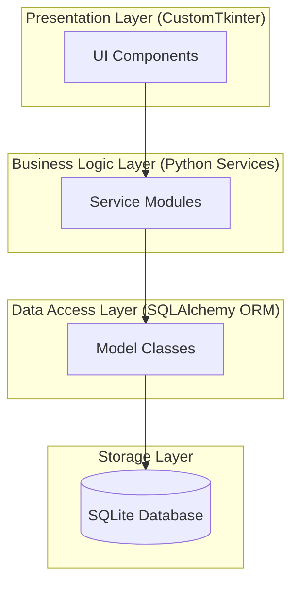
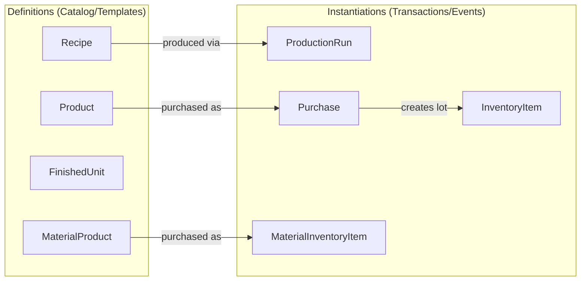
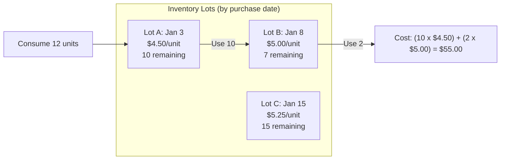
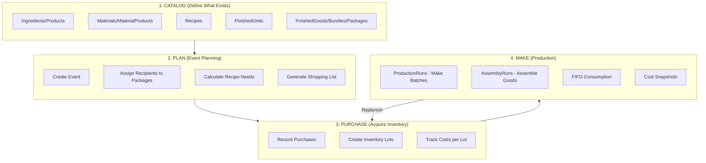
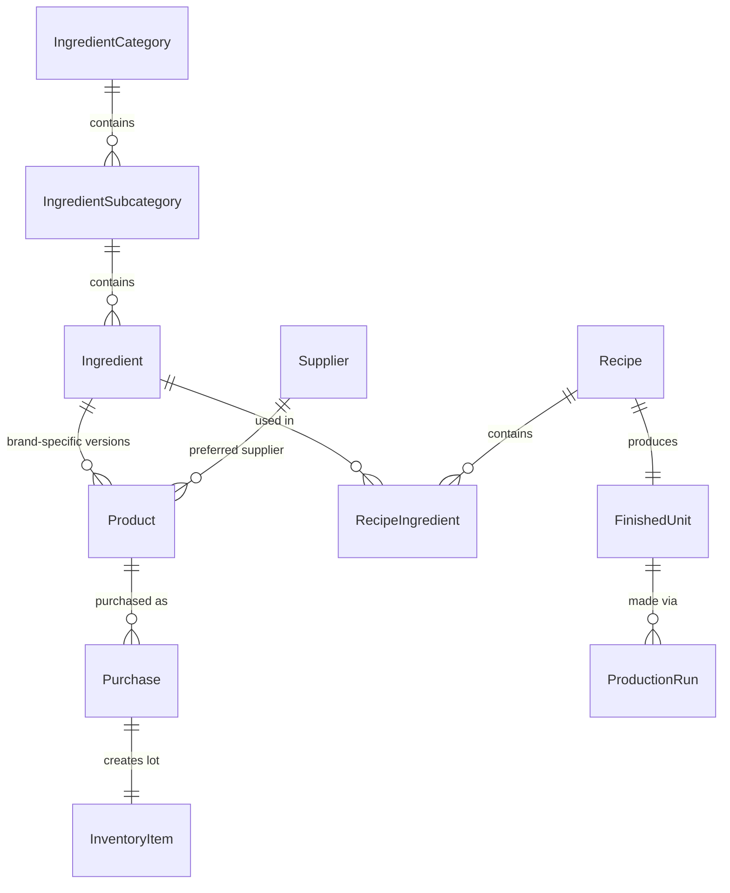
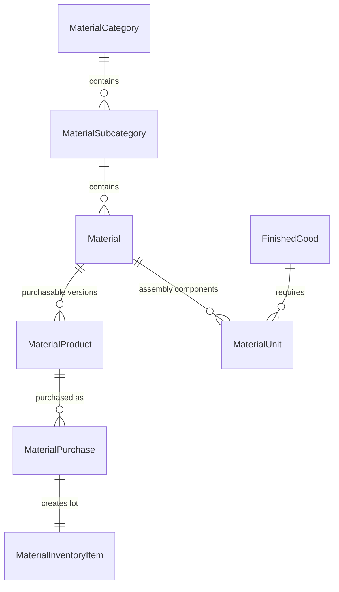
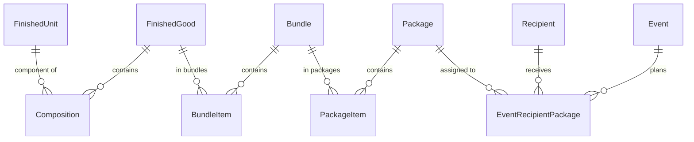
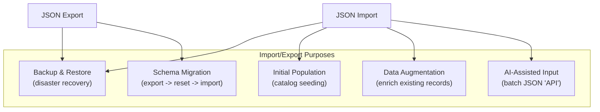
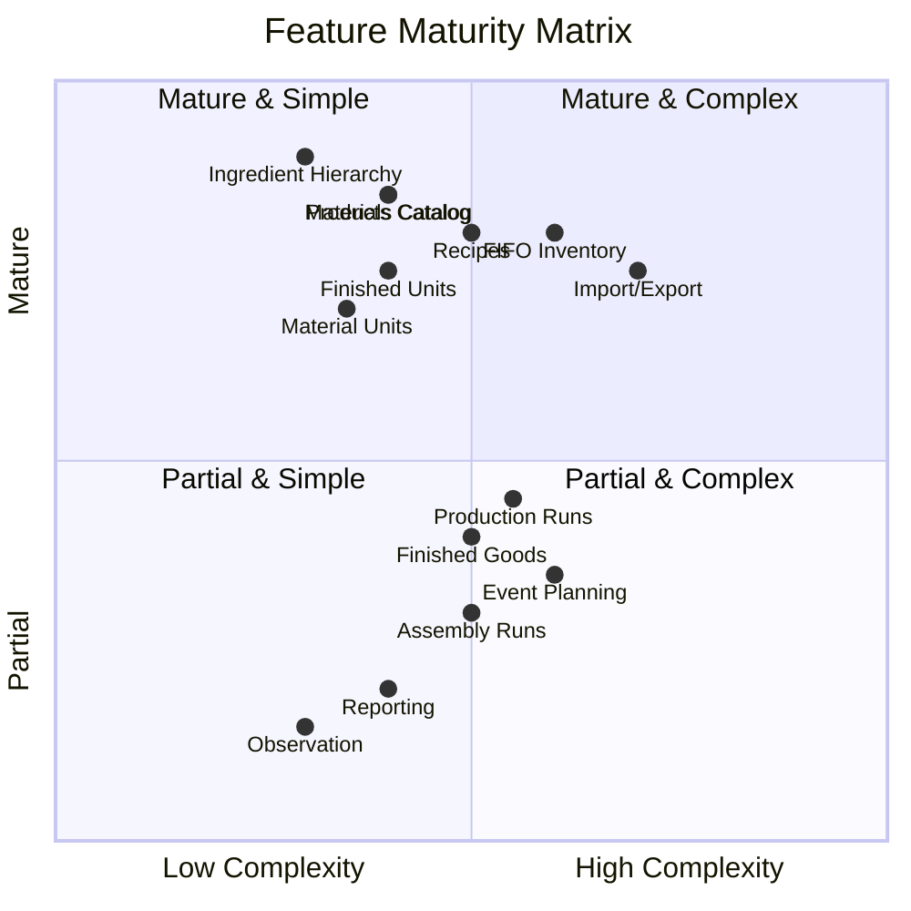
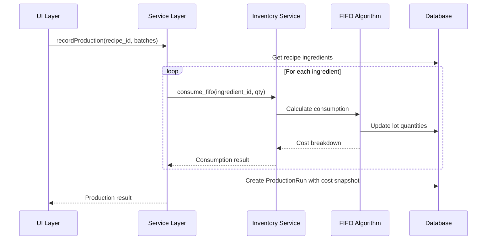

# Architecture Document

> **Document Status:** Living architecture overview
> **Last Updated:** 2026-01-19
> **Schema Version:** v0.7+ (post-F059)

## Navigation

| Document | Purpose |
|----------|---------|
| [SCHEMA.md](SCHEMA.md) | Complete entity definitions and relationships |
| [func-spec/](../func-spec/) | Feature specification documents (F0xx) |
| [Constitution](../../.kittify/memory/constitution.md) | Core architectural principles and project vision |
| [src/services/](../../src/services/) | Service layer implementation |

---

## 1. System Overview

Bake Tracker is a desktop application for managing event-based food production: inventory, recipes, finished goods, and gift package planning. Built with Python and CustomTkinter using SQLite for persistence.



### Technology Stack

| Layer | Technology | Purpose |
|-------|------------|---------|
| **UI** | CustomTkinter | Modern cross-platform desktop widgets |
| **Business Logic** | Python 3.10+ | Service layer with type hints |
| **ORM** | SQLAlchemy 2.x | Database abstraction with relationships |
| **Database** | SQLite (WAL mode) | Portable single-file storage |
| **Testing** | pytest | Unit and integration testing |

---

## 2. Key Design Principles

### 2.1 Definitions vs Instantiations

The foundational pattern separating **what can exist** from **what actually happened**.



| Aspect | Definition Objects | Instantiation Objects |
|--------|-------------------|----------------------|
| **Describes** | WHAT can exist | WHEN/WHERE/HOW it happened |
| **Temporal** | Timeless, persist indefinitely | Specific date/time/circumstances |
| **Costs** | NO stored costs | Snapshot costs at transaction time |
| **Examples** | Recipe, Product, MaterialProduct | ProductionRun, Purchase, InventoryItem |
| **Persistence** | Exists even with zero instances | Created when event occurs |

**Core Principle:** *"Costs on Instances, Not Definitions"*

A recipe doesn't have a cost - making a batch has a cost. A product doesn't have a price - a purchase has a price.

### 2.2 FIFO Inventory Consumption

First In, First Out consumption matches physical reality and enables accurate cost tracking.



### 2.3 Layered Architecture

Strict dependency flow: **UI -> Services -> Models -> Database**

- UI layer must NOT contain business logic
- Services must NOT import UI components
- Models define schema and relationships only
- Cross-layer dependencies flow downward only

---

## 3. Operational Workflow: Catalog -> Plan -> Purchase -> Make

The application supports a natural workflow mirroring physical baking operations.



### Stage Descriptions

| Stage | Purpose | Key Entities |
|-------|---------|--------------|
| **Catalog** | Define reusable templates | Ingredient, Product, Recipe, FinishedUnit, Material, MaterialProduct |
| **Plan** | Event-based production planning | Event, EventRecipientPackage, EventProductionTarget |
| **Purchase** | Acquire and track inventory | Purchase, InventoryItem, MaterialPurchase, MaterialInventoryItem |
| **Make** | Execute production | ProductionRun, AssemblyRun, consumption records |

---

## 4. Domain Model Overview

### 4.1 Food Ingredients Domain



### 4.2 Materials Domain (Non-Food)



### 4.3 Assembly & Packaging Domain



---

## 5. Import/Export System

The import/export system serves multiple critical purposes beyond simple backup/restore.

### 5.1 Purposes



| Purpose | Description | Mode |
|---------|-------------|------|
| **Backup/Restore** | Complete database backup to JSON | Full unified export/import |
| **Initial Population** | Seed catalog with ingredients, products, recipes | ADD_ONLY catalog import |
| **Data Augmentation** | Enrich existing records with additional data | AUGMENT catalog import |
| **AI-Assisted Input** | Crude JSON-based batch "API" for AI data entry | Structured JSON with validation |
| **Schema Migration** | Handle schema changes without migration scripts | Export -> Reset -> Import |

### 5.2 Import Modes

| Mode | Behavior | Use Case |
|------|----------|----------|
| **ADD_ONLY** | Create new records, skip existing | Initial catalog seeding |
| **AUGMENT** | Update NULL fields on existing records | Enrich with prices, GTINs, etc. |
| **UNIFIED** | Complete database replacement | Restore from backup |

### 5.3 AI-Assisted Data Entry Pattern

The JSON import serves as a primitive batch API enabling AI-assisted data entry:

1. User describes purchases/inventory to AI assistant
2. AI generates structured JSON matching import schema
3. User imports JSON via CLI or UI
4. Validation catches errors before database modification

This pattern is foundational for future voice/chat AI interfaces.

---

## 6. Feature Maturity Assessment

### 6.1 Maturity Levels

| Level | Description |
|-------|-------------|
| **Mature** | Feature complete, tested, stable API |
| **Functional** | Working but may need polish or edge case handling |
| **Partial** | Core functionality exists, significant gaps remain |
| **Planned** | Designed but not implemented |

### 6.2 Current State



### 6.3 Detailed Assessment

| Domain | Feature | Maturity | Notes |
|--------|---------|----------|-------|
| **Taxonomy** | Ingredient Categories/Subcategories | Mature | 3-level hierarchy, admin UI |
| **Taxonomy** | Material Categories/Subcategories | Mature | Parallel to ingredients |
| **Catalog** | Products (food ingredients) | Mature | Full CRUD, FIFO tracking |
| **Catalog** | MaterialProducts (non-food) | Mature | F047-F059 complete |
| **Catalog** | Recipes | Mature | Nested recipes, snapshots |
| **Catalog** | Finished Units (yield types) | Mature | Per-recipe yield tracking |
| **Catalog** | Material Units | Functional | Assembly material requirements |
| **Inventory** | Food FIFO | Mature | Purchase-linked lots |
| **Inventory** | Materials FIFO | Mature | F058 foundation |
| **Import/Export** | Unified export/import | Mature | v4.1 format |
| **Import/Export** | Catalog import | Mature | ADD_ONLY/AUGMENT modes |
| **Assembly** | Finished Goods | Partial | Definition exists, cost tracking incomplete |
| **Assembly** | Bundles/Packages | Partial | Structure exists, workflow incomplete |
| **Planning** | Events | Partial | Basic CRUD, targets incomplete |
| **Planning** | Shopping Lists | Functional | Needs UI polish |
| **Production** | ProductionRuns | Functional | Cost snapshots work, loss tracking partial |
| **Production** | AssemblyRuns | Partial | Missing cost snapshots (F046+ deferred) |
| **Analytics** | Reporting | Planned | No dedicated reporting |
| **Analytics** | Observation/Dashboards | Planned | Basic event dashboard only |

---

## 7. Service Layer Architecture

### 7.1 Service Organization


### 7.2 Key Service Responsibilities

| Service Group | Responsibilities |
|---------------|-----------------|
| **Catalog Services** | CRUD for definition entities, hierarchy management, validation |
| **Inventory Services** | FIFO lot management, purchase recording, availability checks |
| **Production Services** | Batch production, assembly, consumption tracking, cost snapshots |
| **Planning Services** | Event CRUD, recipient/package assignments, target calculations |
| **Import/Export Services** | JSON serialization, validation, catalog vs unified modes |
| **Infrastructure Services** | Database sessions, unit conversion, FK resolution |

### 7.3 Service Interaction Pattern



---

## 8. Technology Decisions

### 8.1 Why These Technologies?

| Choice | Rationale |
|--------|-----------|
| **CustomTkinter** | Modern appearance, cross-platform, no web dependencies |
| **SQLite** | No server setup, portable single file, excellent Python support |
| **SQLAlchemy** | ORM simplifies operations, type safety, relationship management |
| **No Migrations** | Export/reset/import simpler for single-user desktop (Constitution VI) |

### 8.2 Session Management Pattern

**Critical:** Nested `session_scope()` calls cause object detachment.

```python
# CORRECT: Pass session through call chain
def outer_function(session=None):
    if session is not None:
        return _impl(session)
    with session_scope() as sess:
        return _impl(sess)

def _impl(session):
    # All operations use same session
    obj = session.query(Model).first()
    inner_function(session=session)  # Pass session!
    obj.field = value  # Changes persist
```

---

## 9. Recommendations for Documentation Structure

### 9.1 This Document: Architecture Overview

Keep this document as the **architectural overview** covering:
- Technology stack
- Key design principles (definition/instantiation, FIFO)
- Domain model overview
- Feature maturity assessment
- Service organization

### 9.2 Recommended Child Documents

| Document | Purpose |
|----------|---------|
| `design/workflows.md` | Detailed workflow documentation (catalog->plan->purchase->make) |
| `design/import-export.md` | Complete import/export specification and formats |
| `design/services.md` | Detailed service responsibilities and APIs |
| `design/data-model.md` | Complete entity relationships and field documentation |

### 9.3 Items to Move to Child Documents

- Detailed import/export format specifications -> `import-export.md`
- Step-by-step workflow procedures -> `workflows.md`
- Service-by-service API documentation -> `services.md`
- Schema evolution history -> `SCHEMA.md` or `data-model.md`

---

## 10. Pattern Checklist for New Features

When designing new features, verify compliance with core patterns:

### Definition vs Instantiation
- [ ] Definitions have NO stored costs
- [ ] Definitions persist when instances = 0
- [ ] Instantiations capture temporal context
- [ ] Instantiations snapshot costs at transaction time

### FIFO Pattern
- [ ] Inventory consumption uses FIFO (oldest first)
- [ ] Costs link to Purchase records
- [ ] Cost snapshots captured at consumption time

### Layered Architecture
- [ ] UI contains no business logic
- [ ] Services contain no UI imports
- [ ] Models define schema only
- [ ] Session parameter pattern for composable transactions

---

**Document Status:** Living architecture overview
**Last Updated:** 2026-01-19
**Reviewed by:** Kent Gale, Claude Opus 4.5
