# Architecture Document

> **Document Status:** Living architecture overview
> **Last Updated:** 2026-02-05
> **Schema Version:** v0.7+ (post-F059, F083 CLI commands, F089-F094 service patterns)

## Navigation

| Document | Purpose |
|----------|---------|
| [SCHEMA.md](SCHEMA.md) | Complete entity definitions and relationships |
| [func-spec/](../func-spec/) | Feature specification documents (F0xx) |
| [Constitution](../../.kittify/memory/constitution.md) | Core architectural principles and project vision |
| [src/services/](../../src/services/) | Service layer implementation |
| [Section 8](<#8-service-layer-patterns--standards>) | Service patterns & standards (F089-F094) |
| [transaction_patterns_guide.md](<./transaction_patterns_guide.md>) | Comprehensive transaction patterns with examples |

---

## Vision & North Star

### Why This Architecture Exists

Bake Tracker is not just a desktop app—it's a **workflow validation platform** for a future AI-assisted SaaS product. Every architectural decision serves dual purposes: solving real problems for today's user while validating patterns that will scale to multi-user, voice/chat-driven interactions.

### Evolution Path

```
Phase 3              Phase 4-5              Phase 5-6              Phase 7-8
(Current)            (Next)                 (Web Prototype)        (North Star)
─────────────        ──────────            ───────────────        ─────────────
Desktop + SQLite  →  AI-Assisted Mobile  →  Web Prototype      →  Cloud Platform
Single User          Voice/Chat Input       Multi-User (<500)      10K+ Users
Manual Workflows     Batch JSON "API"       Core Functionality     Full Feature Set
Local Development    Multi-Developer        Tech Validation        Commercial SaaS
                                            PostgreSQL/FastAPI     Enterprise Scale
```

**Phase Descriptions:**

- **Phase 3 (Current):** Desktop application validating workflows, data structures, and business logic with real user
- **Phase 4-5:** AI-assisted mobile companion (BT Mobile) proving voice/chat input patterns and batch JSON workflows
- **Phase 5-6:** Web prototype multi-user system (<500 users) validating:
  - Core functionality parity with desktop version
  - Technology shift: SQLite → PostgreSQL, Desktop → FastAPI
  - Value proposition for broader user base
  - Multi-tenancy patterns and user management
  - Essential problems solved at small-to-medium scale
- **Phase 7-8 (North Star):** Full commercial SaaS at enterprise scale (10K+ users), complete feature set, production operations

### Design Decisions Traced to Vision

| Decision | Phase 3 (Current) | Phase 5-6 (Web Prototype) | Phase 7-8 (North Star) |
|----------|-----------------|---------------------------|----------------------|
| **Definitions vs Instantiations** | Clean separation, accurate costing | Per-user inventories with shared catalogs | Multi-tenant data isolation at scale |
| **Slug-based FKs** | Stable references in import/export | Safe cross-tenant references | Localization, global catalog federation |
| **UUID on all entities** | Unique identifiers | Multi-user conflict-free IDs | Distributed sync, microservices |
| **JSON Import/Export** | Backup, catalog seeding | Batch data migration, onboarding | API foundation, integration ecosystem |
| **FIFO with cost snapshots** | Accurate lot tracking | Reliable multi-user costing | Audit trail, analytics at scale |
| **Service layer isolation** | Testable business logic | FastAPI endpoints with zero refactor | Microservice-ready architecture |
| **Exception-based returns** | Prevents None-check bugs | Direct HTTP status code mapping | API error contracts, client SDKs |
| **Service boundary compliance** | Centralized validation | Clean REST/GraphQL API layer | Microservice boundaries defined |
| **Transaction boundaries** | Multi-step atomicity guaranteed | PostgreSQL transaction safety | Distributed transaction patterns |
| **No migration scripts** | Simple reset/re-import | Tenant provisioning from templates | Schema evolution without downtime |

### The AI-Forward Principle

> "Solve it manually first, then add AI."

Current manual workflows validate:
- Data structures that AI will populate (purchases, inventory)
- Business logic that AI will invoke (FIFO consumption, production recording)
- Validation rules that catch AI errors before database modification

The JSON import system is the proving ground—a crude batch "API" where AI generates structured data and the app validates/imports it. This pattern will evolve into real-time voice/chat interfaces.

### What This Means for Contributors

When making design decisions:

1. **Prefer patterns that scale** - Even if overkill for single-user, prefer patterns that work at multi-user scale
2. **Keep services pure** - No UI dependencies, no database assumptions that break with cloud DBs (PostgreSQL in Phase 5-6)
3. **Design for AI input** - Validation must catch malformed data; error messages must be AI-parseable
4. **Maintain export fidelity** - JSON export is the migration path; it must capture everything
5. **Web-ready by default** - Service layer patterns (F089-F094) prepare for Phase 5-6 web prototype without requiring rewrites

---

## 1. System Overview

Bake Tracker is a desktop application for managing event-based food production: inventory, recipes, finished goods, and gift package planning. Built with Python and CustomTkinter using SQLite for persistence.


### Technology Stack

| Layer | Technology | Purpose |
|-------|------------|---------|
| **UI** | CustomTkinter | Modern cross-platform desktop widgets |
| **Business Logic** | Python 3.10+ | Service layer with type hints |
| **ORM** | SQLAlchemy 2.x | Database abstraction with relationships |
| **Database** | SQLite (WAL mode) | Portable single-file storage |
| **Testing** | pytest | Unit and integration testing |

---

## 2. Key Design Principles

### 2.1 Definitions vs Instantiations

The foundational pattern separating **what can exist** from **what actually happened**.


| Aspect | Definition Objects | Instantiation Objects |
|--------|-------------------|----------------------|
| **Describes** | WHAT can exist | WHEN/WHERE/HOW it happened |
| **Temporal** | Timeless, persist indefinitely | Specific date/time/circumstances |
| **Costs** | NO stored costs | Snapshot costs at transaction time |
| **Examples** | Recipe, Product, MaterialProduct | ProductionRun, Purchase, InventoryItem |
| **Persistence** | Exists even with zero instances | Created when event occurs |

**Core Principle:** *"Costs on Instances, Not Definitions"*

A recipe doesn't have a cost - making a batch has a cost. A product doesn't have a price - a purchase has a price.

### 2.2 FIFO Inventory Consumption

First In, First Out consumption matches physical reality and enables accurate cost tracking.


### 2.3 Layered Architecture

Strict dependency flow: **UI -> Services -> Models -> Database**

- UI layer must NOT contain business logic
- Services must NOT import UI components
- Models define schema and relationships only
- Cross-layer dependencies flow downward only

---

## 3. Operational Workflow: Catalog -> Plan -> Purchase -> Make

The application supports a natural workflow mirroring physical baking operations.


### Stage Descriptions

| Stage        | Purpose                         | Key Entities                                                         |
| ------------ | ------------------------------- | -------------------------------------------------------------------- |
| **Catalog**  | Define reusable templates       | Ingredient, Product, Recipe, FinishedUnit, Material, MaterialProduct |
| **Plan**     | Event-based production planning | Event, EventRecipientPackage, EventProductionTarget                  |
| **Purchase** | Acquire and track inventory     | Purchase, InventoryItem, MaterialPurchase, MaterialInventoryItem     |
| **Make**     | Execute production              | ProductionRun, AssemblyRun, consumption records                      |

---

## 4. Domain Model Overview

### 4.1 Food Ingredients Domain


### 4.2 Materials Domain (Non-Food)


### 4.3 Assembly & Packaging Domain


---

## 5. Import/Export System

The import/export system serves multiple critical purposes beyond simple backup/restore.

### 5.1 Purposes


| Purpose | Description | Mode |
|---------|-------------|------|
| **Backup/Restore** | Complete database backup to JSON | Full unified export/import |
| **Initial Population** | Seed catalog with ingredients, products, recipes | ADD_ONLY catalog import |
| **Data Augmentation** | Enrich existing records with additional data | AUGMENT catalog import |
| **AI-Assisted Input** | Crude JSON-based batch "API" for AI data entry | Structured JSON with validation |
| **Schema Migration** | Handle schema changes without migration scripts | Export -> Reset -> Import |

### 5.2 Import Modes

| Mode | Behavior | Use Case |
|------|----------|----------|
| **ADD_ONLY** | Create new records, skip existing | Initial catalog seeding |
| **AUGMENT** | Update NULL fields on existing records | Enrich with prices, GTINs, etc. |
| **UNIFIED** | Complete database replacement | Restore from backup |

### 5.3 AI-Assisted Data Entry Pattern

The JSON import serves as a primitive batch API enabling AI-assisted data entry:

1. User describes purchases/inventory to AI assistant
2. AI generates structured JSON matching import schema
3. User imports JSON via CLI or UI
4. Validation catches errors before database modification

This pattern is foundational for future voice/chat AI interfaces.

### 5.4 CLI Transaction Import Commands (F083)

CLI commands enable headless transaction import for mobile AI workflows:

| Command | Purpose |
|---------|---------|
| `import-purchases` | Import purchase transactions from JSON |
| `import-adjustments` | Import inventory adjustments from JSON |
| `validate-import` | Validate import file without database changes |

**Key features:**
- `--dry-run`: Preview changes without database modification
- `--json`: Machine-readable output for AI pipeline integration
- `--resolve-mode strict`: Fail fast on FK resolution errors (vs lenient skip-and-continue)

These commands wrap `transaction_import_service`, keeping business logic in the service layer while providing a thin CLI interface suitable for mobile companion apps (BT Mobile) and automated pipelines.

See `spec_import_export.md` Appendix N for complete CLI documentation.

---

## 6. Feature Maturity Assessment

### 6.1 Maturity Levels

| Level | Description |
|-------|-------------|
| **Mature** | Feature complete, tested, stable API |
| **Functional** | Working but may need polish or edge case handling |
| **Partial** | Core functionality exists, significant gaps remain |
| **Planned** | Designed but not implemented |

### 6.2 Current State


### 6.3 Detailed Assessment

| Domain | Feature | Maturity | Notes |
|--------|---------|----------|-------|
| **Taxonomy** | Ingredient Categories/Subcategories | Mature | 3-level hierarchy, admin UI |
| **Taxonomy** | Material Categories/Subcategories | Mature | Parallel to ingredients |
| **Catalog** | Products (food ingredients) | Mature | Full CRUD, FIFO tracking |
| **Catalog** | MaterialProducts (non-food) | Mature | F047-F059 complete |
| **Catalog** | Recipes | Mature | Nested recipes, snapshots |
| **Catalog** | Finished Units (yield types) | Mature | Per-recipe yield tracking |
| **Catalog** | Material Units | Functional | Assembly material requirements |
| **Inventory** | Food FIFO | Mature | Purchase-linked lots |
| **Inventory** | Materials FIFO | Mature | F058 foundation |
| **Import/Export** | Unified export/import | Mature | v4.3 format |
| **Import/Export** | Catalog import | Mature | ADD_ONLY/AUGMENT modes |
| **Assembly** | Finished Goods | Partial | Definition exists, cost tracking incomplete |
| **Assembly** | Bundles/Packages | Partial | Structure exists, workflow incomplete |
| **Planning** | Events | Partial | Basic CRUD, targets incomplete |
| **Planning** | Shopping Lists | Functional | Needs UI polish |
| **Production** | ProductionRuns | Functional | Cost snapshots work, loss tracking partial |
| **Production** | AssemblyRuns | Partial | Missing cost snapshots (F046+ deferred) |
| **Analytics** | Reporting | Planned | No dedicated reporting |
| **Analytics** | Observation/Dashboards | Planned | Basic event dashboard only |

---

## 7. Service Layer Architecture

### 7.1 Service Organization


### 7.2 Key Service Responsibilities

| Service Group | Responsibilities |
|---------------|-----------------|
| **Catalog Services** | CRUD for definition entities, hierarchy management, validation |
| **Inventory Services** | FIFO lot management, purchase recording, availability checks |
| **Production Services** | Batch production, assembly, consumption tracking, cost snapshots |
| **Planning Services** | Event CRUD, recipient/package assignments, target calculations |
| **Import/Export Services** | JSON serialization, validation, catalog vs unified modes |
| **Infrastructure Services** | Database sessions, unit conversion, FK resolution |

### 7.3 Service Interaction Pattern


---

## 8. Service Layer Patterns & Standards

The service layer follows strict patterns established through F089-F094 to ensure consistency, maintainability, and web-readiness.

### 8.1 Service Boundary Principles (F092)

**Core Rule:** Services must delegate entity operations to the owning service—never query models directly from coordinating services.

```mermaid
flowchart LR
    subgraph Correct["✅ Correct Pattern"]
        CS1[Coordinating Service] -->|delegates| OS1[Owning Service]
        OS1 -->|queries| M1[Model]
    end
    
    subgraph Incorrect["❌ Anti-Pattern"]
        CS2[Coordinating Service] -.->|direct query| M2[Model]
    end
```



**Service Ownership:**
- Product operations → `product_catalog_service`
- Supplier operations → `supplier_service`
- Ingredient operations → `ingredient_service`
- Purchase operations → `purchase_service` (coordinates only)

**Example - Purchase Service (Correct):**

```python
# purchase_service coordinates but delegates entity operations
def record_purchase(purchase_data: dict, session: Session) -> Purchase:
    # ✅ Delegate to owning services
    product = product_catalog_service.get_product(
        purchase_data["product_id"], 
        session=session
    )
    supplier = supplier_service.get_or_create_supplier(
        name=purchase_data.get("store", "Unknown"),
        session=session
    )
    
    # ✅ Purchase service owns Purchase creation
    purchase = Purchase(
        product_id=product.id,
        supplier_id=supplier.id,
        # ...
    )
    session.add(purchase)
    return purchase
```

**Anti-Pattern Example:**

```python
# ❌ WRONG: Direct model queries bypass service logic
def record_purchase(purchase_data: dict, session: Session) -> Purchase:
    # ❌ Bypasses product_catalog_service validation
    product = session.query(Product).filter_by(id=product_data["product_id"]).first()
    
    # ❌ Bypasses supplier_service (no slug generation, no validation)
    supplier = session.query(Supplier).filter_by(name=store_name).first()
    if not supplier:
        supplier = Supplier(name=store_name, city="Unknown")
        session.add(supplier)
```

**Why This Matters:**
- ✅ Cross-cutting concerns applied consistently (audit, cache, provisional entities)
- ✅ Validation rules centralized in owning service
- ✅ Future enhancements (slugs, webhooks) work automatically
- ✅ Service layer remains API-ready for web migration

---

### 8.2 Exception-Based Error Handling (F089, F094)

**Core Rule:** Service functions raise domain-specific exceptions—never return `None` for not-found cases.

#### The Pattern

All `get_*` service functions that look up entities by ID, slug, or name raise exceptions instead of returning `None`.

**Correct Pattern:**

```python
def get_recipe_by_slug(slug: str, session: Optional[Session] = None) -> Recipe:
    """
    Get recipe by slug.
    
    Args:
        slug: Recipe slug
        session: Optional session for transactional composition
    
    Returns:
        Recipe object
    
    Raises:
        RecipeNotFoundBySlug: If recipe doesn't exist
    """
    with session_scope(session) as sess:
        recipe = sess.query(Recipe).filter_by(slug=slug).first()
        if not recipe:
            raise RecipeNotFoundBySlug(slug)  # ✅ Explicit error
        return recipe

# Calling code (forced to handle error)
try:
    recipe = get_recipe_by_slug("chocolate-cake")
    print(recipe.display_name)  # ✅ Safe - can't be None
except RecipeNotFoundBySlug as e:
    show_error(f"Recipe '{e.slug}' not found")
```

**Anti-Pattern:**

```python
# ❌ WRONG: Returns None (caller must remember to check)
def get_recipe_by_slug(slug: str) -> Optional[Recipe]:
    """Get recipe by slug."""
    with session_scope() as session:
        return session.query(Recipe).filter_by(slug=slug).first()

# Calling code (easy to forget None check!)
recipe = get_recipe_by_slug("chocolate-cake")
print(recipe.display_name)  # 🐛 AttributeError if None!
```

#### Exception Naming Convention

Pattern: `{Entity}NotFoundBy{LookupField}`

Examples:
- `RecipeNotFoundBySlug` - Recipe lookup by slug
- `RecipeNotFoundByName` - Recipe lookup by name
- `EventNotFoundById` - Event lookup by ID
- `IngredientNotFoundBySlug` - Ingredient lookup by slug

#### Three-Tier Exception Strategy

**Service Layer:**
- Raises domain exceptions with technical details
- Includes full operation context (entity IDs, slugs, attempted operation)
- No user-facing message concerns

**UI Layer:**
- Catches specific exception types
- Uses centralized error handler for user messages (see F089)
- Logs technical details for debugging

**Unexpected Errors:**
- Generic `Exception` catch as last resort
- Always logs full stack trace
- Shows generic "contact support" message

#### Validation Pattern

**Core Rule:** Validation functions raise `ValidationError`—never return tuples like `(bool, List[str])`.

**Correct Pattern:**

```python
def validate_required_string(value: Optional[str], field_name: str = "Field") -> None:
    """
    Validate that a string is not empty.
    
    Raises:
        ValidationError: If value is empty or whitespace
    """
    if not value or not value.strip():
        raise ValidationError([f"{field_name} is required"])

# Calling code (simpler, clearer)
try:
    validate_required_string(name, "Name")
    validate_required_string(category, "Category")
    # All validations passed
except ValidationError as e:
    show_errors(e.errors)  # List of error messages
```

#### Services Updated (F094)

The following services fully implement exception-based patterns:

**Core Services:**
- `ingredient_service.py`, `recipe_service.py`, `event_service.py`
- `package_service.py`, `finished_good_service.py`, `finished_unit_service.py`

**Secondary Services:**
- `composition_service.py`, `supplier_service.py`, `recipient_service.py`
- `unit_service.py`, `material_catalog_service.py`

**Validators:**
- `utils/validators.py`, `unit_converter.py`, `material_unit_converter.py`

See `src/services/exceptions.py` for the complete exception hierarchy.

---

### 8.3 Transaction Boundaries & Session Management (F091)

**Critical:** Nested `session_scope()` calls cause SQLAlchemy objects to become detached, resulting in silent data loss.

#### Session Composition Pattern

**Core Rule:** Service functions accept optional `session` parameter to enable transactional composition.

```python
def service_operation(
    ...,
    session: Optional[Session] = None
) -> ReturnType:
    """
    [Function description]
    
    Transaction boundary: [ALL operations in single session (atomic) | 
                          Single operation (atomic) | 
                          Read-only (no transaction)]
    
    Args:
        ...: Operation parameters
        session: Optional session for transactional composition
    
    Returns:
        ReturnType
    
    Raises:
        DomainException: Error conditions
    """
    def _impl(sess: Session) -> ReturnType:
        # Implementation uses sess throughout
        entity = sess.query(Model).first()
        other_service_operation(session=sess)  # ✅ Pass session
        return result
    
    if session is not None:
        return _impl(session)
    with session_scope() as sess:
        return _impl(sess)
```

#### Three Transaction Patterns

**Pattern A: Read-Only Operation**

```python
"""
Transaction boundary: Read-only, no transaction needed.
Safe to call without session - uses temporary session for query.
"""
```

**Pattern B: Single-Step Write**

```python
"""
Transaction boundary: Single operation, automatically atomic.
If session provided, caller controls transaction commit/rollback.
If session not provided, uses session_scope() (auto-commit on success).
"""
```

**Pattern C: Multi-Step Atomic Operation**

```python
"""
Transaction boundary: ALL operations in single session (atomic).
Atomicity guarantee: Either ALL steps succeed OR entire operation rolls back.
Steps executed atomically:
1. Validate product exists (delegates to product_catalog_service)
2. Get or create supplier (delegates to supplier_service)
3. Create purchase record
4. Update inventory

CRITICAL: All nested service calls receive session parameter to ensure
atomicity. Never create new session_scope() within this function.
"""
```

#### Anti-Pattern: Nested session_scope()

```python
# ❌ WRONG: Nested session_scope causes detachment
def outer_function():
    with session_scope() as session:
        obj = session.query(Model).first()
        inner_function()  # Creates new session_scope!
        obj.field = value  # THIS CHANGE IS SILENTLY LOST
```

#### Correct Pattern: Pass Session

```python
# ✅ CORRECT: Pass session through call chain
def outer_function():
    with session_scope() as session:
        obj = session.query(Model).first()
        inner_function(session=session)  # Pass session
        obj.field = value  # This change persists correctly
```

#### Rules for Service Functions

1. **Multi-step operations MUST share a session** - If a function queries an object, calls other services, then modifies the object, all operations must use the same session.

2. **Service functions that may be called from other services MUST accept `session=None`** - This allows callers to pass their session for transactional atomicity.

3. **When calling another service function within a transaction, ALWAYS pass the session** - Even if the called function works without it, passing the session ensures objects remain tracked.

4. **Never return ORM objects from `session_scope()` if they'll be modified later** - Objects become detached when the scope exits. Return IDs or DTOs instead, or keep operations within the same session.

**Reference:** See `docs/design/transaction_patterns_guide.md` for comprehensive examples and common pitfalls.

---

### 8.4 API Consistency Standards (F094)

**Core Rule:** All public service functions follow consistent signature and return patterns.

#### Type Hints (Required)

All public service functions MUST have complete type hints:

```python
from typing import Optional, List, Dict, Any
from sqlalchemy.orm import Session

def create_ingredient(
    ingredient_data: Dict[str, Any],
    session: Optional[Session] = None
) -> Ingredient:
    """Create ingredient from data."""
    # ...

def list_recipes(
    category: Optional[str] = None,
    name_search: Optional[str] = None,
    session: Optional[Session] = None
) -> List[Recipe]:
    """Get all recipes with optional filters."""
    # ...
```

#### Return Type Standards

**Never return `None` for not-found:**
```python
# ✅ CORRECT: Return type is Ingredient (not Optional)
def get_ingredient(slug: str) -> Ingredient:
    # Raises IngredientNotFoundBySlug if not found
    pass

# ❌ WRONG: Returns Optional[Ingredient]
def get_ingredient(slug: str) -> Optional[Ingredient]:
    return None  # Caller must remember to check
```

**Never return tuples for validation:**
```python
# ✅ CORRECT: Raises ValidationError
def validate_data(data: dict) -> None:
    if errors:
        raise ValidationError(errors)

# ❌ WRONG: Returns (bool, List[str])
def validate_data(data: dict) -> Tuple[bool, List[str]]:
    return is_valid, errors
```

#### Common Type Patterns

```python
# ORM objects
def get_item(id: int) -> Item: ...

# Lists of objects
def list_items() -> List[Item]: ...

# Optional parameters
def search(query: Optional[str] = None) -> List[Item]: ...

# Session parameter (always optional)
def operation(..., session: Optional[Session] = None) -> Item: ...

# Dictionary data
def create_item(data: Dict[str, Any]) -> Item: ...
```

---

### 8.5 Pagination Foundation (F093)

**Status:** DTOs available, service adoption deferred to Phase 5-6 (web prototype).

#### DTOs Available

- `PaginationParams`: Page number and items per page
- `PaginatedResult[T]`: Generic result container with metadata

Located in: `src/services/dto.py`

#### Optional Pagination Pattern (Future Service Adoption)

When adding pagination to a service function:

```python
from src.services.dto import PaginationParams, PaginatedResult

def list_items(
    filter: Optional[ItemFilter] = None,
    pagination: Optional[PaginationParams] = None,  # Optional!
    session: Optional[Session] = None
) -> PaginatedResult[Item]:
    """
    List items with optional pagination.
    
    Desktop usage: pagination=None returns all items (current behavior)
    Web usage: pagination=PaginationParams(...) returns one page
    """
    def _impl(sess: Session) -> PaginatedResult[Item]:
        query = sess.query(Item)
        
        # Apply filters...
        total = query.count()
        
        # Apply pagination (if provided)
        if pagination:
            items = query.offset(pagination.offset()).limit(pagination.per_page).all()
            page, per_page = pagination.page, pagination.per_page
        else:
            items = query.all()
            page, per_page = 1, total or 1
        
        return PaginatedResult(items=items, total=total, page=page, per_page=per_page)
    
    if session is not None:
        return _impl(session)
    with session_scope() as sess:
        return _impl(sess)
```

#### Desktop vs Web Usage

**Desktop (current pattern unchanged):**
```python
result = list_ingredients(filter=IngredientFilter(category="baking"))
all_items = result.items  # All ingredients
```

**Web (future FastAPI):**
```python
@app.get("/api/ingredients")
def get_ingredients(page: int = 1, per_page: int = 50):
    result = list_ingredients(
        pagination=PaginationParams(page=page, per_page=per_page)
    )
    return {
        "items": [serialize(i) for i in result.items],
        "total": result.total,
        "page": result.page,
        "pages": result.pages,
        "has_next": result.has_next
    }
```

**When to Adopt:**
- **New services**: Use pagination from the start
- **Existing services**: Adopt incrementally during refactoring
- **Desktop UI**: No changes needed (pagination=None)
- **Phase 5-6 (Web Prototype)**: See `web-prep/F003` for comprehensive adoption plan

---

## 9. Technology Decisions

### 9.1 Why These Technologies?

| Choice | Rationale |
|--------|-----------|
| **CustomTkinter** | Modern appearance, cross-platform, no web dependencies |
| **SQLite** | No server setup, portable single file, excellent Python support |
| **SQLAlchemy** | ORM simplifies operations, type safety, relationship management |
| **No Migrations** | Export/reset/import simpler for single-user desktop (Constitution VI) |

### 9.2 Pattern Evolution (F089-F094)

Recent architectural work (December 2025 - February 2026) established consistent patterns across the service layer:

- **Exception-based returns** (F089, F094) - See Section 8.2
- **Service boundary compliance** (F092) - See Section 8.1
- **Transaction boundaries** (F091) - See Section 8.3
- **API consistency standards** (F094) - See Section 8.4
- **Pagination foundation** (F093) - See Section 8.5

These patterns solve immediate desktop needs while preparing for Phase 5-6 (web prototype). See Section 8 for comprehensive documentation.

---

## 10. Recommendations for Documentation Structure

### 10.1 This Document: Architecture Overview

Keep this document as the **architectural overview** covering:
- Technology stack
- Key design principles (definition/instantiation, FIFO)
- Domain model overview
- Feature maturity assessment
- Service organization
- Service layer patterns & standards (Section 8)

### 10.2 Recommended Child Documents

| Document | Purpose |
|----------|---------|
| `design/workflows.md` | Detailed workflow documentation (catalog->plan->purchase->make) |
| `design/import-export.md` | Complete import/export specification and formats |
| `design/transaction_patterns_guide.md` | Comprehensive transaction patterns with examples (exists) |
| `design/service_patterns.md` | Detailed service layer pattern catalog (future) |
| `design/data-model.md` | Complete entity relationships and field documentation |

### 10.3 Items to Move to Child Documents

- Detailed import/export format specifications → `import-export.md`
- Step-by-step workflow procedures → `workflows.md`
- Comprehensive service pattern examples → `service_patterns.md` (future)
- Schema evolution history → `SCHEMA.md` or `data-model.md`

---

## 11. Pattern Checklist for New Features

When designing new features, verify compliance with core patterns:

### Definition vs Instantiation
- [ ] Definitions have NO stored costs
- [ ] Definitions persist when instances = 0
- [ ] Instantiations capture temporal context
- [ ] Instantiations snapshot costs at transaction time

### FIFO Pattern
- [ ] Inventory consumption uses FIFO (oldest first)
- [ ] Costs link to Purchase records
- [ ] Cost snapshots captured at consumption time

### Layered Architecture
- [ ] UI contains no business logic
- [ ] Services contain no UI imports
- [ ] Models define schema only
- [ ] Cross-layer dependencies flow downward only

### Service Layer Patterns (Section 8)
- [ ] **Exception-based returns**: No `None` returns for not-found, no tuple returns for validation
- [ ] **Service boundaries**: Delegates to owning services (no direct model queries in coordinators)
- [ ] **Transaction boundaries**: Documented in docstring with atomicity guarantee
- [ ] **Session composition**: Accepts `session=None` parameter, passes to nested calls
- [ ] **Complete type hints**: Parameters and return types fully annotated
- [ ] **Domain exceptions**: Raises specific exceptions (`EntityNotFoundByField`)

### Code Quality
- [ ] Functions follow naming convention: `{Entity}NotFoundBy{LookupField}`
- [ ] Multi-step operations document steps executed atomically
- [ ] Service delegation preserves cross-cutting concerns
- [ ] Type hints enable IDE autocomplete and early error detection

---

**Document Status:** Living architecture overview
**Last Updated:** 2026-02-05
**Reviewed by:** Kent Gale, Claude Sonnet 4.5
