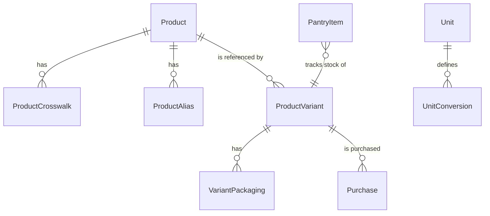

---
id: docs/specs/ingredient_data_model_spec
doc_type: spec
title: Ingredient & Product Data Model — Initial Implementation Spec
status: draft
level: L2
owners: ["Kent Gale"]
last_validated: 2025-11-06
---

# Goals

- Model **generic ingredients** separately from **branded/packaged products** to support recipes, pantry, and purchasing.
- Adopt identifiers that align with industry/regulatory standards.
- Ship a **stable schema** with future‑ready fields we may not populate immediately.

# Scope (Phase 1)

- Baking‑focused subset (flours, sugars, fats, leaveners, spices, chocolates, dairy, nuts, fruits) + common packaging.
- Read‑only crosswalks to FoodOn/FDC; optional enrichment from OFF. GTIN optional.

# Entity Overview


# Entities & Fields

## Product  (generic ingredient — *what it is*)
| Field | Type | Req | Notes / Source |
|---|---|---|---|
| id | uuid | ✓ | Internal primary key |
| name | text | ✓ | Canonical display name (e.g., “All‑purpose flour”) |
| slug | text unique | ✓ | Lowercase, underscores |
| foodon_id | text | ◇ | Primary external ID (e.g., FOODON:03309942) |
| foodex2_code | text | ◇ | Optional regulator crosswalk |
| langual_terms | text[] | ◇ | Facet codes (optional) |
| fdc_ids | text[] | ◇ | USDA FDC IDs (Foundation/SR Legacy) |
| default_recipe_unit | text | ✓ | e.g., gram |
| density_g_per_ml | numeric | ◇ | For volume↔mass conversions (if known) |
| moisture_pct | numeric | ◇ | For advanced baking/calculations (future) |
| allergens | text[] | ◇ | e.g., ["gluten","tree_nut"] (future) |
| created_at/updated_at | timestamptz | ✓ | |

**Indexes:** (slug unique), (foodon_id), GIN on langual_terms.

## ProductAlias  (synonyms & multilingual)
| Field | Type | Req | Notes |
|---|---|---|---|
| id | uuid | ✓ | |
| product_id | uuid fk→Product.id | ✓ | |
| alias | text | ✓ | e.g., “AP flour”, “plain flour” |
| locale | text | ◇ | e.g., en-US, en-GB |

## ProductCrosswalk  (external identifiers)
| Field | Type | Req | Notes |
|---|---|---|---|
| id | uuid | ✓ | |
| product_id | uuid fk→Product.id | ✓ | |
| system | text | ✓ | e.g., FOODON, FDC, FOODEx2, OFF |
| code | text | ✓ | External code/ID |
| meta | jsonb | ◇ | Freeform extras |

## ProductVariant  (commercial/branded — *who/pack/how*)
| Field | Type | Req | Notes / Source |
|---|---|---|---|
| id | uuid | ✓ | |
| product_id | uuid fk→Product.id | ✓ | Links variant to generic ingredient |
| gtin | text unique | ◇ | GS1 GTIN (may be null initially) |
| brand_name | text | ◇ | |
| brand_owner | text | ◇ | |
| gpc_brick_code | text | ◇ | GS1 category |
| net_content_value | numeric | ◇ | From label/GDSN |
| net_content_uom | text | ◇ | e.g., g, kg, ml, L, oz |
| country_of_sale | text | ◇ | ISO code |
| off_id | text | ◇ | Open Food Facts code (optional) |
| notes | text | ◇ | Free text |
| created_at/updated_at | timestamptz | ✓ | |

## VariantPackaging  (packaging detail per variant & level)
| Field | Type | Req | Notes |
|---|---|---|---|
| id | uuid | ✓ | |
| product_variant_id | uuid fk→ProductVariant.id | ✓ | |
| packaging_level | text | ✓ | each \| inner \| case \| pallet |
| packaging_type_code | text | ◇ | GS1 code |
| packaging_material_code | text | ◇ | GS1 code |
| qty_of_next_lower_level | integer | ◇ | e.g., 12 each per case |
| dimensions_l_w_h_uom | jsonb | ◇ | {l,w,h,uom} |
| gross_weight_value_uom | jsonb | ◇ | {value,uom} |

## PantryItem  (current stock on hand)
| Field | Type | Req | Notes |
|---|---|---|---|
| id | uuid | ✓ | |
| product_variant_id | uuid fk→ProductVariant.id | ✓ | |
| location | text | ◇ | “Kitchen/Pantry shelf 2” |
| qty_on_hand | numeric | ✓ | |
| qty_uom | text | ✓ | |
| lot_or_batch | text | ◇ | |
| best_by | date | ◇ | |
| opened_at | timestamptz | ◇ | |
| created_at/updated_at | timestamptz | ✓ | |

## Purchase  (price history & FIFO support)
| Field | Type | Req | Notes |
|---|---|---|---|
| id | uuid | ✓ | |
| product_variant_id | uuid fk→ProductVariant.id | ✓ | |
| purchased_at | timestamptz | ✓ | |
| retailer | text | ◇ | |
| unit_price | numeric | ✓ | price per `purchase_uom` |
| purchase_qty | numeric | ✓ | |
| purchase_uom | text | ✓ | |
| notes | text | ◇ | |

## Unit / UnitConversion  (shared services)
**Unit**(code pk, description)  
**UnitConversion**(from_unit, to_unit, factor, method, notes) — mass/volume conversions; allow product‑specific overrides via `density_g_per_ml` on Product.

# Relationships & Rules

- A **Product** can map to many **ProductVariants** (1→N).  
- A **ProductVariant** can have many **VariantPackaging** rows (1 per packaging level).  
- **PantryItem** references **ProductVariant**; **Purchase** logs costs for FIFO and analytics.  
- **ProductCrosswalk** supports multiple external IDs per Product.  
- **ProductAlias** supports synonyms/multilingual names for UX.

# Minimal Required Fields (Phase 1)

- **Product:** name, slug, default_recipe_unit (optional: foodon_id, fdc_ids)
- **ProductVariant:** product_id (link), brand_name (optional: gtin, net_content_*)
- **PantryItem:** product_variant_id, qty_on_hand, qty_uom
- **Purchase:** product_variant_id, purchased_at, unit_price, purchase_qty, purchase_uom

# Future Fields Reserved (Do not populate yet)

- Product: allergens, moisture_pct; ProductVariant: gpc_brick_code, country_of_sale; VariantPackaging: GS1 codes & case/pallet; Crosswalks to UNSPSC, FDA 21 CFR 170.3.

# Validation & Constraints

- Enforce **slug** pattern `[a-z0-9_]+`.  
- Unique: Product.slug, ProductVariant.gtin (when not null).  
- If `gtin` present, validate checksum (GS1).  
- If `net_content_value` present, `net_content_uom` required.  
- `VariantPackaging.packaging_level` ∈ {each, inner, case, pallet}.

# Example Records (JSON)

```json
{
  "product": {
    "id": "uuid-1",
    "name": "All-purpose flour",
    "slug": "all_purpose_flour",
    "foodon_id": "FOODON:03309942",
    "fdc_ids": ["20129"],
    "default_recipe_unit": "gram"
  },
  "product_variant": {
    "id": "uuid-2",
    "product_id": "uuid-1",
    "brand_name": "King Arthur",
    "gtin": null,
    "net_content_value": 2268,
    "net_content_uom": "g"
  },
  "pantry_item": {
    "id": "uuid-3",
    "product_variant_id": "uuid-2",
    "qty_on_hand": 1800,
    "qty_uom": "g",
    "location": "Kitchen/Pantry"
  }
}
```

# Migration Plan

1. Create tables and constraints per the above.
2. Seed **Unit** and **UnitConversion** with mass/volume basics.
3. Load a curated **Product** set (baking staples) with slugs; link a subset to FDC.
4. Allow manual **ProductVariant** creation without GTIN; attach purchases/pantry entries.
5. Add ingestion jobs later for FoodOn/FDC/GS1/OFF; schema stays unchanged.

# Non‑Goals (Phase 1)

- Full GS1/GDSN ingestion; multi‑locale labeling; full LanguaL coverage; full FoodEx2 mapping; allergen computation; vendor GLNs.
