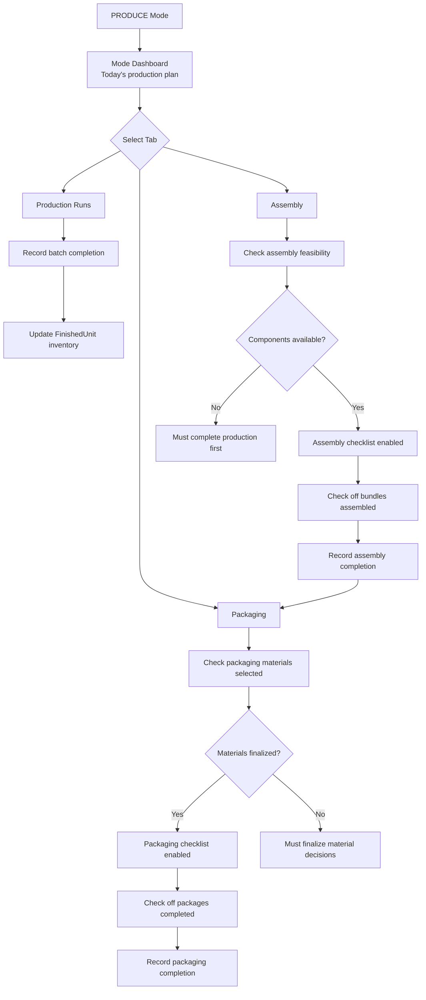

# F038 UI Mode Restructure - Alignment Issues with req_planning.md

**Date:** 2026-01-05
**Analysis:** Comparing F038 vs req_planning.md requirements

---

## Critical Misalignments Found

### Issue 1: Assembly and Packaging Both Phase 2 (Not "Future")

**In req_planning.md:**
```
7. ASSEMBLY FEASIBILITY & COMPLETION
   ✅ Have 336 cookies (need 300)
   ✅ Have 168 brownies (need 150)
   ✅ Can assemble 50 gift bags
   [ ] Checklist: 50 gift bags assembled
   [ ] Checklist: 50 gift bags packaged
```

**Planning workflow explicitly includes:**
```
Event → Finished Goods → Recipes → Inventory → Purchasing → 
Production → Assembly → Packaging → Delivery
```

**Complete use case (Christmas packages):**
1. Plan: "50 gift bags needed (6 cookies + 3 brownies each)"
2. Shop & Produce: Make batches
3. **Assembly:** Combine FinishedUnits into Bundles (functional grouping)
4. **Packaging:** Put Bundles into physical containers with materials (aesthetic presentation)
5. Deliver

**In F038 PRODUCE Mode (Section 5, Mode 4):**
```
**Tabs within PRODUCE:**
- **Production Runs**: Batch production (existing Production Dashboard tab)
- **Assembly**: Finished goods assembly (future)
- **Packaging**: Final packaging for events (future)
```

**Problem:** Both Assembly AND Packaging marked "future" but req_planning.md makes it clear that:
1. Assembly feasibility is CRITICAL Phase 2 requirement (REQ-PLAN-031 through REQ-PLAN-037)
2. Assembly completion checklist is Phase 2 minimal (REQ-PLAN-034)
3. **Packaging execution is Phase 2** (completes the full use case cycle)
4. Bundle assembly + packaging = THE OUTPUT of the planning workflow

**What F026 "Deferred Packaging" Actually Means:**
- **NOT:** "Packaging is Phase 3"
- **INSTEAD:** "Packaging material PLANNING can be deferred within Phase 2"
- Material decisions can happen anytime between initial planning and assembly time
- Material decisions MUST be finalized by assembly time
- Packaging EXECUTION (putting bundles in materials) is Phase 2

**Impact:** F038 doesn't recognize that both assembly and packaging are Phase 2 critical workflows.

---

### Issue 2: Bundle Concept Not Represented in Mode Structure

**In req_planning.md (Section 3.1):**
```
**Event Planning:**
- ✅ Define event requirements (output mode, finished goods, quantities)
- ✅ Support multiple output modes (BULK_COUNT, BUNDLED)

Output modes:
- BULK_COUNT: List of {finished_unit_id, quantity}
- BUNDLED: List of {bundle_id, quantity}
```

**Use Case 4.3: Bundle Event Planning**
```
Event: "Christmas Client Gifts"
Output Mode: BUNDLED
Requirements:
  - 50 Holiday Gift Bags (Bundle)
    - Each contains: 6 cookies, 3 brownies
```

**In F038 (Section 2, Conceptual Model):**
```
NEW (Workflow-Centric):
├─ CATALOG (Define Things)
│  ├─ Ingredients
│  ├─ Products  
│  ├─ Recipes
│  ├─ Finished Units
│  └─ Packages              ← Only mentions "packages"
```

**Problem:** F038 uses "Packages" terminology but planning requirements use "Bundle" as the primary concept:
- Bundle = assembly of FinishedUnits (e.g., gift bag with 6 cookies + 3 brownies)
- Package = aesthetic container (deferred in F026)

**In F038 Section 5, Mode 1 CATALOG:**
```
**Tabs within CATALOG:**
- Packages: Package definitions (gift boxes, trays, etc.)
```

**This is wrong based on requirements:**
- Packages (F026) = deferred aesthetic decisions (boxes, ribbons, etc.)
- Bundles = functional assembly definitions needed for planning

**Impact:** F038 conflates Bundles (critical) with Packages (deferred), missing the core planning concept.

---

### Issue 3: Assembly and Packaging Flow Missing from Conceptual Flow Diagrams

**In req_planning.md (Section 2.1):**
```
6. PRODUCTION EXECUTION
   Make 7 batches cookies (336 produced, 36 extra)
   Make 7 batches brownies (168 produced, 18 extra)
                ↓
7. ASSEMBLY FEASIBILITY & COMPLETION
   ✅ Can assemble 50 gift bags
   [ ] Checklist: 50 gift bags assembled
   [ ] Checklist: 50 gift bags packaged
   Ready for delivery
```

**In F038 Section 4, Flow 1:**
```mermaid
B -->|Start baking| F[PRODUCE Mode]
F --> F1[Make batches<br/>Production days]
```

**Problem:** Flow diagram shows production but doesn't show assembly and packaging steps that follow.

**In F038 Section 4, Flow 2 (Within-Mode Navigation):**
- Shows CATALOG mode internal flow
- Doesn't show PRODUCE mode flow including assembly + packaging

**Impact:** Users won't understand the complete workflow: Production → Assembly → Packaging → Delivery.

---

### Issue 4: PLAN Mode Missing Planning Workspace Details

**In req_planning.md:**
Planning Workspace is THE critical feature - automatic batch calculation from bundle requirements.

**Core algorithm (Section 7.1):**
```python
def calculate_production_plan(event_requirements, output_mode):
    # Explode bundles → FinishedUnits → Recipe groups → 
    # Batch calculation → Ingredient aggregation → 
    # Inventory gaps → Assembly feasibility
```

**In F038 Section 5, Mode 2 PLAN:**
```
**Tabs within PLAN:**
- **Events**: List of events with status (existing Events tab)
- **Planning Workspace**: Non-linear planning tool (#5 - future)
```

**Problem:** Planning Workspace marked "future" but this is THE CORE FEATURE for Phase 2.
- It's not a "non-linear planning tool" - it's the automatic batch calculator
- Without it, the application has no value proposition

**Impact:** F038 doesn't prioritize the most critical feature.

---

### Issue 5: Data Model Section Doesn't Show Bundle Entities

**In F038 Section 3: Data Model:**
```
This is a **UI-only reorganization**. No database schema changes needed.
```

**Then shows navigation model with:**
```
B --> B4[Finished Units Tab]
B --> B5[Packages Tab]
```

**In req_planning.md:**
Bundles are distinct entities used throughout planning:
- Events have Bundle requirements (output_mode = BUNDLED)
- Bundles contain FinishedUnits
- Assembly creates Bundles from FinishedUnits
- Assembly feasibility checks Bundle component availability

**Problem:** F038 doesn't show Bundles in CATALOG mode, only shows "Packages" which is wrong terminology.

**Impact:** Users won't be able to define Bundles, which are required for BUNDLED output mode.

---

### Issue 6: OBSERVE Mode Progress Tracking Should Include Both Assembly and Packaging

**In req_planning.md (Section 5.7, REQ-PLAN-036):**
```
**REQ-PLAN-036:** Checking checklist item shall record assembly confirmation
```

**Both assembly and packaging are tracked progress in Phase 2:**
```
Event Readiness:
- Shopping: ✅ Complete (100%)
- Production: 🔶 In Progress (65%)
- Assembly: ⚠️ Not Started (0%)      ← Phase 2
- Packaging: ⚠️ Not Started (0%)     ← Phase 2 (was correct in F038!)
```

**In F038 Section 5, Mode 5 OBSERVE:**
```
**Tabs within OBSERVE:**
- **Dashboard**: Overview of all activity (existing Summary tab)
- **Event Status**: Per-event progress tracking (new feature)
- **Reports**: Cost analysis, production history (placeholder)
```

**Event Status mockup shows:**
```
Shopping:     ✅ Complete (100%)
Production:   🔶 In Progress (65%)
Packaging:    ⚠️ Not Started (0%)    ← Correct! (but missing Assembly)
```

**Problem:** Mockup correctly shows Packaging (Phase 2) but is missing Assembly tracking.

**Correction needed:** Show BOTH Assembly and Packaging progress:
```
Shopping:     ✅ Complete (100%)
Production:   🔶 In Progress (65%)
Assembly:     ⚠️ Not Started (0%)      ← ADD
Packaging:    ⚠️ Not Started (0%)      ← KEEP (already there)
```

**Impact:** Users can't see assembly progress, but packaging tracking was already correct.

---

## Summary of Required Updates to F038

### Update 1: Add Bundles to CATALOG Mode

**Section 2 - Conceptual Model:**
```
CHANGE:
├─ CATALOG (Define Things)
│  └─ Packages                    ← Remove or clarify as future

TO:
├─ CATALOG (Define Things)
│  ├─ Bundles (Phase 2)           ← ADD
│  └─ Packages (Phase 3 - deferred)
```

**Section 5, Mode 1 CATALOG tabs:**
```
ADD:
- **Bundles**: Bundle definitions (functional assemblies - e.g., "Gift Bag A" contains 6 cookies + 3 brownies)

CLARIFY:
- **Packages**: Material definitions (deferred to Phase 3 - aesthetic containers)
```

**Add to CATALOG dashboard mockup:**
```
Quick Stats:
• 487 Ingredients | 892 Products | 45 Recipes
• 12 Finished Units | 5 Bundles | 8 Package Types (future)
                      ↑ ADD THIS
```

---

### Update 2: Clarify Assembly and Packaging are Both Phase 2

**Section 5, Mode 4 PRODUCE:**
```
CHANGE:
**Tabs within PRODUCE:**
- **Production Runs**: Batch production
- **Assembly**: Finished goods assembly (future)    ← Remove "future"
- **Packaging**: Final packaging for events (future)  ← Remove "future"

TO:
**Tabs within PRODUCE:**
- **Production Runs**: Batch production (record batches)
- **Assembly**: Bundle assembly (Phase 2 - checklist; Phase 3 - inventory transactions)
- **Packaging**: Final packaging (Phase 2 - checklist; Phase 3 - inventory transactions)
```

**Clarify what F026 "deferred packaging" means:**
- NOT: "Packaging execution is Phase 3"
- INSTEAD: "Packaging material SELECTION can be deferred within Phase 2"
- Workflow: Material decisions made anytime between planning and assembly
- Material decisions MUST be finalized by assembly time
- Both assembly and packaging EXECUTION are Phase 2

**Update PRODUCE dashboard mockup:**
```
CHANGE:
Pending Production:
┌────────────────────────────────────────────────┐
│ ☐ Chocolate Chip Cookies (3 batches)          │
│ ☐ Raspberry Thumbprints (2 batches)           │
└────────────────────────────────────────────────┘

TO:
Pending Production:
┌────────────────────────────────────────────────┐
│ ☐ Chocolate Chip Cookies (3 batches)          │
│ ☐ Raspberry Thumbprints (2 batches)           │
└────────────────────────────────────────────────┘

Assembly Checklist (after production):
┌────────────────────────────────────────────────┐
│ ☐ 50 Holiday Gift Bags assembled               │
│   (6 cookies + 3 brownies per bag)             │
└────────────────────────────────────────────────┘

Packaging Checklist (after assembly):
┌────────────────────────────────────────────────┐
│ ☐ 50 Holiday Gift Bags packaged                │
│   (in red tissue with gold ribbon)             │
└────────────────────────────────────────────────┘
```

---

### Update 3: Clarify Planning Workspace is Phase 2 Critical

**Section 5, Mode 2 PLAN:**
```
CHANGE:
**Tabs within PLAN:**
- **Events**: List of events with status (existing Events tab)
- **Planning Workspace**: Non-linear planning tool (#5 - future)

TO:
**Tabs within PLAN:**
- **Events**: List of events with status and requirements
- **Planning Workspace**: Automatic batch calculation (Phase 2 CRITICAL - see gap analysis)
```

**Update PLAN dashboard mockup to show batch calculation results:**
```
ADD to dashboard:
Production Plan Preview:
┌────────────────────────────────────────────────┐
│ Christmas 2025 (planned)                       │
│ • Sugar Cookies: 7 batches → 336 cookies      │
│ • Brownies: 7 batches → 168 brownies          │
│ • Assembly: 50 Holiday Gift Bags ✅           │
│ [View Details in Planning Workspace →]        │
└────────────────────────────────────────────────┘
```

---

### Update 4: Add Assembly and Packaging to Conceptual Flow Diagrams

**Section 4, Flow 1 - Add Assembly and Packaging steps:**
```mermaid
B -->|Start baking| F[PRODUCE Mode]
F --> F1[Production Runs<br/>Make batches]
F1 --> F2[Assembly<br/>Assemble bundles]   ← ADD THIS
F2 --> F3[Packaging<br/>Package bundles]    ← ADD THIS
F3 --> G[OBSERVE Mode]
```

**Add Flow 3: PRODUCE Mode Internal Flow (new diagram):**


**Note:** Material selection can happen anytime between planning and assembly, but MUST be finalized by assembly time per F026 "deferred packaging decisions."

---

### Update 5: Add Assembly to OBSERVE Mode Progress Tracking

**Section 5, Mode 5 OBSERVE dashboard:**
```
CHANGE:
Event Readiness:
│ Shopping:     ✅ Complete (100%)
│ Production:   🔶 In Progress (65%)
│ Packaging:    ⚠️ Not Started (0%)

TO:
Event Readiness:
│ Shopping:     ✅ Complete (100%)
│ Production:   🔶 In Progress (65%)
│ Assembly:     ⚠️ Not Started (0%)      ← ADD
│ Packaging:    ⚠️ Not Started (0%)      ← KEEP (already correct)
```

**Note:** Packaging tracking was already present in F038 mockup (correctly showing Phase 2). Only Assembly tracking was missing.

---

### Update 6: Tab Migration Gaps - Add Bundle Tab

**Section 10, Gap Analysis - Tab Migration Gaps:**
```
ADD new row:
| (New) | CATALOG → Bundles | New tab (Phase 2) |
```

---

### Update 7: Update Mode Definitions Table

**Section 2, Mode Definitions:**
```
ADD to PRODUCE mode description:
| **PRODUCE** | Execute production & assembly | "Time to bake & assemble" | Daily (during production period) |
                                    ↑ ADD "& assembly"
```

---

### Update 8: Update Implementation Complexity

**Section 12, Estimated Effort:**
```
CHANGE:
- New tabs (Shopping Lists, Purchases, Event Status): 12-16 hours

TO:
- New tabs (Shopping Lists, Purchases, Bundles, Assembly Checklist, Packaging Checklist, Event Status): 24-32 hours
```

**Update total:**
```
CHANGE:
**Total: 80-109 hours** (roughly 10-14 working days)

TO:
**Total: 92-133 hours** (roughly 12-17 working days)
```

**Note:** Assembly and Packaging checklists are both Phase 2 minimal implementations (simple checklist UI, no inventory transactions until Phase 3).

---

## Terminology Alignment

| F038 Term | Should Be | Reason |
|-----------|-----------|--------|
| Packages (in CATALOG) | Bundles (Phase 2) | Bundles = functional assemblies needed for planning |
| "Assembly (future)" | "Assembly (Phase 2)" | Assembly execution is Phase 2 requirement |
| "Packaging (future)" | "Packaging (Phase 2)" | Packaging execution is Phase 2 (F026 defers material SELECTION not execution) |
| "Non-linear planning tool" | "Automatic batch calculator" | Describes actual functionality |

**Key Clarification on F026 "Deferred Packaging":**
- F026 defers packaging material **SELECTION** (which box, which ribbon)
- F026 does NOT defer packaging **EXECUTION** (putting bundles in materials)
- Material selection can happen anytime between planning and assembly
- Material selection MUST be finalized by assembly time
- Packaging execution (the checklist workflow) is Phase 2

---

## Priority Updates (Most Critical First)

1. **CRITICAL:** Add Bundles tab to CATALOG mode
2. **CRITICAL:** Promote Assembly and Packaging to Phase 2 in PRODUCE mode (remove "future" labels)
3. **CRITICAL:** Clarify Planning Workspace is Phase 2 core feature
4. **HIGH:** Add assembly and packaging steps to flow diagrams
5. **HIGH:** Add Assembly tracking to OBSERVE mode (Packaging already shown correctly)
6. **MEDIUM:** Update terminology consistently (Bundles in CATALOG, not Packages)
7. **MEDIUM:** Update complexity estimates to include Bundle, Assembly checklist, and Packaging checklist tabs
8. **MEDIUM:** Add clarification that F026 defers material SELECTION, not execution workflow

---

## Constitutional Compliance

The updates maintain F038's constitutional compliance:
- ✅ Still UI-layer only (no schema changes)
- ✅ Still layered architecture (UI → Services)
- ✅ Adds clarity on Phase 2 vs Phase 3 features
- ✅ Aligns with actual requirements priorities

---

**END OF ALIGNMENT ANALYSIS**
