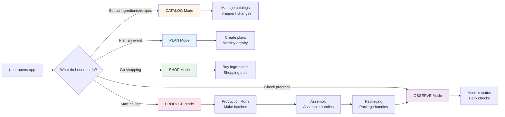
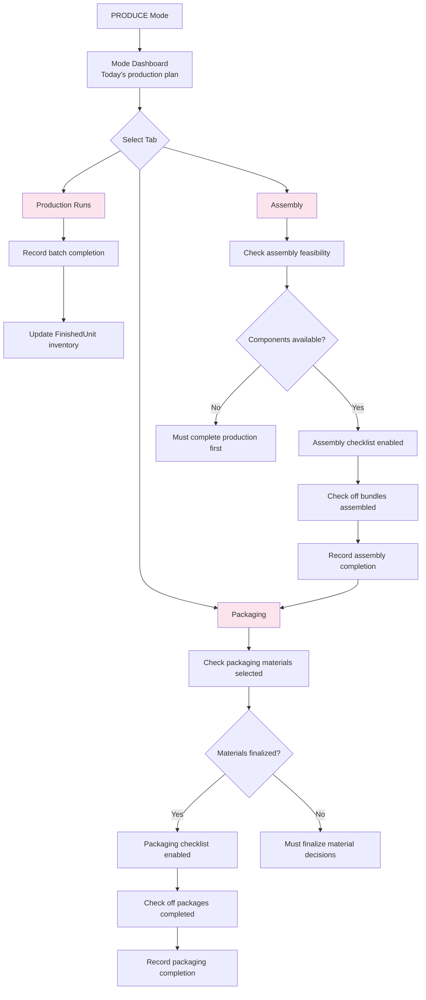

# UI Mode Restructure Architecture Specification

**Document Version**: 1.3
**Status**: Design Proposal (Terminology corrected: Bundle → FinishedGood)
**Date**: January 2026
**Constitutional References**: Principles V (Layered Architecture), VII (Pragmatic Aspiration)

---

## Important Note on Specification Approach

**This document contains detailed technical illustrations** including code samples, schema definitions, service method signatures, and UI mockups. These are provided as **examples and guidance**, not as prescriptive implementations.

**When using spec-kitty to implement this feature:**
- The code samples are **illustrative** - they show one possible approach
- Spec-kitty should **validate and rationalize** the technical approach during its planning phase
- Spec-kitty may **modify or replace** these examples based on:
  - Current codebase patterns and conventions
  - Better architectural approaches discovered during analysis
  - Constitution compliance verification
  - Test-driven development requirements

**The requirements and business logic are the source of truth** - the technical implementation details should be determined by spec-kitty's specification and planning phases.

---

## Executive Summary

This specification restructures the application UI from a flat tab-based navigation (11 tabs with inconsistent layouts) to a **5-mode workflow-oriented architecture**. Each mode represents a distinct work activity (Catalog, Plan, Shop, Produce, Observe) with consistent internal layouts and mode-specific dashboards. This reorganization addresses usability issues where users cannot find entry points, lack visibility into system state, and experience jarring transitions between related tasks.

**Key Design Decisions**:
1. **5 Work Modes**: Organize by workflow stage, not entity type
2. **Consistent Tab Layouts**: Standardized header/search/filter/actions pattern within modes
3. **Mode-Specific Dashboards**: Context-aware status summaries at mode level
4. **Navigation Clarity**: Clear visual distinction between modes, obvious entry points

---

## 1. Problem Statement

### Current State Issues

**Issue 1: Flat Navigation - No Workflow Guidance**
```
Current: 11 tabs in single level
- Production, Summary, My Ingredients, My Pantry, Products, Recipes, 
  Finished Units, Packages, Recipients, Events, Reports

Problem: 
- No clear starting point for new users
- Cannot distinguish catalog management from active planning
- Admin tasks mixed with production tasks
```

**Issue 2: Inconsistent Tab Layouts**
```
Example Variations:
- Some tabs have search bars, others don't
- Action buttons placed differently (top-right vs. below filters)
- Filters vary (dropdowns vs. checkboxes vs. none)
- Refresh buttons inconsistent

Result: Users must relearn layout on each tab
```

**Issue 3: No State Visibility**
```
User questions that cannot be answered without clicking through tabs:
- "What events are coming up?"
- "Am I ready for Christmas event?" (inventory vs. needs)
- "When did I last buy flour?"
- "How many cookies have I made for this event?"

Current: Must navigate to specific tabs, remember context
```

**Issue 4: Unclear Entry Points**
```
User wants to plan new event:
- Where to start? (Events tab? Recipes tab? Production tab?)
- How to progress? (No guidance on next steps)
- What's missing? (No status indicators)
```

---

## 2. Proposed Solution: 5-Mode Workflow Architecture

### Conceptual Model

```
Application organized by WORK ACTIVITY, not ENTITY TYPE

OLD (Entity-Centric):          NEW (Workflow-Centric):
├─ My Ingredients              ├─ CATALOG (Define Things)
├─ Products                    │  ├─ Ingredients
├─ Recipes                     │  ├─ Products
├─ Finished Units              │  ├─ Recipes
├─ Packages                    │  ├─ Finished Units (individual items)
├─ Recipients                  │  ├─ Finished Goods (assemblies)
├─ Events                      │  └─ Packages (Phase 3 - deferred)
                               │
├─ My Pantry                   ├─ PLAN (Forward-Looking)
├─ Production                  │  ├─ Events
└─ Summary                     │  └─ Planning Workspace
                               │
                               ├─ SHOP (Acquire Materials)
                               │  ├─ Shopping Lists
                               │  ├─ Purchases
                               │  └─ Inventory Status
                               │
                               ├─ PRODUCE (Execute)
                               │  ├─ Production Runs
                               │  ├─ Assembly
                               │  └─ Packaging
                               │
                               └─ OBSERVE (Monitor)
                                  ├─ Dashboard
                                  ├─ Event Status
                                  └─ Reports
```

### Mode Definitions

| Mode | Purpose | User Mental Model | Frequency |
|------|---------|-------------------|-----------|
| **CATALOG** | Define reusable things | "Set up my kitchen" | Infrequent (setup + maintenance) |
| **PLAN** | Create event plans | "What am I making?" | Weekly (event planning) |
| **SHOP** | Acquire ingredients | "What do I need to buy?" | Weekly (shopping trips) |
| **PRODUCE** | Execute production & assembly | "Time to bake & assemble" | Daily (during production period) |
| **OBSERVE** | Monitor status | "How am I doing?" | Daily (check progress) |

---

## 3. Data Model (No Schema Changes Required)

This is a **UI-only reorganization**. No database schema changes needed.

### Conceptual Navigation Model

```mermaid
graph TD
    A[Application Root] --> B[CATALOG Mode]
    A --> C[PLAN Mode]
    A --> D[SHOP Mode]
    A --> E[PRODUCE Mode]
    A --> F[OBSERVE Mode]
    
    B --> B1[Ingredients Tab]
    B --> B2[Products Tab]
    B --> B3[Recipes Tab]
    B --> B4[Finished Units Tab]
    B --> B5[Finished Goods Tab]
    B --> B6[Packages Tab]
    
    C --> C1[Events Tab]
    C --> C2[Planning Workspace Tab]
    
    D --> D1[Shopping Lists Tab]
    D --> D2[Purchases Tab]
    D --> D3[Inventory Tab]
    
    E --> E1[Production Runs Tab]
    E --> E2[Assembly Tab]
    E --> E3[Packaging Tab]
    
    F --> F1[Dashboard Tab]
    F --> F2[Event Status Tab]
    F --> F3[Reports Tab]
    
    style B fill:#FFF4E6
    style C fill:#E3F2FD
    style D fill:#E8F5E9
    style E fill:#FCE4EC
    style F fill:#F3E5F5
```



---

## 4. Conceptual Flow Diagrams

### Flow 1: Mode-Based Navigation (User Perspective)



### Flow 2: Within-Mode Navigation (Catalog Example)

```mermaid
graph TD
    A[CATALOG Mode] --> B[Mode Dashboard<br/>Quick stats + actions]
    
    B --> C{Select Tab}
    
    C -->|Need new ingredient| D[Ingredients Tab]
    C -->|Need product/brand| E[Products Tab]
    C -->|Need recipe| F[Recipes Tab]
    C -->|Need finished unit| G[Finished Units Tab]
    C -->|Need package type| H[Packages Tab]
    
    D --> I[Consistent Layout:<br/>Search | Filters | Actions | List]
    E --> I
    F --> I
    G --> I
    H --> I
    
    I --> J{User Action}
    J -->|Add| K[Create Form]
    J -->|Edit| L[Edit Form]
    J -->|Delete| M[Delete Confirmation]
    
    K --> N[Return to List<br/>Refresh data]
    L --> N
    M --> N
    
    style B fill:#FFE4B5
    style I fill:#90EE90
```

### Flow 3: PRODUCE Mode Internal Flow



**Note:** Material selection can happen anytime between planning and assembly, but MUST be finalized by assembly time per F026 "deferred packaging decisions."

---

## 5. Detailed Mode Specifications

### Mode 1: CATALOG (Define Things)

**Purpose**: Manage reusable definitions (ingredients, recipes, packages)  
**User Activity**: Infrequent setup and maintenance  
**Mental Model**: "My kitchen catalog"

**Mode Dashboard:**
```
┌─ CATALOG ──────────────────────────────────────────────┐
│                                                         │
│  Quick Stats:                                          │
│  • 487 Ingredients | 892 Products | 45 Recipes         │
│  • 12 Finished Units | 8 Finished Goods                │
│                                                         │
│  Quick Actions:                                        │
│  [+ New Ingredient] [+ New Recipe] [Import Catalog]    │
│                                                         │
│  Recent Activity:                                      │
│  • Chocolate Chip Cookie recipe updated (2 days ago)   │
│  • Added 5 new products (1 week ago)                   │
│                                                         │
│  [Ingredients] [Products] [Recipes] [Finished Units]   │
│  [Packages]                                            │
└─────────────────────────────────────────────────────────┘
```

**Tabs within CATALOG:**
- **Ingredients**: Hierarchical ingredient catalog (after #1 implementation)
- **Products**: Brand-specific products with UPCs, pricing
- **Recipes**: Recipe templates (after #2 implementation)
- **Finished Units**: Individual items from recipes (single cookie, single brownie, etc.)
- **Finished Goods**: Assemblies & gift bundles (e.g., "Holiday Gift Bag" = 6 cookies + 3 brownies)
- **Packages**: Package definitions (Phase 3 - deferred per F026, aesthetic containers)

**Terminology Note:** Requirements documents use "Bundle" terminology, which maps to the FinishedGood model in code. FinishedGoods are assemblies that contain FinishedUnits. The assembly_type field (GIFT_BOX, VARIETY_PACK, etc.) distinguishes different types.

**Navigation from CATALOG:**
- Create ingredient → Used in recipes (stay in CATALOG)
- View recipe → Need to plan production (switch to PLAN mode)

---

### Mode 2: PLAN (Forward-Looking)

**Purpose**: Create and manage event plans  
**User Activity**: Weekly event planning  
**Mental Model**: "What am I making and when?"

**Mode Dashboard:**
```
┌─ PLAN ─────────────────────────────────────────────────┐
│                                                         │
│  Upcoming Events:                                      │
│  ┌────────────────────────────────────────────────┐   │
│  │ Christmas 2025          Dec 20-25              │   │
│  │ Status: ⚠️ Shopping list pending               │   │
│  │ Packages: 15 planned                           │   │
│  │ [View Details →]                               │   │
│  ├────────────────────────────────────────────────┤   │
│  │ New Year Party          Dec 31                 │   │
│  │ Status: ✅ Ready to produce                    │   │
│  │ Trays: 5 planned                               │   │
│  │ [View Details →]                               │   │
│  └────────────────────────────────────────────────┘   │
│                                                         │
│  Quick Actions:                                        │
│  [+ New Event] [Planning Workspace]                   │
│                                                         │
│  Production Plan Preview:                              │
│  ┌────────────────────────────────────────────────┐   │
│  │ Christmas 2025 (planned)                        │   │
│  │ • Sugar Cookies: 7 batches → 336 cookies       │   │
│  │ • Brownies: 7 batches → 168 brownies           │   │
│  │ • Assembly: 50 Holiday Gift Bags ✅            │   │
│  │ [View Details in Planning Workspace →]         │   │
│  └────────────────────────────────────────────────┘   │
│                                                         │
│  [Events] [Planning Workspace]                        │
└─────────────────────────────────────────────────────────┘
```

**Tabs within PLAN:**
- **Events**: List of events with status and requirements
- **Planning Workspace**: Automatic batch calculation (Phase 2 CRITICAL - see gap analysis)

**Navigation from PLAN:**
- Event needs ingredients → Generate shopping list (switch to SHOP mode)
- Event ready → Start production (switch to PRODUCE mode)
- Check event status → View progress (switch to OBSERVE mode)

---

### Mode 3: SHOP (Acquire Materials)

**Purpose**: Purchase ingredients and track inventory  
**User Activity**: Shopping trips (weekly/bi-weekly)  
**Mental Model**: "What do I need to buy?"

**Mode Dashboard:**
```
┌─ SHOP ─────────────────────────────────────────────────┐
│                                                         │
│  Shopping Lists:                                       │
│  ┌────────────────────────────────────────────────┐   │
│  │ Costco (5 items)         [View List →]        │   │
│  │ Wegmans (12 items)       [View List →]        │   │
│  │ Penzeys (3 items)        [View List →]        │   │
│  └────────────────────────────────────────────────┘   │
│                                                         │
│  Recent Purchases:                                     │
│  • King Arthur Flour (2 bags) - 2 days ago            │
│  • Semi-Sweet Chocolate Chips - 1 week ago            │
│                                                         │
│  Inventory Alerts:                                     │
│  ⚠️ Low: Butter (0.5 lbs remaining)                    │
│  ⚠️ Low: Vanilla Extract (1 oz remaining)              │
│                                                         │
│  [Shopping Lists] [Purchases] [My Pantry]             │
└─────────────────────────────────────────────────────────┘
```

**Tabs within SHOP:**
- **Shopping Lists**: Auto-generated from events (new feature)
- **Purchases**: Record purchases (manual or AI-assisted) (#6)
- **My Pantry**: Current inventory status (existing Inventory tab)

**Navigation from SHOP:**
- Bought ingredients → Update inventory (stay in SHOP mode)
- Inventory complete → Start production (switch to PRODUCE mode)

---

### Mode 4: PRODUCE (Execute Production)

**Purpose**: Record production runs, assembly, packaging  
**User Activity**: Daily during production periods  
**Mental Model**: "Time to make things"

**Mode Dashboard:**
```
┌─ PRODUCE ──────────────────────────────────────────────┐
│                                                         │
│  Today's Production:                                   │
│  Event: Christmas 2025                                 │
│                                                         │
│  Pending Production:                                   │
│  ┌────────────────────────────────────────────────┐   │
│  │ ☐ Chocolate Chip Cookies (3 batches)          │   │
│  │ ☐ Raspberry Thumbprints (2 batches)           │   │
│  │ ☐ Magic Bars (1 batch)                        │   │
│  └────────────────────────────────────────────────┘   │
│                                                         │
│  Assembly Checklist (after production):                │
│  ┌────────────────────────────────────────────────┐   │
│  │ ☐ 50 Holiday Gift Bags assembled               │   │
│  │   (6 cookies + 3 brownies per bag)             │   │
│  └────────────────────────────────────────────────┘   │
│                                                         │
│  Packaging Checklist (after assembly):                 │
│  ┌────────────────────────────────────────────────┐   │
│  │ ☐ 50 Holiday Gift Bags packaged                │   │
│  │   (in red tissue with gold ribbon)             │   │
│  └────────────────────────────────────────────────┘   │
│                                                         │
│  Completed Today:                                      │
│  • ✅ Gingerbread Cookies (2 batches, 48 cookies)      │
│                                                         │
│  Quick Actions:                                        │
│  [+ Start Production] [View Progress]                 │
│                                                         │
│  [Production Runs] [Assembly] [Packaging]             │
└─────────────────────────────────────────────────────────┘
```

**Tabs within PRODUCE:**
- **Production Runs**: Batch production (existing Production Dashboard tab)
- **Assembly**: Bundle assembly (Phase 2 - checklist; Phase 3 - inventory transactions)
- **Packaging**: Final packaging (Phase 2 - checklist; Phase 3 - inventory transactions)

**Note on F026 "Deferred Packaging":** F026 defers packaging material *selection* (which box, which ribbon), not packaging *execution*. Material decisions can happen anytime between planning and assembly, but MUST be finalized by assembly time. The packaging checklist workflow is Phase 2.

**Navigation from PRODUCE:**
- Production complete → View inventory (switch to SHOP mode)
- Check event readiness → View progress (switch to OBSERVE mode)

---

### Mode 5: OBSERVE (Monitor Status)

**Purpose**: Dashboard and reporting  
**User Activity**: Daily progress checks  
**Mental Model**: "How am I doing?"

**Mode Dashboard:**
```
┌─ OBSERVE ──────────────────────────────────────────────┐
│                                                         │
│  Event Readiness:                                      │
│  ┌────────────────────────────────────────────────┐   │
│  │ Christmas 2025 (5 days away)                   │   │
│  │ ━━━━━━━━━━━━━━━━━━━━━━━━━━━━━━━━━━━━━━━━━━━ │   │
│  │ Shopping:     ✅ Complete (100%)               │   │
│  │ Production:   🔶 In Progress (65%)             │   │
│  │ Assembly:     ⚠️ Not Started (0%)              │   │
│  │ Packaging:    ⚠️ Not Started (0%)              │   │
│  │ [View Details →]                               │   │
│  └────────────────────────────────────────────────┘   │
│                                                         │
│  Recent Activity:                                      │
│  • Produced 48 Gingerbread Cookies (today)            │
│  • Purchased flour, butter (2 days ago)               │
│                                                         │
│  Quick Stats:                                          │
│  • Total production cost (this month): $245.50        │
│  • Inventory value: $183.20                           │
│                                                         │
│  [Dashboard] [Event Status] [Reports]                 │
└─────────────────────────────────────────────────────────┘
```

**Tabs within OBSERVE:**
- **Dashboard**: Overview of all activity (existing Summary tab)
- **Event Status**: Per-event progress tracking (new feature)
- **Reports**: Cost analysis, production history (placeholder)

**Navigation from OBSERVE:**
- Need ingredients → Go shopping (switch to SHOP mode)
- Need to produce → Start production (switch to PRODUCE mode)
- Update plans → Adjust event (switch to PLAN mode)

---

## 6. Consistent Tab Layout Standard

All tabs within all modes follow this standard layout:

```
┌─ [Tab Name] ───────────────────────────────────────────┐
│                                                         │
│  [Action Buttons]                          [Refresh]   │
│                                                         │
│  Search: [___________] Filters: [___] [___] [___]     │
│                                                         │
│  ┌─ Data Grid ──────────────────────────────────────┐  │
│  │ [Headers]                                        │  │
│  │ ━━━━━━━━━━━━━━━━━━━━━━━━━━━━━━━━━━━━━━━━━━━━━ │  │
│  │ [Row 1]                                          │  │
│  │ [Row 2]                                          │  │
│  │ [Row 3]                                          │  │
│  │ ...                                              │  │
│  └──────────────────────────────────────────────────┘  │
│                                                         │
│  Status: [Status message]            [Page 1 of 5]    │
└─────────────────────────────────────────────────────────┘
```

**Elements (in order top to bottom):**
1. **Action Buttons** (left-aligned): Add, Edit, Delete, etc.
2. **Refresh Button** (right-aligned): Reload data
3. **Search Bar** (left): Text search
4. **Filters** (right of search): Dropdowns, checkboxes
5. **Data Grid** (main area): Sortable table
6. **Status Bar** (bottom): Messages, pagination

**Consistency Rules:**
- Action buttons always same vertical position across tabs
- Search bar always full-width or left-aligned
- Filters always to right of search
- Data grid always uses same font/sizing
- Status bar always bottom with same height

---

## 7. Implementation Architecture

### File Structure (Proposed)

```
src/ui/
├── main_window.py (modified - mode-based navigation)
├── modes/
│   ├── catalog_mode.py (new - CATALOG mode container)
│   ├── plan_mode.py (new - PLAN mode container)
│   ├── shop_mode.py (new - SHOP mode container)
│   ├── produce_mode.py (new - PRODUCE mode container)
│   └── observe_mode.py (new - OBSERVE mode container)
├── tabs/
│   ├── ingredients_tab.py (refactored - consistent layout)
│   ├── products_tab.py (refactored)
│   ├── recipes_tab.py (refactored)
│   ├── finished_units_tab.py (refactored)
│   ├── packages_tab.py (refactored)
│   ├── events_tab.py (refactored)
│   ├── shopping_lists_tab.py (new)
│   ├── purchases_tab.py (new)
│   ├── inventory_tab.py (refactored from My Pantry)
│   ├── production_runs_tab.py (refactored)
│   ├── assembly_tab.py (new - future)
│   ├── packaging_tab.py (new - future)
│   ├── dashboard_tab.py (refactored)
│   ├── event_status_tab.py (new)
│   └── reports_tab.py (placeholder)
├── components/
│   ├── mode_dashboard.py (new - reusable dashboard widget)
│   ├── standard_tab_layout.py (new - base class for consistent layouts)
│   └── ... (existing form components)
```

### Base Classes

**Mode Base Class:**
```python
# src/ui/modes/base_mode.py

class BaseMode(ctk.CTkFrame):
    """
    Base class for application modes.
    
    Provides:
    - Mode dashboard at top
    - Tabbed navigation for mode-specific tabs
    - Consistent styling
    """
    
    def __init__(self, parent, mode_name: str, mode_color: str):
        super().__init__(parent)
        self.mode_name = mode_name
        self.mode_color = mode_color
        
        self.grid_rowconfigure(0, weight=0)  # Mode dashboard
        self.grid_rowconfigure(1, weight=1)  # Tabs
        self.grid_columnconfigure(0, weight=1)
        
        self._create_mode_dashboard()
        self._create_tabs()
    
    def _create_mode_dashboard(self):
        """Create mode-specific dashboard (override in subclass)."""
        pass
    
    def _create_tabs(self):
        """Create tabs for this mode (override in subclass)."""
        pass
    
    def refresh_dashboard(self):
        """Refresh mode dashboard data (override in subclass)."""
        pass
```

**Tab Base Class:**
```python
# src/ui/components/standard_tab_layout.py

class StandardTabLayout(ctk.CTkFrame):
    """
    Base class for consistent tab layouts.
    
    Provides standard layout:
    - Action buttons (top-left)
    - Refresh button (top-right)
    - Search bar + filters
    - Data grid
    - Status bar
    """
    
    def __init__(self, parent, tab_name: str):
        super().__init__(parent)
        self.tab_name = tab_name
        
        self.grid_rowconfigure(0, weight=0)  # Actions
        self.grid_rowconfigure(1, weight=0)  # Search/filters
        self.grid_rowconfigure(2, weight=1)  # Data grid
        self.grid_rowconfigure(3, weight=0)  # Status
        self.grid_columnconfigure(0, weight=1)
        
        self._create_action_bar()
        self._create_search_filter_bar()
        self._create_data_grid()
        self._create_status_bar()
    
    def _create_action_bar(self):
        """Create action buttons (override to add specific buttons)."""
        pass
    
    def _create_search_filter_bar(self):
        """Create search and filters (override for specific filters)."""
        pass
    
    def _create_data_grid(self):
        """Create data display grid (override for specific columns)."""
        pass
    
    def _create_status_bar(self):
        """Create status bar (standard implementation)."""
        pass
    
    def refresh(self):
        """Refresh data (override in subclass)."""
        pass
```

---

## 8. Migration Strategy

### Phase 1: Create Mode Containers (Non-Disruptive)

**Goal**: Add mode structure without removing existing tabs

1. Create `BaseMode` class
2. Create 5 mode containers (Catalog, Plan, Shop, Produce, Observe)
3. Add mode switcher to main window (alongside existing tabs)
4. Initially, modes are empty or show "Coming Soon"

**Result**: Users can see new structure but continue using old tabs

---

### Phase 2: Migrate Tabs (One Mode at a Time)

**Sequence**: CATALOG → OBSERVE → PRODUCE → SHOP → PLAN

**For each mode:**
1. Create `StandardTabLayout` base class
2. Refactor existing tabs to use standard layout
3. Move tabs into mode container
4. Add mode dashboard
5. Test with real user (Marianne)

**Example: CATALOG Mode Migration**
```
Step 1: Refactor IngredientsTab to use StandardTabLayout
Step 2: Move IngredientsTab into CatalogMode
Step 3: Repeat for Products, Recipes, Finished Units, Packages
Step 4: Create CatalogMode dashboard
Step 5: Test CATALOG mode end-to-end
```

---

### Phase 3: Remove Old Navigation

1. Once all modes complete, deprecate old flat tab structure
2. Remove redundant navigation
3. Clean up unused code

---

## 9. UI Mockups

### Top-Level Mode Navigation

```
┌─ Bake Tracker ─────────────────────────────────────────┐
│                                                         │
│  [CATALOG] [PLAN] [SHOP] [PRODUCE] [OBSERVE]          │
│                                                         │
│  ┌─ Current Mode Content ─────────────────────────┐   │
│  │                                                 │   │
│  │ (Mode dashboard + tabs shown here)             │   │
│  │                                                 │   │
│  └─────────────────────────────────────────────────┘   │
│                                                         │
│  Status: Ready                                         │
└─────────────────────────────────────────────────────────┘
```

**Mode Switcher Behavior:**
- Horizontal button bar (segmented control style)
- Active mode highlighted
- Click to switch modes
- Keyboard shortcuts: Ctrl+1 through Ctrl+5

---

### Example: CATALOG Mode Full View

```
┌─ CATALOG Mode ─────────────────────────────────────────┐
│                                                         │
│  Quick Stats:                                          │
│  487 Ingredients | 892 Products | 45 Recipes           │
│  [+ Ingredient] [+ Product] [+ Recipe] [Import]        │
│                                                         │
│  ┌─────────────────────────────────────────────────┐  │
│  │ [Ingredients] [Products] [Recipes] [Units]      │  │
│  │                                                  │  │
│  │ ┌─ Ingredients ─────────────────────────────┐   │  │
│  │ │ [+ Add] [Edit] [Delete]         [Refresh] │   │  │
│  │ │                                            │   │  │
│  │ │ Search: [___] Category: [All ▼]  [Clear] │   │  │
│  │ │                                            │   │  │
│  │ │ ┌─ List ────────────────────────────────┐ │   │  │
│  │ │ │ Name          Category    Products    │ │   │  │
│  │ │ │ ────────────  ──────────  ──────────  │ │   │  │
│  │ │ │ All-Purpose   Flour       5           │ │   │  │
│  │ │ │ Butter        Dairy       3           │ │   │  │
│  │ │ │ ...                                   │ │   │  │
│  │ │ └───────────────────────────────────────┘ │   │  │
│  │ │                                            │   │  │
│  │ │ Status: 487 ingredients                   │   │  │
│  │ └────────────────────────────────────────────┘   │  │
│  └─────────────────────────────────────────────────┘  │
└─────────────────────────────────────────────────────────┘
```

---

## 10. Gap Analysis

### Code Structure Gaps

| Gap | Current | Required |
|-----|---------|----------|
| Mode containers | None | 5 mode classes (Catalog, Plan, Shop, Produce, Observe) |
| Mode dashboards | None | Mode-specific dashboard widgets |
| Base mode class | None | `BaseMode` with common functionality |
| Standard tab layout | Inconsistent | `StandardTabLayout` base class |
| Mode switching | None | Mode switcher UI component |

### Tab Migration Gaps

| Current Tab | Target Mode | Refactoring Needed |
|-------------|-------------|-------------------|
| My Ingredients | CATALOG → Ingredients | Adopt StandardTabLayout |
| Products | CATALOG → Products | Adopt StandardTabLayout |
| Recipes | CATALOG → Recipes | Adopt StandardTabLayout |
| Finished Units | CATALOG → Finished Units | Adopt StandardTabLayout |
| Packages | CATALOG → Packages | Adopt StandardTabLayout |
| Finished Goods | CATALOG → Finished Goods | Adopt StandardTabLayout (existing tab, may need rename) |
| Events | PLAN → Events | Adopt StandardTabLayout |
| (New) | PLAN → Planning Workspace | New tab (Phase 2 CRITICAL) |
| (New) | SHOP → Shopping Lists | New tab |
| (New) | SHOP → Purchases | New tab (#6) |
| My Pantry | SHOP → My Pantry | Adopt StandardTabLayout |
| Production | PRODUCE → Production Runs | Adopt StandardTabLayout |
| (New) | PRODUCE → Assembly | New tab (Phase 2 - checklist) |
| (New) | PRODUCE → Packaging | New tab (Phase 2 - checklist) |
| Summary | OBSERVE → Dashboard | Adopt StandardTabLayout |
| (New) | OBSERVE → Event Status | New tab |
| Reports | OBSERVE → Reports | Adopt StandardTabLayout |

### New Features Required

| Feature | Description | Priority |
|---------|-------------|----------|
| Mode dashboards | Summary widgets for each mode | High |
| Shopping Lists tab | Auto-generated from events | High |
| Purchases tab | Record purchases (#6) | High |
| Assembly tab | FinishedGood assembly checklist | High (Phase 2) |
| Packaging tab | Package completion checklist | High (Phase 2) |
| Planning Workspace | Automatic batch calculation | High (Phase 2 CRITICAL) |
| Event Status tab | Per-event progress tracking | Medium |

**Note:** "Finished Goods" tab already exists (may be misnamed). No new tab needed - just adopt StandardTabLayout and clarify subtitle as "(Assemblies & Gift Bundles)".

---

## 11. Constitutional Compliance Check

### Principle V: Layered Architecture Discipline
✅ **Compliant**: 
- UI layer changes only (no service/model changes)
- Mode containers organize UI, not business logic
- Tab refactoring maintains separation (UI talks to services)

### Principle VII: Pragmatic Aspiration
✅ **Desktop Phase**: Mode structure simple, desktop-native (CustomTkinter)
✅ **Web Migration Ready**: 
- Mode concept translates to web routing (URLs per mode)
- Tab structure becomes nested routes
- Dashboards become React components
⚠️ **Platform Phase**: May need mobile-specific navigation patterns

---

## 12. Implementation Complexity Assessment

### Complexity Factors

| Factor | Complexity | Justification |
|--------|-----------|---------------|
| Mode base class | **Low** | Simple container with dashboard + tabs |
| Standard tab layout | **Low** | Extract common pattern from existing tabs |
| Mode dashboards | **Medium** | New widgets, query data from services |
| Tab refactoring | **Medium** | Mechanical but repetitive (11 tabs) |
| Mode switcher UI | **Low** | Simple button bar component |
| Testing | **Medium** | Ensure all tabs work in new structure |

### Estimated Effort
- Base classes (BaseMode, StandardTabLayout): 6-8 hours
- Mode containers (5 modes): 8-10 hours
- Mode dashboards (5 dashboards): 16-20 hours
- Tab refactoring (12 tabs @ 2-3 hours each): 24-36 hours
- Mode switcher UI: 4-6 hours
- New tabs (Shopping Lists, Purchases, Assembly Checklist, Packaging Checklist, Event Status): 20-28 hours
- Testing: 12-16 hours
- **Total: 90-132 hours** (roughly 11-17 working days)

**Note:** Assembly and Packaging checklists are both Phase 2 minimal implementations (simple checklist UI, no inventory transactions until Phase 3). "Finished Goods" is an existing tab (not new) - just needs StandardTabLayout adoption.

### Risk Mitigation
1. **Risk**: Refactoring breaks existing tabs
   - **Mitigation**: Migrate one mode at a time, test thoroughly
   
2. **Risk**: User confusion with new navigation
   - **Mitigation**: Early prototype testing with Marianne, adjust based on feedback
   
3. **Risk**: Performance degradation (loading all modes)
   - **Mitigation**: Lazy load mode dashboards, maintain tab lazy loading

---

## 13. Success Criteria

### User Experience
- ✅ User can find entry point for common tasks in <5 seconds
- ✅ User understands which mode to use for each activity
- ✅ User sees current status without clicking through tabs
- ✅ Navigation feels natural and predictable

### Technical Requirements
- ✅ All existing functionality preserved
- ✅ All tabs use consistent layout
- ✅ Mode dashboards load in <1 second
- ✅ No performance regression vs. current implementation

### Usability Testing (with Marianne)
- ✅ Can plan new event using PLAN mode without guidance
- ✅ Can find shopping list in SHOP mode
- ✅ Can see event readiness in OBSERVE mode
- ✅ Prefers new navigation over old flat tabs

---

## 14. Terminology Glossary

This section clarifies terminology mapping between requirements documents and code models.

| User-Facing Term | Requirements Term | Code Model | Table | Description |
|------------------|------------------|------------|-------|-------------|
| Individual Item | FinishedUnit | FinishedUnit | finished_units | Single cookie, brownie, cake - produced from recipe |
| Assembly / Bundle | Bundle | **FinishedGood** | finished_goods | Assembled item containing FinishedUnits |
| Gift Bag / Gift Box | Bundle | FinishedGood (assembly_type=GIFT_BOX) | finished_goods | Specific assembly type for gifting |
| Variety Pack | Bundle | FinishedGood (assembly_type=VARIETY_PACK) | finished_goods | Specific assembly type for variety |
| Package | Package | Package | packages | Aesthetic container with materials |

**Key Insight:** "Bundle" in requirements = FinishedGood in code. No separate Bundle entity exists.

**Two-Tier Hierarchy:**
- **FinishedUnit** (Tier 1): Individual items from recipes
- **FinishedGood** (Tier 2): Assemblies that contain FinishedUnits (or other FinishedGoods)

**Planning Flow:**
- BULK_COUNT mode: Event specifies FinishedUnit quantities directly
- BUNDLED mode: Event specifies FinishedGood quantities → system explodes to FinishedUnits

---

## 15. Related Documents

- `/docs/design/ingredient_hierarchy_architecture.md` - Ingredient hierarchy (used in CATALOG)
- `/docs/design/recipe_redesign_architecture.md` - Recipe templates (used in CATALOG/PLAN)
- `/docs/design/PHASE2_workflow_ux_redesign.md` - Phase 2 requirements
- `/docs/func-spec/F038_TERMINOLOGY_CORRECTION.md` - Terminology alignment (Bundle → FinishedGood)
- `/.kittify/memory/constitution.md` - Architectural principles

---

## 16. Next Steps

### Immediate (Pre-Implementation)
1. **Create mode navigation mockups** for Marianne review
2. **Prototype mode switcher** (simple version to test concept)
3. **Design mode dashboard data queries** (what stats to show?)

### Implementation Sequence
1. Create base classes (BaseMode, StandardTabLayout)
2. Implement mode switcher UI
3. Migrate CATALOG mode (5 tabs)
4. Test CATALOG mode with Marianne
5. Migrate OBSERVE mode (dashboard + reports)
6. Migrate PRODUCE mode (production runs)
7. Migrate SHOP mode (add Shopping Lists, Purchases tabs)
8. Migrate PLAN mode (add Planning Workspace tab - #5 future)
9. Remove old flat navigation
10. Final user testing

### Critical Dependencies
- **BLOCKS**: Planning Workspace (#5) - needs PLAN mode framework
- **INDEPENDENT**: Can be implemented before or after #1/#2

---

**Document Status**: Approved - Ready for implementation

**Next Requirement**: #5 Planning Workspace (needs #1, #2, #4 complete) OR #6 Purchase Workflow (independent)
